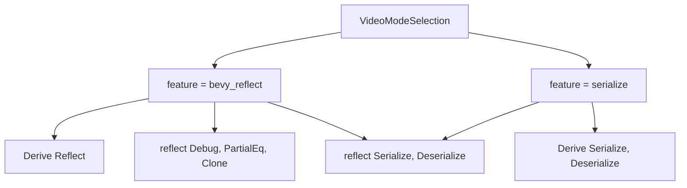

+++
title = "#19745 Gate Reflect derive behind feature flag"
date = "2025-06-19T00:00:00"
draft = false
template = "pull_request_page.html"
in_search_index = true

[taxonomies]
list_display = ["show"]

[extra]
current_language = "en"
available_languages = {"en" = { name = "English", url = "/pull_request/bevy/2025-06/pr-19745-en-20250619" }, "zh-cn" = { name = "中文", url = "/pull_request/bevy/2025-06/pr-19745-zh-cn-20250619" }}
labels = ["C-Bug", "D-Trivial", "A-Windowing", "A-Reflection"]
+++

# Gate Reflect derive behind feature flag

## Basic Information
- **Title**: Gate Reflect derive behind feature flag
- **PR Link**: https://github.com/bevyengine/bevy/pull/19745
- **Author**: theotherphil
- **Status**: MERGED
- **Labels**: C-Bug, D-Trivial, A-Windowing, S-Ready-For-Final-Review, A-Reflection
- **Created**: 2025-06-19T20:49:32Z
- **Merged**: 2025-06-19T22:15:52Z
- **Merged By**: alice-i-cecile

## Description Translation
# Objective

Fix https://github.com/bevyengine/bevy/issues/19733

## Solution

Gate reflect features behind `feature(bevy_reflect)`

## Tests

None

## The Story of This Pull Request

This PR addresses a specific build failure in the Bevy engine when the `bevy_reflect` feature is disabled. The issue originated from the `VideoModeSelection` enum unconditionally deriving the `Reflect` trait. Since `Reflect` is part of Bevy's reflection system which is feature-gated, this caused compilation errors when `bevy_reflect` wasn't enabled.

The solution implements proper feature gating for the reflection functionality. Instead of directly deriving `Reflect` on the `VideoModeSelection` enum, we now conditionally include it only when the `bevy_reflect` feature is active. This is achieved using Rust's `cfg_attr` attribute for conditional compilation.

The implementation required reorganizing the existing attribute macros. The `Reflect` derive was moved inside a `cfg_attr` block that activates only when `feature = "bevy_reflect"` is present. Additionally, the `reflect` attribute containing the trait implementations (`Debug`, `PartialEq`, `Clone`) was moved into the same conditional block since these implementations are only relevant when reflection is enabled.

For the serialization attributes, the PR introduces more precise conditional logic. The `derive(serde::Serialize, serde::Deserialize)` is now in a separate `cfg_attr` block that activates with the `serialize` feature. The `reflect(Serialize, Deserialize)` attribute is now gated behind both `serialize` and `bevy_reflect` features since it requires both capabilities.

These changes maintain all existing functionality when features are enabled while preventing build failures when `bevy_reflect` is disabled. The implementation follows Bevy's established patterns for feature gating and doesn't introduce new dependencies or runtime behavior changes.

## Visual Representation



## Key Files Changed

### `crates/bevy_window/src/window.rs`
**What changed**: Modified attribute macros on `VideoModeSelection` to conditionally include reflection-related code  
**Why changed**: To fix compilation errors when `bevy_reflect` feature is disabled  
**Relation to PR**: This is the core change that implements the feature gating  

**Code Snippets**:  
Before:  
```rust
#[derive(Debug, Clone, Copy, PartialEq, Eq, Reflect)]
#[cfg_attr(
    feature = "serialize",
    derive(serde::Serialize, serde::Deserialize),
    reflect(Serialize, Deserialize)
)]
#[reflect(Debug, PartialEq, Clone)]
pub enum VideoModeSelection {
```

After:  
```rust
#[derive(Debug, Clone, Copy, PartialEq, Eq)]
#[cfg_attr(
    feature = "bevy_reflect",
    derive(Reflect),
    reflect(Debug, PartialEq, Clone)
)]
#[cfg_attr(feature = "serialize", derive(serde::Serialize, serde::Deserialize))]
#[cfg_attr(
    all(feature = "serialize", feature = "bevy_reflect"),
    reflect(Serialize, Deserialize)
)]
pub enum VideoModeSelection {
```

## Further Reading
- [Rust Conditional Compilation](https://doc.rust-lang.org/reference/conditional-compilation.html)
- [Bevy Reflection System](https://bevyengine.org/learn/book/features/reflection/)
- [Serde Derive Macros](https://serde.rs/derive.html)