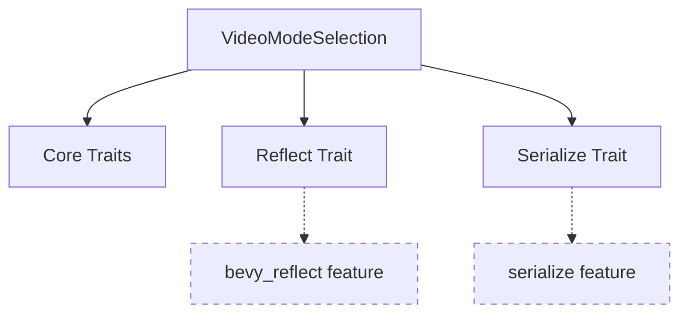

+++
title = "#19745 Gate Reflect derive behind feature flag"
date = "2025-06-19T00:00:00"
draft = false
template = "pull_request_page.html"
in_search_index = false

[extra]
current_language = "zh-cn"
available_languages = {"en" = { name = "English", url = "/pull_request/bevy/2025-06/pr-19745-en-20250619" }, "zh-cn" = { name = "中文", url = "/pull_request/bevy/2025-06/pr-19745-zh-cn-20250619" }}
labels = ["C-Bug", "D-Trivial", "A-Windowing", "A-Reflection"]
+++

# Gate Reflect derive behind feature flag

## Basic Information
- **Title**: Gate Reflect derive behind feature flag
- **PR Link**: https://github.com/bevyengine/bevy/pull/19745
- **Author**: theotherphil
- **Status**: MERGED
- **Labels**: C-Bug, D-Trivial, A-Windowing, S-Ready-For-Final-Review, A-Reflection
- **Created**: 2025-06-19T20:49:32Z
- **Merged**: 2025-06-19T22:15:52Z
- **Merged By**: alice-i-cecile

## Description Translation
### 目标
修复 https://github.com/bevyengine/bevy/issues/19733

### 解决方案
将反射功能置于 `feature(bevy_reflect)` 特性标志后

### 测试
无

## The Story of This Pull Request

### 问题背景
在 Bevy 引擎中，`VideoModeSelection` 枚举直接派生了 `Reflect` trait。这导致当用户未启用 `bevy_reflect` 特性时，编译会失败，因为 `Reflect` trait 及其依赖在条件编译中被排除。具体问题是当 `bevy_reflect` 未激活时，编译器找不到 `Reflect` 实现，违反了可选依赖管理的基本原则。

### 解决方案选择
解决方案明确：将 `Reflect` 派生移至条件编译块内。技术决策要点：
1. 保留核心功能 (`Debug`, `Clone`, `Copy`, `PartialEq`, `Eq`) 的无条件派生
2. 仅当 `bevy_reflect` 启用时才派生 `Reflect`
3. 保持序列化 (`serialize`) 特性独立但正确处理交叉依赖

### 实现细节
核心修改在 `VideoModeSelection` 枚举的属性宏：
1. 从基础派生列表中移除 `Reflect`
2. 新增条件编译属性：
   ```rust
   #[cfg_attr(
       feature = "bevy_reflect",
       derive(Reflect),
       reflect(Debug, PartialEq, Clone)
   )]
   ```
3. 分离序列化特性处理：
   ```rust
   #[cfg_attr(feature = "serialize", derive(serde::Serialize, serde::Deserialize))]
   ```
4. 处理特性组合情况：
   ```rust
   #[cfg_attr(
       all(feature = "serialize", feature = "bevy_reflect"),
       reflect(Serialize, Deserialize)
   )]
   ```

这种实现确保了：
- 未启用 `bevy_reflect` 时不会尝试派生 `Reflect`
- 各特性保持独立且组合时行为正确
- 原有功能在激活特性时完全保留

### 影响与改进
该修复：
1. 解决了特定配置下的编译失败问题
2. 强化了条件编译边界的正确性
3. 保持了 API 向后兼容性
4. 减少了未使用反射功能的二进制大小

关键教训：当使用可选依赖时，必须确保所有相关代码路径都正确处理特性激活状态，特别是派生宏这类在编译早期展开的元编程功能。

## Visual Representation



## Key Files Changed

### `crates/bevy_window/src/window.rs`
**变更原因**：修复当 `bevy_reflect` 特性未启用时的编译错误

**关键修改**：
```rust
// 修改前：
#[derive(Debug, Clone, Copy, PartialEq, Eq, Reflect)]
#[cfg_attr(
    feature = "serialize",
    derive(serde::Serialize, serde::Deserialize),
    reflect(Serialize, Deserialize)
)]
#[reflect(Debug, PartialEq, Clone)]
pub enum VideoModeSelection {

// 修改后：
#[derive(Debug, Clone, Copy, PartialEq, Eq)]
#[cfg_attr(
    feature = "bevy_reflect",
    derive(Reflect),
    reflect(Debug, PartialEq, Clone)
)]
#[cfg_attr(feature = "serialize", derive(serde::Serialize, serde::Deserialize))]
#[cfg_attr(
    all(feature = "serialize", feature = "bevy_reflect"),
    reflect(Serialize, Deserialize)
)]
pub enum VideoModeSelection {
```

**变更说明**：
1. 将 `Reflect` 派生移至 `bevy_reflect` 特性条件块内
2. 分离序列化特性的条件处理
3. 添加组合特性条件处理逻辑
4. 保留核心 trait 的无条件派生

## Further Reading
1. [Rust 特性标志文档](https://doc.rust-lang.org/cargo/reference/features.html)
2. [Bevy 反射系统概览](https://bevyengine.org/learn/book/reflection/)
3. [属性宏高级用法](https://doc.rust-lang.org/reference/procedural-macros.html#attribute-macros)

# Full Code Diff
```diff
diff --git a/crates/bevy_window/src/window.rs b/crates/bevy_window/src/window.rs
index e2a9ca3c0fac3..403801e9d0478 100644
--- a/crates/bevy_window/src/window.rs
+++ b/crates/bevy_window/src/window.rs
@@ -1168,13 +1168,17 @@ pub enum MonitorSelection {
 /// References an exclusive fullscreen video mode.
 ///
 /// Used when setting [`WindowMode::Fullscreen`] on a window.
-#[derive(Debug, Clone, Copy, PartialEq, Eq, Reflect)]
+#[derive(Debug, Clone, Copy, PartialEq, Eq)]
+#[cfg_attr(
+    feature = "bevy_reflect",
+    derive(Reflect),
+    reflect(Debug, PartialEq, Clone)
+)]
+#[cfg_attr(feature = "serialize", derive(serde::Serialize, serde::Deserialize))]
 #[cfg_attr(
-    feature = "serialize",
-    derive(serde::Serialize, serde::Deserialize),
+    all(feature = "serialize", feature = "bevy_reflect"),
     reflect(Serialize, Deserialize)
 )]
-#[reflect(Debug, PartialEq, Clone)]
 pub enum VideoModeSelection {
     /// Uses the video mode that the monitor is already in.
     Current,
```