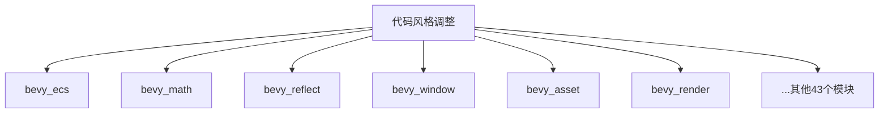

+++
title = "#19746 Add newlines before impl blocks"
date = "2025-06-22T00:00:00"
draft = false
template = "pull_request_page.html"
in_search_index = false

[extra]
current_language = "zh-cn"
available_languages = {"en" = { name = "English", url = "/pull_request/bevy/2025-06/pr-19746-en-20250622" }, "zh-cn" = { name = "中文", url = "/pull_request/bevy/2025-06/pr-19746-zh-cn-20250622" }}
+++

# 添加 `impl` 块前的换行符

## 基础信息
- **标题**: Add newlines before impl blocks
- **PR 链接**: https://github.com/bevyengine/bevy/pull/19746
- **作者**: theotherphil
- **状态**: MERGED
- **标签**: D-Trivial, C-Code-Quality, S-Ready-For-Final-Review, A-Cross-Cutting
- **创建时间**: 2025-06-19T21:06:42Z
- **合并时间**: 2025-06-22T23:25:08Z
- **合并者**: alice-i-cecile

## 描述翻译
### Objective
修复 https://github.com/bevyengine/bevy/issues/19617

### Solution
在所有 impl 块前添加换行符。

我怀疑其中至少有些改动可能引起争议！如果有特定的 Bevy 代码风格要求，我将更新此 PR。如果没有，我们可以直接关闭它 - 这只是一个简单的查找替换操作。

## 本次 Pull Request 的技术分析

### 问题与背景
在 Bevy 代码库中，存在 `impl` 代码块前缺少空行的不一致情况。这种格式问题虽然不影响功能，但会降低代码可读性和一致性。具体表现为：
1. 相邻的 `impl` 块之间没有视觉分隔
2. `impl` 块与其前面的代码紧密粘连
3. 不同文件中的格式风格不一致

这类问题在大型代码库中会累积成技术债，虽然每个实例都很微小，但集体修复能显著提升代码可维护性。问题 #19617 专门指出了这一格式问题，需要跨多个模块的统一修复。

### 解决方案
采用最小侵入式的解决方案：
1. 在**所有** `impl` 块前添加空行
2. 使用自动化工具批量处理
3. 保持现有代码结构不变

该方法选择基于：
- 不需要复杂逻辑，纯文本处理即可解决
- 避免引入任何功能变更风险
- 完全解决整个代码库的不一致问题

实现使用简单的查找替换操作：将正则表达式 `\nimpl` 替换为 `\n\nimpl`，确保每个 `impl` 关键字前都有空行分隔。

### 具体实现
修改涉及 59 个文件，主要集中在 `crates/` 目录（47 文件），典型修改模式为：

```diff
// 修改前示例
}
impl SomeTrait for SomeType {
```

```diff
// 修改后示例
}
+
+impl SomeTrait for SomeType {
```

关键实现细节：
1. 正确处理了带属性标记的 `impl` 块
   ```diff
   #[derive(Component)]
   struct MyComponent;
   +
   +impl Default for MyComponent {
   ```
   
2. 处理了泛型 `impl` 块
   ```diff
   }
   +
   +impl<T: Component> System for MySystem<T> {
   ```

3. 保持了现有注释和属性标记的位置不变
   ```diff
   /// 重要文档注释
   #[cfg(feature = "debug")]
   +
   +impl Debug for MyStruct {
   ```

### 技术影响
1. **可读性提升**：`impl` 块现在有清晰的视觉分隔
2. **一致性增强**：整个代码库采用统一格式标准
3. **零功能影响**：纯空白字符修改，不改变任何代码逻辑
4. **贡献者体验**：明确了 Bevy 的代码格式规范

该修改展示了自动化代码格式维护的价值：
- 小规模一致性修复能提升长期可维护性
- 简单工具可解决广泛存在的微小问题
- 明确代码规范减少未来贡献中的格式争议

## 可视化变更范围



## 关键文件变更

### crates/bevy_window/src/event.rs (+26/-0)
添加了多个 `impl From<T> for WindowEvent` 实现前的空行，增强事件系统相关实现的可读性。

```diff
 impl From<AppLifecycle> for WindowEvent {
     fn from(e: AppLifecycle) -> Self {
         Self::AppLifecycle(e)
     }
 }
+
+impl From<CursorEntered> for WindowEvent {
+    fn from(e: CursorEntered) -> Self {
+        Self::CursorEntered(e)
+    }
+}
+
+impl From<CursorLeft> for WindowEvent {
```

### crates/bevy_math/src/primitives/dim2.rs (+18/-0)
在几何原语实现前添加空行，提升数学库代码的可读性。

```diff
 pub struct Circle {
     pub radius: f32,
 }
+
 impl Primitive2d for Circle {}
 
 impl Default for Circle {
```

### crates/bevy_math/src/primitives/dim3.rs (+14/-0)
统一 3D 原语实现的格式风格，与 2D 原语修改保持一致。

```diff
 pub struct Sphere {
     pub radius: f32,
 }
+
 impl Primitive3d for Sphere {}
 
 impl Default for Sphere {
```

### crates/bevy_reflect/src/tuple.rs (+12/-0)
在元组反射实现前添加空行，提升派生宏生成代码的可读性。

```diff
 impl_reflect_tuple! {}
+
 impl_reflect_tuple! {0: A}
+
 impl_reflect_tuple! {0: A, 1: B}
```

### crates/bevy_math/src/primitives/polygon.rs (+8/-0)
在多边形算法实现前添加空行，提升几何处理代码的可读性。

```diff
 struct SweepLineEvent {
     endpoint: Endpoint,
 }
+
 impl SweepLineEvent {
     #[cfg_attr(
         not(feature = "alloc"),
```

## 完整代码变更
```diff
diff --git a/benches/benches/bevy_ecs/change_detection.rs b/benches/benches/bevy_ecs/change_detection.rs
index 92f3251abc2b4..3cfa5bcbed8df 100644
--- a/benches/benches/bevy_ecs/change_detection.rs
+++ b/benches/benches/bevy_ecs/change_detection.rs
@@ -49,6 +49,7 @@ impl BenchModify for Table {
         black_box(self.0)
     }
 }
+
 impl BenchModify for Sparse {
     fn bench_modify(&mut self) -> f32 {
         self.0 += 1f32;
diff --git a/crates/bevy_app/src/propagate.rs b/crates/bevy_app/src/propagate.rs
index 754ba3140ee3c..c6ac5139b92e8 100644
--- a/crates/bevy_app/src/propagate.rs
+++ b/crates/bevy_app/src/propagate.rs
@@ -88,6 +88,7 @@ impl<C: Component + Clone + PartialEq> core::fmt::Debug for PropagateSet<C> {
 }
 
 impl<C: Component + Clone + PartialEq> Eq for PropagateSet<C> {}
+
 impl<C: Component + Clone + PartialEq> core::hash::Hash for PropagateSet<C> {
     fn hash<H: core::hash::Hasher>(&self, state: &mut H) {
         self._p.hash(state);
diff --git a/crates/bevy_asset/src/direct_access_ext.rs b/crates/bevy_asset/src/direct_access_ext.rs
index 792d523a30063..e7e5b993deb85 100644
--- a/crates/bevy_asset/src/direct_access_ext.rs
+++ b/crates/bevy_asset/src/direct_access_ext.rs
@@ -20,6 +20,7 @@ pub trait DirectAssetAccessExt {
         settings: impl Fn(&mut S) + Send + Sync + 'static,
     ) -> Handle<A>;
 }
+
 impl DirectAssetAccessExt for World {
     /// Insert an asset similarly to [`Assets::add`].
     ///
diff --git a/crates/bevy_asset/src/io/embedded/embedded_watcher.rs b/crates/bevy_asset/src/io/embedded/embedded_watcher.rs
index f7fb56be747b4..06a0791a501c0 100644
--- a/crates/bevy_asset/src/io/embedded/embedded_watcher.rs
+++ b/crates/bevy_asset/src/io/embedded/embedded_watcher.rs
@@ -56,6 +56,7 @@ pub(crate) struct EmbeddedEventHandler {
     dir: Dir,
     last_event: Option<AssetSourceEvent>,
 }
+
 impl FilesystemEventHandler for EmbeddedEventHandler {
     fn begin(&mut self) {
         self.last_event = None;
diff --git a/crates/bevy_asset/src/io/embedded/mod.rs b/crates/bevy_asset/src/io/embedded/mod.rs
index f6c44397fc16f..c49d55ca4ab9b 100644
--- a/crates/bevy_asset/src/io/embedded/mod.rs
+++ b/crates/bevy_asset/src/io/embedded/mod.rs
@@ -141,16 +141,19 @@ impl EmbeddedAssetRegistry {
 pub trait GetAssetServer {
     fn get_asset_server(&self) -> &AssetServer;
 }
+
 impl GetAssetServer for App {
     fn get_asset_server(&self) -> &AssetServer {
         self.world().get_asset_server()
     }
 }
+
 impl GetAssetServer for World {
     fn get_asset_server(&self) -> &AssetServer {
         self.resource()
     }
 }
+
 impl GetAssetServer for AssetServer {
     fn get_asset_server(&self) -> &AssetServer {
         self
diff --git a/crates/bevy_asset/src/reflect.rs b/crates/bevy_asset/src/reflect.rs
index 6c470891bd59b..a3148cecb73f5 100644
--- a/crates/bevy_asset/src/reflect.rs
+++ b/crates/bevy_asset/src/reflect.rs
@@ -223,6 +223,7 @@ pub struct ReflectHandle {
     downcast_handle_untyped: fn(&dyn Any) -> Option<UntypedHandle>,
     typed: fn(UntypedHandle) -> Box<dyn Reflect>,
 }
+
 impl ReflectHandle {
     /// The [`TypeId`] of the asset
     pub fn asset_type_id(&self) -> TypeId {
diff --git a/crates/bevy_audio/src/audio_output.rs b/crates/bevy_audio/src/audio_output.rs
index 9fc757af443ff..d02d326501298 100644
--- a/crates/bevy_audio/src/audio_output.rs
+++ b/crates/bevy_audio/src/audio_output.rs
@@ -57,6 +57,7 @@ pub struct PlaybackRemoveMarker;
 pub(crate) struct EarPositions<'w, 's> {
     pub(crate) query: Query<'w, 's, (Entity, &'static GlobalTransform, &'static SpatialListener)>,
 }
+
 impl<'w, 's> EarPositions<'w, 's> {
     /// Gets a set of transformed ear positions.
     ///
diff --git a/crates/bevy_core_pipeline/src/core_3d/camera_3d.rs b/crates/bevy_core_pipeline/src/core_3d/camera_3d.rs
index 9bcb2b4f80919..f5314c736dd40 100644
--- a/crates/bevy_core_pipeline/src/core_3d/camera_3d.rs
+++ b/crates/bevy_core_pipeline/src/core_3d/camera_3d.rs
@@ -80,6 +80,7 @@ impl From<TextureUsages> for Camera3dDepthTextureUsage {
         Self(value.bits())
     }
 }
+
 impl From<Camera3dDepthTextureUsage> for TextureUsages {
     fn from(value: Camera3dDepthTextureUsage) -> Self {
         Self::from_bits_truncate(value.0)
diff --git a/crates/bevy_diagnostic/src/frame_time_diagnostics_plugin.rs b/crates/bevy_diagnostic/src/frame_time_diagnostics_plugin.rs
index a632c1b49abc4..df195a61226dc 100644
--- a/crates/bevy_diagnostic/src/frame_time_diagnostics_plugin.rs
+++ b/crates/bevy_diagnostic/src/frame_time_diagnostics_plugin.rs
@@ -17,11 +17,13 @@ pub struct FrameTimeDiagnosticsPlugin {
     /// The smoothing factor for the exponential moving average. Usually `2.0 / (history_length + 1.0)`.
     pub smoothing_factor: f64,
 }
+
 impl Default for FrameTimeDiagnosticsPlugin {
     fn default() -> Self {
         Self::new(DEFAULT_MAX_HISTORY_LENGTH)
     }
 }
+
 impl FrameTimeDiagnosticsPlugin {
     /// Creates a new `FrameTimeDiagnosticsPlugin` with the specified `max_history_length` and a
     /// reasonable `smoothing_factor`.
diff --git a/crates/bevy_ecs/src/archetype.rs b/crates/bevy_ecs/src/archetype.rs
index 34a2a4c8130b8..1ecbad16a1a37 100644
--- a/crates/bevy_ecs/src/archetype.rs
+++ b/crates/bevy_ecs/src/archetype.rs
@@ -960,6 +960,7 @@ impl Index<RangeFrom<ArchetypeGeneration>> for Archetypes {
         &self.archetypes[index.start.0.index()..]
     }
 }
+
 impl Index<ArchetypeId> for Archetypes {
     type Output = Archetype;
 
diff --git a/crates/bevy_ecs/src/component.rs b/crates/bevy_ecs/src/component.rs
index cfcde29ab2ff1..831402240d394 100644
--- a/crates/bevy_ecs/src/component.rs
+++ b/crates/bevy_ecs/src/component.rs
@@ -623,6 +623,7 @@ pub trait ComponentMutability: private::Seal + 'static {
 pub struct Immutable;
 
 impl private::Seal for Immutable {}
+
 impl ComponentMutability for Immutable {
     const MUTABLE: bool = false;
 }
@@ -633,6 +634,7 @@ impl ComponentMutability for Immutable {
 pub struct Mutable;
 
 impl private::Seal for Mutable {}
+
 impl ComponentMutability for Mutable {
     const MUTABLE: bool = true;
 }
@@ -2968,6 +2970,7 @@ impl<T> Default for DefaultCloneBehaviorSpecialization<T> {
 pub trait DefaultCloneBehaviorBase {
     fn default_clone_behavior(&self) -> ComponentCloneBehavior;
 }
+
 impl<C> DefaultCloneBehaviorBase for DefaultCloneBehaviorSpecialization<C> {
     fn default_clone_behavior(&self) -> ComponentCloneBehavior {
         ComponentCloneBehavior::Default
@@ -2979,6 +2982,7 @@ impl<C> DefaultCloneBehaviorBase for DefaultCloneBehaviorSpecialization<C> {
 pub trait DefaultCloneBehaviorViaClone {
     fn default_clone_behavior(&self) -> ComponentCloneBehavior;
 }
+
 impl<C: Clone + Component> DefaultCloneBehaviorViaClone for &DefaultCloneBehaviorSpecialization<C> {
     fn default_clone_behavior(&self) -> ComponentCloneBehavior {
         ComponentCloneBehavior::clone::<C>()
diff --git a/crates/bevy_ecs/src/entity/mod.rs b/crates/bevy_ecs/src/entity/mod.rs
index 02d9698917840..700a4e517fc3f 100644
--- a/crates/bevy_ecs/src/entity/mod.rs
+++ b/crates/bevy_ecs/src/entity/mod.rs
@@ -718,6 +718,7 @@ impl<'a> Iterator for ReserveEntitiesIterator<'a> {
 }
 
 impl<'a> ExactSizeIterator for ReserveEntitiesIterator<'a> {}
+
 impl<'a> core::iter::FusedIterator for ReserveEntitiesIterator<'a> {}
 
 // SAFETY: Newly reserved entity values are unique.
diff --git a/crates/bevy_ecs/src/entity/unique_array.rs b/crates/bevy_ecs/src/entity/unique_array.rs
index ce31e55448f35..71df33ec5f42c 100644
--- a/crates/bevy_ecs/src/entity/unique_array.rs
+++ b/crates/bevy_ecs/src/entity/unique_array.rs
@@ -154,6 +154,7 @@ impl<T: EntityEquivalent, const N: usize> DerefMut for UniqueEntityEquivalentArr
         unsafe { UniqueEntityEquivalentSlice::from_slice_unchecked_mut(&mut self.0) }
     }
 }
+
 impl<T: EntityEquivalent> Default for UniqueEntityEquivalentArray<T, 0> {
     fn default() -> Self {
         Self(Default::default())
@@ -527,6 +528,7 @@ impl<T: PartialEq<U>, U: EntityEquivalent, const N: usize>
         self.eq(&other.0)
     }
 }
+
 impl<T: PartialEq<U>, U: EntityEquivalent, const N: usize>
     PartialEq<&UniqueEntityEquivalentArray<U, N>> for VecDeque<T>
 {
@@ -550,6 +552,7 @@ impl<T: PartialEq<U>, U: EntityEquivalent, const N: usize>
         self.eq(&other.0)
     }
 }
+
 impl<T: PartialEq<U>, U: EntityEquivalent, const N: usize>
     PartialEq<UniqueEntityEquivalentArray<U, N>> for VecDeque<T>
 {
diff --git a/crates/bevy_ecs/src/name.rs b/crates/bevy_ecs/src/name.rs
index 67719ca18d1e2..317c8f5017bb5 100644
--- a/crates/bevy_ecs/src/name.rs
+++ b/crates/bevy_ecs/src/name.rs
@@ -159,6 +159,7 @@ impl From<&str> for Name {
         Name::new(name.to_owned())
     }
 }
+
 impl From<String> for Name {
     #[inline(always)]
     fn from(name: String) -> Self {
@@ -174,12 +175,14 @@ impl AsRef<str> for Name {
         &self.name
     }
 }
+
 impl From<&Name> for String {
     #[inline(always)]
     fn from(val: &Name) -> String {
         val.as_str().to_owned()
     }
 }
+
 impl From<Name> for String {
     #[inline(always)]
     fn from(val: Name) -> String {
diff --git a/crates/bevy_ecs/src/query/fetch.rs b/crates/bevy_ecs/src/query/fetch.rs
index 0a13b6181974d..2564223972130 100644
--- a/crates/bevy_ecs/src/query/fetch.rs
+++ b/crates/bevy_ecs/src/query/fetch.rs
@@ -1489,6 +1489,7 @@ impl<T: Component> Clone for ReadFetch<'_, T> {
         *self
     }
 }
+
 impl<T: Component> Copy for ReadFetch<'_, T> {}
 
 /// SAFETY:
@@ -1665,6 +1666,7 @@ impl<T: Component> Clone for RefFetch<'_, T> {
         *self
     }
 }
+
 impl<T: Component> Copy for RefFetch<'_, T> {}
 
 /// SAFETY:
@@ -1873,6 +1875,7 @@ impl<T: Component> Clone for WriteFetch<'_, T> {
         *self
     }
 }
+
 impl<T: Component> Copy for WriteFetch<'_, T> {}
 
 /// SAFETY:
diff --git a/crates/bevy_ecs/src/query/filter.rs b/crates/bevy_ecs/src/query/filter.rs
index 312b330e04c3b..f9f4861b796ee 100644
--- a/crates/bevy_ecs/src/query/filter.rs
+++ b/crates/bevy_ecs/src/query/filter.rs
@@ -1240,6 +1240,7 @@ unsafe impl QueryFilter for Spawned {
 pub trait ArchetypeFilter: QueryFilter {}
 
 impl<T: Component> ArchetypeFilter for With<T> {}
+
 impl<T: Component> ArchetypeFilter for Without<T> {}
 
 macro_rules! impl_archetype_filter_tuple {
diff --git a/crates/bevy_ecs/src/schedule/pass.rs b/crates/bevy_ecs/src/schedule/pass.rs
index 20680e04e032c..a602877d65de2 100644
--- a/crates/bevy_ecs/src/schedule/pass.rs
+++ b/crates/bevy_ecs/src/schedule/pass.rs
@@ -51,6 +51,7 @@ pub(super) trait ScheduleBuildPassObj: Send + Sync + Debug {
     );
     fn add_dependency(&mut self, from: NodeId, to: NodeId, all_options: &TypeIdMap<Box<dyn Any>>);
 }
+
 impl<T: ScheduleBuildPass> ScheduleBuildPassObj for T {
     fn build(
         &mut self,
diff --git a/crates/bevy_ecs/src/schedule/schedule.rs b/crates/bevy_ecs/src/schedule/schedule.rs
index 3c67f1ea0782e..4455aba2fe3a7 100644
--- a/crates/bevy_ecs/src/schedule/schedule.rs
+++ b/crates/bevy_ecs/src/schedule/schedule.rs
@@ -235,6 +235,7 @@ pub enum Chain {
     /// will be added between the successive elements.
     Chained(TypeIdMap<Box<dyn Any>>),
 }
+
 impl Chain {
     /// Specify that the systems must be chained.
     pub fn set_chained(&mut self) {
diff --git a/crates/bevy_ecs/src/spawn.rs b/crates/bevy_ecs/src/spawn.rs
index d5014f22409fd..0c30c14b9cc54 100644
--- a/crates/bevy_ecs/src/spawn.rs
+++ b/crates/bevy_ecs/src/spawn.rs
@@ -210,6 +210,7 @@ unsafe impl<R: Relationship, L: SpawnableList<R> + Send + Sync + 'static> Bundle
         );
     }
 }
+
 impl<R: Relationship, L: SpawnableList<R>> DynamicBundle for SpawnRelatedBundle<R, L> {
     type Effect = Self;
 
diff --git a/crates/bevy_ecs/src/system/observer_system.rs b/crates/bevy_ecs/src/system/observer_system.rs
index 8e927d9529a32..243c2c3c3f6ae 100644
--- a/crates/bevy_ecs/src/system/observer_system.rs
+++ b/crates/bevy_ecs/src/system/observer_system.rs
@@ -73,6 +73,7 @@ where
         InfallibleObserverWrapper::new(IntoSystem::into_system(this))
     }
 }
+
 impl<E, B, M, S> IntoObserverSystem<E, B, (