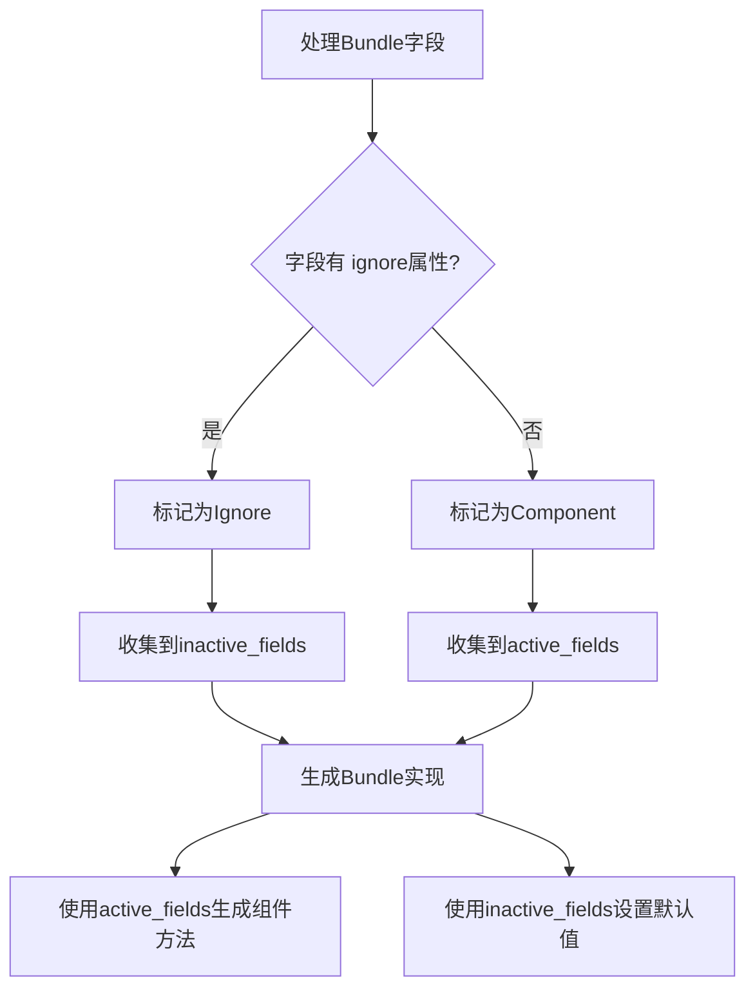

+++
title = "#19749 Refactor bundle derive"
date = "2025-06-20T00:00:00"
draft = false
template = "pull_request_page.html"
in_search_index = false

[extra]
current_language = "zh-cn"
available_languages = {"en" = { name = "English", url = "/pull_request/bevy/2025-06/pr-19749-en-20250620" }, "zh-cn" = { name = "中文", url = "/pull_request/bevy/2025-06/pr-19749-zh-cn-20250620" }}
+++

## Refactor bundle derive

### 基本信息
- **标题**: Refactor bundle derive
- **PR链接**: https://github.com/bevyengine/bevy/pull/19749
- **作者**: SkiFire13
- **状态**: 已合并
- **标签**: C-Bug, A-ECS, C-Code-Quality, S-Ready-For-Final-Review, X-Uncontroversial, D-Straightforward
- **创建时间**: 2025-06-20T05:31:16Z
- **合并时间**: 2025-06-20T16:53:19Z
- **合并人**: alice-i-cecile

### 描述翻译
**目标**

- 从 #19491 中拆分出来
- 使向 `Bundle` 派生宏添加生成代码更容易
- 修复当多个字段被 `#[bundle(ignore)]` 时的 bug

**解决方案**

- 不再为每个方法在单独的 `Vec` 中累积代码，而是只累积非忽略字段的名称和类型，然后使用 `quote` 在方法体中为每个字段生成代码
- 为了修复 bug，修改填充 `BundleFieldKind` 的代码，每个字段只推入一次（之前每个 `#[bundle(ignore)]` 会导致推入两次：一次是 `BundleFieldKind::Ignore`，然后无条件再推入 `BundleFieldKind::Component`）

**测试**

- 为修复的 bug 添加了回归测试

### 这个PR的故事

这个PR起源于对Bevy的ECS（实体组件系统）中Bundle派生宏的改进需求。Bundle是Bevy ECS的核心概念，允许开发者将多个组件组合成一个逻辑单元。之前的实现有两个主要问题：首先，代码生成逻辑复杂且重复；其次，当多个字段被标记为`#[bundle(ignore)]`时存在bug。

在原始实现中，Bundle派生宏为每个方法（如`component_ids`、`get_components`等）分别维护单独的向量(Vec)来累积代码片段。例如：

```rust
// 重构前：为每个方法单独累积代码
let mut field_component_ids = Vec::new();
let mut field_get_component_ids = Vec::new();
// ...其他向量
```

这种方法导致代码重复且难以维护。更严重的是字段处理逻辑的bug：当字段标记为`#[bundle(ignore)]`时，代码会错误地将其添加到`field_kind`向量两次。第一次正确添加为`Ignore`，但随后又无条件添加为`Component`：

```rust
// 重构前有bug的字段处理
for field in named_fields {
    if has_ignore_attr {
        field_kind.push(BundleFieldKind::Ignore);
    }
    field_kind.push(BundleFieldKind::Component); // 错误添加
}
```

这个bug会导致被忽略的字段被错误地当作组件处理，引发未定义行为。

解决方案的核心是重构字段处理逻辑。首先修复字段类型判断：每个字段现在只被分类一次，默认是`Component`，只有明确标记`ignore`时才设为`Ignore`：

```rust
// 修复后的字段处理
for field in named_fields {
    let mut kind = BundleFieldKind::Component; // 默认值
    
    if has_ignore_attr {
        kind = BundleFieldKind::Ignore;
    }
    
    field_kind.push(kind); // 只添加一次
}
```

接着重构代码生成策略。不再为每个方法单独生成代码片段，而是收集所有非忽略字段的类型和标识符：

```rust
let mut active_field_types = Vec::new();
let mut active_field_tokens = Vec::new();
let mut inactive_field_tokens = Vec::new();

for (field_type, field_kind, field) in ... {
    match field_kind {
        BundleFieldKind::Component => {
            active_field_types.push(field_type);
            active_field_tokens.push(field.to_token_stream());
        }
        BundleFieldKind::Ignore => {
            inactive_field_tokens.push(field.to_token_stream());
        }
    }
}
```

然后使用这些集合统一生成所有方法实现：

```rust
let bundle_impl = quote! {
    impl #impl_generics Bundle for #struct_name #ty_generics #where_clause {
        fn component_ids(...) {
            #(<#active_field_types as Bundle>::component_ids(components, ids);)*
        }
        // 其他方法类似
    }
};
```

这种方法显著简化了代码结构，从原来的5个独立代码生成向量减少到3个统一的字段集合。同时修复了多忽略字段的bug，确保被忽略的字段不会被错误处理。

最后添加了回归测试验证修复效果：

```rust
// 测试多个忽略字段的情况
#[derive(Bundle)]
struct Ignore {
    #[bundle(ignore)]
    foo: i32,
    #[bundle(ignore)]
    bar: i32,
}
```

### 关键文件变更

1. **crates/bevy_ecs/macros/src/lib.rs**
   - 重构了Bundle派生宏的实现
   - 修复了多忽略字段的bug
   - 简化了代码生成逻辑

重构前字段处理：
```rust
for field in named_fields {
    for attr in ... {
        if bundle ignore attribute found {
            field_kind.push(BundleFieldKind::Ignore);
        }
    }
    field_kind.push(BundleFieldKind::Component); // 无条件添加
}
```

重构后字段处理：
```rust
for field in named_fields {
    let mut kind = BundleFieldKind::Component;
    
    if bundle ignore attribute found {
        kind = BundleFieldKind::Ignore;
    }
    
    field_kind.push(kind); // 每个字段只添加一次
}
```

代码生成优化（前）：
```rust
let mut field_component_ids = Vec::new();
let mut field_get_component_ids = Vec::new();
// ...多个向量

for ... {
    match field_kind {
        Component => {
            field_component_ids.push(quote! { ... });
            field_get_component_ids.push(quote! { ... });
            // ...每个方法单独处理
        }
    }
}
```

代码生成优化（后）：
```rust
let mut active_field_types = Vec::new();
let mut active_field_tokens = Vec::new();

for ... {
    match field_kind {
        Component => {
            active_field_types.push(field_type);
            active_field_tokens.push(field.to_token_stream());
        }
    }
}

let bundle_impl = quote! {
    impl ... {
        fn component_ids(...) {
            #(<#active_field_types as Bundle>::component_ids(...);)*
        }
        // 其他方法使用相同的字段集合
    }
};
```

2. **crates/bevy_ecs/src/bundle.rs**
   - 添加了多忽略字段的测试用例

```rust
#[derive(Bundle)]
#[expect(unused, reason = "tests the output of the derive macro is valid")]
struct Ignore {
    #[bundle(ignore)]
    foo: i32,
    #[bundle(ignore)]
    bar: i32,
}
```

### 技术示意图



### 进一步阅读

1. [Bevy ECS Bundles文档](https://bevyengine.org/learn/book/getting-started/ecs/#bundles)
2. [Rust过程宏指南](https://doc.rust-lang.org/reference/procedural-macros.html)
3. [quote库文档](https://docs.rs/quote/latest/quote/) - Rust代码生成工具
4. [syn库文档](https://docs.rs/syn/latest/syn/) - Rust语法解析工具