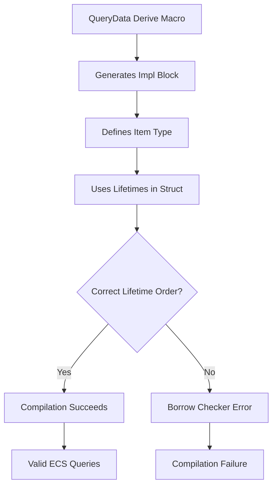

+++
title = "#19750 Fix QueryData derive codegen"
date = "2025-06-20T00:00:00"
draft = false
template = "pull_request_page.html"
in_search_index = true

[taxonomies]
list_display = ["show"]

[extra]
current_language = "en"
available_languages = {"en" = { name = "English", url = "/pull_request/bevy/2025-06/pr-19750-en-20250620" }, "zh-cn" = { name = "中文", url = "/pull_request/bevy/2025-06/pr-19750-zh-cn-20250620" }}
labels = ["C-Bug", "A-ECS", "D-Straightforward"]
+++

# Fix QueryData derive codegen

## Basic Information
- **Title**: Fix QueryData derive codegen
- **PR Link**: https://github.com/bevyengine/bevy/pull/19750
- **Author**: ecoskey
- **Status**: MERGED
- **Labels**: C-Bug, A-ECS, S-Ready-For-Final-Review, D-Straightforward
- **Created**: 2025-06-20T07:22:49Z
- **Merged**: 2025-06-20T16:06:25Z
- **Merged By**: alice-i-cecile

## Description Translation
Custom derived `QueryData` impls currently generate `Item` structs with the lifetimes swapped, which blows up the borrow checker sometimes.

See: https://discord.com/channels/691052431525675048/749335865876021248/1385509416086011914

could add a regression test, TBH I don't know the error well enough to do that minimally. Seems like it's that both lifetimes on `QueryData::Item` need to be covariant, but I'm not sure.

## The Story of This Pull Request

### The Problem and Context
The Bevy engine's ECS system uses a `QueryData` derive macro to generate boilerplate code for query types. A bug was discovered where custom derived implementations were generating structs with swapped lifetimes for `QueryData::Item`. This caused borrow checker failures due to incorrect lifetime variance. The issue manifested when developers created custom query types using the derive macro, leading to compilation errors that were difficult to diagnose. The problem was reported in the Bevy Discord community, highlighting its impact on real-world usage.

### The Solution Approach
The root cause was identified in the macro's generic parameter ordering. The original implementation inserted lifetimes in an order that inverted their positions in the generated code. The solution required adjusting the insertion order of two lifetime parameters (`'__w` and `'__s`) in the generated generic type parameters. This ensures the world lifetime (`'__w`) appears before the state lifetime (`'__s`), matching the expected variance requirements of the `QueryData` trait.

### The Implementation
The fix modifies the order of lifetime parameter insertion in the macro's code generation logic. Originally, the state lifetime was inserted at index 0 followed by the world lifetime at index 0 (pushing the state lifetime to index 1). The corrected version inserts the world lifetime at index 0 first, then inserts the state lifetime at index 1, maintaining proper ordering.

Key technical insight: The `QueryData` trait requires covariance in both lifetimes of its associated `Item` type. Swapping the lifetimes violated this requirement, causing the borrow checker to reject valid code. The fix ensures the generated code matches the trait's lifetime ordering expectations.

### The Impact
This change resolves borrow checker errors in custom `QueryData` implementations without affecting existing functionality. It maintains backward compatibility while fixing a subtle code generation issue. Developers can now use the derive macro without encountering confusing lifetime errors. The fix is minimal (single-line change) and focused, reducing risk of unintended side effects.

## Visual Representation



## Key Files Changed

### crates/bevy_ecs/macros/src/query_data.rs
This file contains the derive macro implementation for `QueryData`. The change fixes the order of lifetime parameter insertion in the generated generic type parameters.

**Before:**
```rust
let user_generics_with_world_and_state = {
    let mut generics = ast.generics;
    generics.params.insert(0, parse_quote!('__w));
    generics.params.insert(0, parse_quote!('__s));
    generics
};
```

**After:**
```rust
let user_generics_with_world_and_state = {
    let mut generics = ast.generics;
    generics.params.insert(0, parse_quote!('__w));
    generics.params.insert(1, parse_quote!('__s));
    generics
};
```

The change swaps the insertion order:
1. World lifetime (`'__w`) inserted at position 0
2. State lifetime (`'__s`) inserted at position 1 (after `'__w`)
Previously, both were inserted at position 0, causing inverted ordering.

## Further Reading
- [Bevy ECS Query System Documentation](https://bevyengine.org/learn/book/ecs/queries/)
- [Rust Lifetime Variance Explained](https://doc.rust-lang.org/nomicon/subtyping.html)
- [Procedural Macros Guide](https://doc.rust-lang.org/reference/procedural-macros.html)
- [Original Discord Discussion](https://discord.com/channels/691052431525675048/749335865876021248/1385509416086011914)