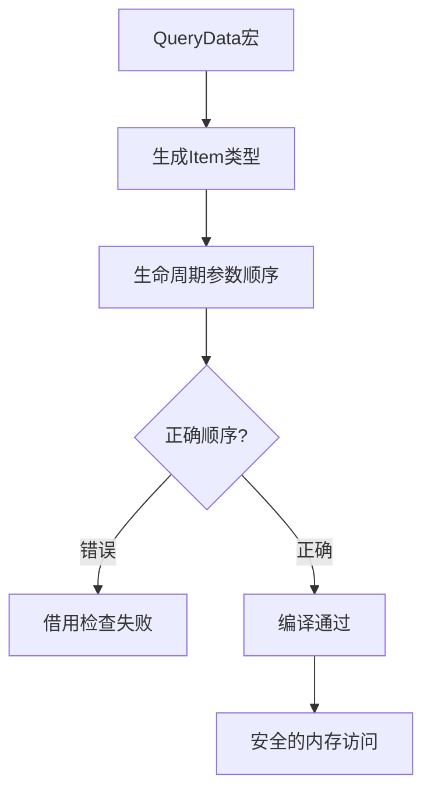

+++
title = "#19750 Fix QueryData derive codegen"
date = "2025-06-20T00:00:00"
draft = false
template = "pull_request_page.html"
in_search_index = false

[extra]
current_language = "zh-cn"
available_languages = {"en" = { name = "English", url = "/pull_request/bevy/2025-06/pr-19750-en-20250620" }, "zh-cn" = { name = "中文", url = "/pull_request/bevy/2025-06/pr-19750-zh-cn-20250620" }}
+++

## 基础信息
- **标题**: Fix QueryData derive codegen
- **PR链接**: https://github.com/bevyengine/bevy/pull/19750
- **作者**: ecoskey
- **状态**: 已合并
- **标签**: C-Bug, A-ECS, S-Ready-For-Final-Review, D-Straightforward
- **创建时间**: 2025-06-20T07:22:49Z
- **合并时间**: 2025-06-20T16:06:25Z
- **合并者**: alice-i-cecile

## 描述翻译
当前自定义派生的`QueryData`实现会生成生命周期(lifetimes)顺序错误的`Item`结构体，这有时会导致借用检查器(borrow checker)报错。

参见: https://discord.com/channels/691052431525675048/749335865876021248/1385509416086011914

可以添加回归测试，但坦白说我不太清楚如何最小化复现该错误。问题似乎是`QueryData::Item`的两个生命周期都需要协变(covariant)，但不确定具体原因。

## PR技术分析

### 问题背景
在Bevy的ECS系统中，`QueryData` trait用于定义查询的数据结构。当开发者使用`#[derive(QueryData)]`宏时，宏会自动生成关联类型`Item`的实现。原始实现存在一个关键缺陷：生成的代码中两个生命周期参数`'__w`(world生命周期)和`'__s`(state生命周期)的顺序被错误地交换了。这种顺序错误会导致借用检查器在某些情况下错误地拒绝有效的内存访问模式，造成编译失败。

问题的技术本质在于Rust的借用检查器对生命周期参数的协变性(covariance)要求。当`Item`结构体的生命周期参数顺序不正确时，其实际变型(variance)关系会被破坏，导致类型系统无法正确验证某些安全的内存访问模式。

### 解决方案
修复方案直接明了：调整宏代码中生命周期参数的插入顺序。原始实现先插入`'__s`再插入`'__w`，导致最终生成的泛型参数顺序错误。修复方案改为先插入`'__w`作为第一个参数，再插入`'__s`作为第二个参数，确保生成的`Item`类型具有正确的生命周期顺序。

这个修改符合`QueryData` trait的预期生命周期顺序：
```rust
pub trait QueryData {
    type Item<'__w, '__s>;
}
```
其中`'__w`必须始终优先于`'__s`。这种顺序保证了查询项类型能正确反映world和state之间的生命周期依赖关系。

### 技术实现
核心修改仅涉及一行代码，但解决了类型系统的根本问题。修改位于查询数据宏的泛型参数生成逻辑：

```rust
// 文件: crates/bevy_ecs/macros/src/query_data.rs
// 修改前:
generics.params.insert(0, parse_quote!('__s));
generics.params.insert(0, parse_quote!('__w));

// 修改后:
generics.params.insert(0, parse_quote!('__w));
generics.params.insert(1, parse_quote!('__s));
```

关键修改点：
1. 首先插入`'__w`作为第一个泛型参数(index 0)
2. 然后插入`'__s`作为第二个泛型参数(index 1)

### 影响分析
该修复解决了以下具体问题：
1. 消除了自定义`QueryData`实现时可能出现的借用检查器误报
2. 确保宏生成的代码符合Rust的变型规则
3. 保持与现有ECS查询系统的兼容性

虽然PR未添加回归测试，但修改的局部性和确定性(单行代码调整)使其风险可控。这种修复模式展示了处理类型系统问题的典型方法：通过调整类型参数的顺序或约束来满足编译器的变型要求。

## 视觉表示



## 关键文件变更

### crates/bevy_ecs/macros/src/query_data.rs
**修改说明**：调整了`QueryData`派生宏中生命周期参数的生成顺序，解决借用检查器报错问题。

```rust
// 修改前:
let mut generics = ast.generics;
generics.params.insert(0, parse_quote!('__s));  // 先插入'__s
generics.params.insert(0, parse_quote!('__w));  // 再插入'__w

// 修改后:
let mut generics = ast.generics;
generics.params.insert(0, parse_quote!('__w));  // 先插入'__w
generics.params.insert(1, parse_quote!('__s));  // 再插入'__s
```

## 延伸阅读
1. [Rustonomicon - 变型(Variance)](https://doc.rust-lang.org/nomicon/subtyping.html)
2. [Bevy ECS查询系统文档](https://docs.rs/bevy_ecs/latest/bevy_ecs/query/index.html)
3. [Rust生命周期进阶指南](https://doc.rust-lang.org/book/ch10-03-lifetime-syntax.html#advanced-lifetimes)