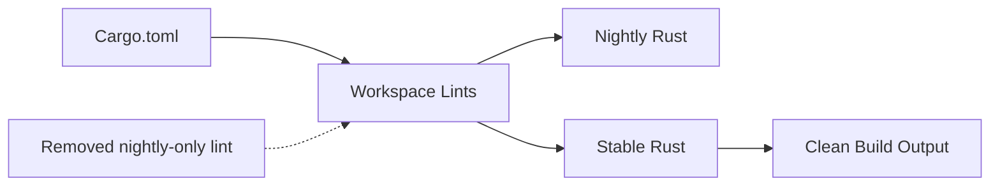

+++
title = "#19756 don't allow nightly lints"
date = "2025-06-21T00:00:00"
draft = false
template = "pull_request_page.html"
in_search_index = true

[taxonomies]
list_display = ["show"]

[extra]
current_language = "en"
available_languages = {"en" = { name = "English", url = "/pull_request/bevy/2025-06/pr-19756-en-20250621" }, "zh-cn" = { name = "中文", url = "/pull_request/bevy/2025-06/pr-19756-zh-cn-20250621" }}
labels = ["A-Build-System", "X-Blessed"]
+++

# Technical Analysis of PR #19756: "don't allow nightly lints"

## Basic Information
- **Title**: don't allow nightly lints
- **PR Link**: https://github.com/bevyengine/bevy/pull/19756
- **Author**: mockersf
- **Status**: MERGED
- **Labels**: A-Build-System, S-Ready-For-Final-Review, X-Blessed
- **Created**: 2025-06-20T23:16:57Z
- **Merged**: 2025-06-21T00:01:15Z
- **Merged By**: alice-i-cecile

## Description Translation
# Objective

- A nightly only lint is allowed in cargo.toml, making all stable builds issue warning
- Fixes #19528 

## Solution

- Don't allow nightly lints

## The Story of This Pull Request

The problem started when developers using stable Rust toolchains encountered unnecessary compiler warnings during Bevy builds. The root cause was a lint configuration in the project's Cargo.toml file that specified `mismatched_lifetime_syntaxes = "allow"`. This lint is only available in nightly Rust builds, but was being applied to stable builds as well. When stable Rust encountered this configuration, it generated a warning about an unknown lint option since stable Rust doesn't recognize `mismatched_lifetime_syntaxes`.

This situation violated the principle of keeping builds clean and warning-free by default. The issue (#19528) specifically reported that stable builds were producing warnings that couldn't be fixed by users since they originated from project configuration. This created noise in build outputs and could mask legitimate warnings.

The solution approach was straightforward: remove the nightly-specific lint configuration. Since this lint isn't applicable to stable Rust and only served to generate false warnings, it didn't provide value to most users. The developer considered alternative approaches like conditional compilation based on toolchain version, but determined that was unnecessarily complex for this specific case. The simplest and most maintainable solution was complete removal of the problematic configuration line.

The implementation consisted of a single-line deletion in the workspace lints section of Cargo.toml. By removing `mismatched_lifetime_syntaxes = "allow"`, the configuration no longer references a nightly-only lint. This change eliminated the warning for stable Rust users without affecting nightly users, as nightly Rust would simply apply its default behavior for this lint.

The impact of this change is immediately beneficial: stable Rust users no longer see extraneous warnings during builds. This maintains the integrity of the warning system and prevents false positives from cluttering build outputs. The change also simplifies the configuration by removing an unnecessary, toolchain-specific setting.

## Visual Representation



## Key Files Changed

### `Cargo.toml`
This file defines the project's Rust workspace and build configuration. The change removes a nightly-only lint configuration that was causing warnings in stable Rust builds.

Before:
```toml
[workspace.lints.rust]
missing_docs = "warn"
mismatched_lifetime_syntaxes = "allow"
unexpected_cfgs = { level = "warn", check-cfg = ['cfg(docsrs_dep)'] }
```

After:
```toml
[workspace.lints.rust]
missing_docs = "warn"
unexpected_cfgs = { level = "warn", check-cfg = ['cfg(docsrs_dep)'] }
```

The removal of the `mismatched_lifetime_syntaxes` line addresses the core issue by eliminating the reference to a nightly-only lint that wasn't recognized by stable Rust compilers.

## Further Reading
1. [Rust Lint Documentation](https://doc.rust-lang.org/rustc/lints/index.html) - Official reference for Rust lints
2. [Cargo Workspace Configuration](https://doc.rust-lang.org/cargo/reference/workspaces.html) - How to configure Rust workspaces
3. [Issue #19528](https://github.com/bevyengine/bevy/issues/19528) - Original issue report describing the problem
4. [Rust Edition Guide](https://doc.rust-lang.org/edition-guide/) - Understanding Rust editions and compatibility

## Full Code Diff
```diff
diff --git a/Cargo.toml b/Cargo.toml
index d2e5b92258d79..532860125e28e 100644
--- a/Cargo.toml
+++ b/Cargo.toml
@@ -72,7 +72,6 @@ allow_attributes_without_reason = "warn"
 
 [workspace.lints.rust]
 missing_docs = "warn"
-mismatched_lifetime_syntaxes = "allow"
 unexpected_cfgs = { level = "warn", check-cfg = ['cfg(docsrs_dep)'] }
 unsafe_code = "deny"
 unsafe_op_in_unsafe_fn = "warn"
```