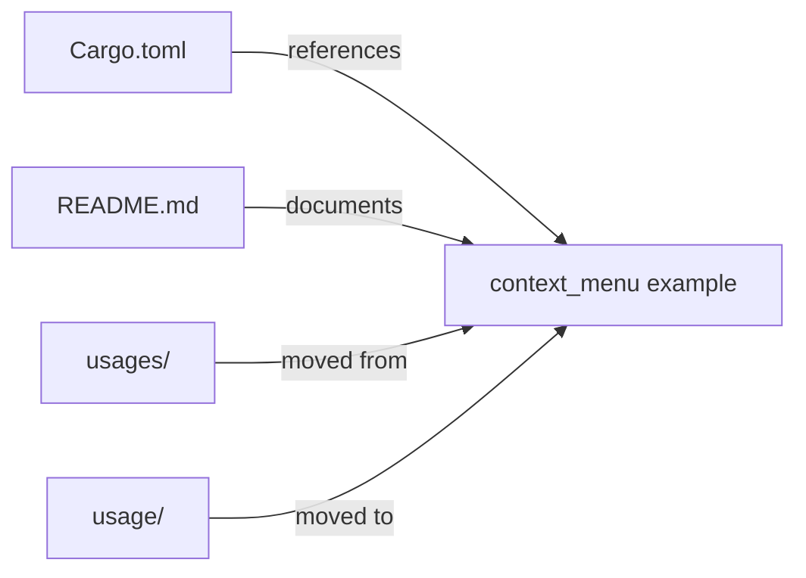

+++
title = "#19757 Move `usages` folder to `usage`"
date = "2025-06-21T00:00:00"
draft = false
template = "pull_request_page.html"
in_search_index = true

[taxonomies]
list_display = ["show"]

[extra]
current_language = "en"
available_languages = {"en" = { name = "English", url = "/pull_request/bevy/2025-06/pr-19757-en-20250621" }, "zh-cn" = { name = "中文", url = "/pull_request/bevy/2025-06/pr-19757-zh-cn-20250621" }}
labels = ["D-Trivial", "C-Examples"]
+++

## Move `usages` folder to `usage`

### Basic Information
- **Title**: Move `usages` folder to `usage`
- **PR Link**: https://github.com/bevyengine/bevy/pull/19757
- **Author**: hukasu
- **Status**: MERGED
- **Labels**: D-Trivial, C-Examples, S-Ready-For-Final-Review
- **Created**: 2025-06-20T23:45:36Z
- **Merged**: 2025-06-21T00:24:04Z
- **Merged By**: alice-i-cecile

### Description Translation
# Objective

There were 2 folders inside of `examples`, each with 1 example, and with similar folder names.

## Solution

Move the example in the `usages` folder to `usage`.

## Testing

`cargo run -p ci`

### The Story of This Pull Request

The problem started with a minor inconsistency in the Bevy engine's examples directory structure. Two folders existed with similar names: `usage` and `usages`. Each contained only one example file (`cooldown.rs` in `usage` and `context_menu.rs` in `usages`). This naming similarity created potential confusion for developers exploring the examples, as the folder names were nearly identical yet referred to separate directories. The duplication also violated the principle of maintaining a clean and consistent project structure.

The solution approach was straightforward: consolidate the examples under a single folder name to eliminate the naming ambiguity. The developer chose to move `context_menu.rs` from `usages` to `usage` since `usage` was the more grammatically conventional term. This decision preserved existing functionality while simplifying the directory structure. No code changes were required since this was purely an organizational improvement.

The implementation involved three coordinated changes. First, the `Cargo.toml` manifest was updated to point to the new file location for the context menu example. Second, the examples README documentation was modified to reflect the new path. Finally, the actual file move operation was performed. The entire change set was minimal but effective, touching only three files with simple modifications.

The impact of these changes is improved codebase maintainability and reduced cognitive load for developers. By eliminating the similarly-named directories, the project reduces the risk of developers looking in the wrong location for examples. The change also sets a precedent for consistent naming conventions in the examples directory. The trivial nature of the change was confirmed by running `cargo run -p ci` to verify that all examples still compiled correctly after the relocation.

### Visual Representation



### Key Files Changed

1. **Cargo.toml**  
   Updated the example path to reflect the new file location  
   ```diff
   [[example]]
   name = "context_menu"
   - path = "examples/usages/context_menu.rs"
   + path = "examples/usage/context_menu.rs"
   doc-scrape-examples = true
   ```

2. **examples/README.md**  
   Corrected documentation link to match new file path  
   ```diff
   Example | Description
   --- | ---
   -[Context Menu](../examples/usages/context_menu.rs) | Example of a context menu
   +[Context Menu](../examples/usage/context_menu.rs) | Example of a context menu
   [Cooldown](../examples/usage/cooldown.rs) | Example for cooldown on button clicks
   ```

3. **examples/usage/context_menu.rs**  
   File moved without content changes (100% similarity)  
   ```bash
   rename from examples/usages/context_menu.rs
   rename to examples/usage/context_menu.rs
   ```

### Further Reading
1. [Bevy Examples Documentation](https://github.com/bevyengine/bevy/tree/main/examples)  
2. [Rust Workspace Configuration](https://doc.rust-lang.org/cargo/reference/workspaces.html)  
3. [Semantic File Organization Best Practices](https://en.wikipedia.org/wiki/File_system#File_names_and_paths)