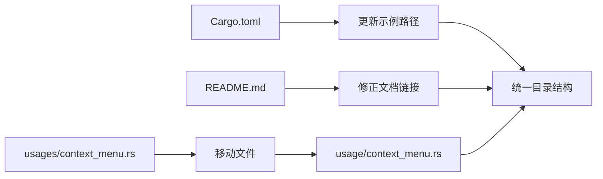

+++
title = "#19757 Move `usages` folder to `usage"
date = "2025-06-21T00:00:00"
draft = false
template = "pull_request_page.html"
in_search_index = false

[extra]
current_language = "zh-cn"
available_languages = {"en" = { name = "English", url = "/pull_request/bevy/2025-06/pr-19757-en-20250621" }, "zh-cn" = { name = "中文", url = "/pull_request/bevy/2025-06/pr-19757-zh-cn-20250621" }}
+++

# Move `usages` folder to `usage`

## 基本信息
- **标题**: Move `usages` folder to `usage`
- **PR链接**: https://github.com/bevyengine/bevy/pull/19757
- **作者**: hukasu
- **状态**: 已合并
- **标签**: D-Trivial, C-Examples, S-Ready-For-Final-Review
- **创建时间**: 2025-06-20T23:45:36Z
- **合并时间**: 2025-06-21T00:24:04Z
- **合并者**: alice-i-cecile

## 描述翻译

# Objective（目标）

在`examples`目录下有两个文件夹，每个文件夹包含一个示例，并且这两个文件夹名称相似。

# Solution（解决方案）

将`usages`文件夹中的示例移动到`usage`文件夹。

# Testing（测试）

运行`cargo run -p ci`

## 这个PR的故事

这个PR源于Bevy引擎示例目录中的命名不一致问题。在`examples`目录下存在两个名称相似的文件夹：`usages`和`usage`。这两个文件夹各自包含一个示例文件（`context_menu.rs`和`cooldown.rs`），这种命名方式容易造成混淆且不够直观。

开发者识别到这个命名问题后，决定简化目录结构。解决方案是将`usages`文件夹重命名为`usage`，并将其中唯一的示例文件移动到新位置。这种变更属于典型的代码库维护工作，旨在提高项目的可读性和一致性。

实现过程涉及三个关键修改：
1. 更新`Cargo.toml`中的示例路径引用
2. 修改`README.md`中的文档链接
3. 实际移动文件位置

在`Cargo.toml`中，修改了`context_menu`示例的路径指向新的位置。在`examples/README.md`中，更新了`Context Menu`示例的文档链接。最后，将`context_menu.rs`文件从`usages`移动到`usage`目录，保持了文件内容的完整性。

验证过程通过运行`cargo run -p ci`完成，确保示例仍然能正常编译运行。这种简单的重构不需要修改任何代码逻辑，但通过统一目录命名提高了代码库的整洁度。变更后，所有相关示例都位于统一的`usage`目录下，消除了命名相似性可能导致的混淆。

## 视觉表示



## 关键文件更改

1. **Cargo.toml**
   - 修改原因：更新示例路径引用
   - 代码片段：
```diff
diff --git a/Cargo.toml b/Cargo.toml
index d2e5b92258d79..73c5534243c1d 100644
--- a/Cargo.toml
+++ b/Cargo.toml
@@ -608,7 +608,7 @@ web-sys = { version = "0.3", features = ["Window"] }
 
 [[example]]
 name = "context_menu"
-path = "examples/usages/context_menu.rs"
+path = "examples/usage/context_menu.rs"
 doc-scrape-examples = true
 
 [package.metadata.example.context_menu]
```

2. **examples/README.md**
   - 修改原因：修正文档中的示例链接
   - 代码片段：
```diff
diff --git a/examples/README.md b/examples/README.md
index bccadd438eab9..7b21d15da3ba0 100644
--- a/examples/README.md
+++ b/examples/README.md
@@ -584,7 +584,7 @@ Example | Description
 
 Example | Description
 --- | ---
-[Context Menu](../examples/usages/context_menu.rs) | Example of a context menu
+[Context Menu](../examples/usage/context_menu.rs) | Example of a context menu
 [Cooldown](../examples/usage/cooldown.rs) | Example for cooldown on button clicks
 
 ## Window
```

3. **examples/usages/context_menu.rs → examples/usage/context_menu.rs**
   - 修改原因：移动文件到统一目录
   - 说明：文件内容未改变，仅位置变更

## 进一步阅读

1. Bevy示例组织结构文档：https://github.com/bevyengine/bevy/tree/main/examples
2. Cargo工作区配置指南：https://doc.rust-lang.org/cargo/reference/workspaces.html
3. 语义化版本控制规范：https://semver.org/ (与Cargo.toml管理相关)