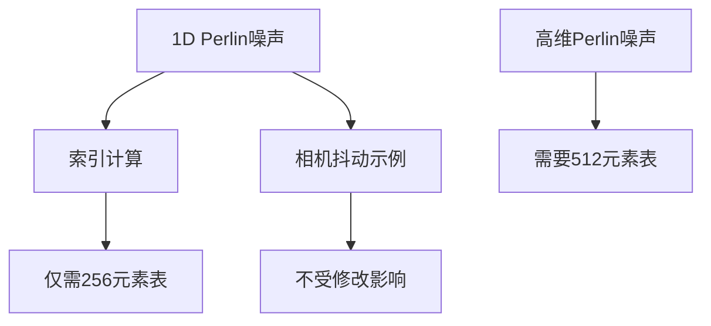

+++
title = "#19765 Remove unused code in Perlin noise 1D impl"
date = "2025-06-21T00:00:00"
draft = false
template = "pull_request_page.html"
in_search_index = false

[extra]
current_language = "zh-cn"
available_languages = {"en" = { name = "English", url = "/pull_request/bevy/2025-06/pr-19765-en-20250621" }, "zh-cn" = { name = "中文", url = "/pull_request/bevy/2025-06/pr-19765-zh-cn-20250621" }}
labels = ["D-Trivial", "C-Examples", "A-Math"]
+++

# Perlin噪声实现中移除未使用代码的技术分析

## Basic Information
- **Title**: Remove unused code in Perlin noise 1D impl
- **PR Link**: https://github.com/bevyengine/bevy/pull/19765
- **Author**: janhohenheim
- **Status**: MERGED
- **Labels**: D-Trivial, C-Examples, S-Ready-For-Final-Review, A-Math
- **Created**: 2025-06-21T13:28:56Z
- **Merged**: 2025-06-21T15:24:29Z
- **Merged By**: alice-i-cecile

## Description Translation
### 目标

- 修复 #19759 
- 更大的排列表(permutation table)仅在高维(>1)情况下使用，此时需要执行`PERMUTATION_TABLE[PERMUTATION_TABLE[index] + some_number]`操作
  - 更大的排列表没有数学意义，仅用于避免高维嵌套查找时多次编写`& 0xFF`
- 但在相机抖动中我们仅使用1D Perlin噪声，因为我们需要维度不相关

### 解决方案

- 因此，我们可以裁剪排列表 :)
  - 从数学角度这应是等价的，因为取模后的值在大表中访问的元素与未取模值相同
- 原注释也有些误导。"mirror"不是指"镜像值"而是"重复值"

### 测试

- 运行示例，行为与之前一致

## The Story of This Pull Request

### 问题背景与上下文
在Bevy引擎的2D屏幕抖动示例中，使用了一维Perlin噪声生成相机抖动效果。Perlin噪声实现包含一个512字节的排列表(PERMUTATION_TABLE)，但实际上一维噪声计算仅需要256字节的表。问题源于：
1. 高维Perlin噪声(如2D/3D)需要扩展排列表(512元素)来避免频繁的索引取模操作
2. 但一维实现中，所有索引访问都通过`& 0xFF`取模，因此512元素表的后半部分从未使用
3. 当前表结构浪费了256字节内存，且相关注释("second half is a mirror")表述不准确

### 解决方案与实现
解决方案直接明了：将排列表缩减至实际需要的256元素，并修正注释：
1. 修改索引计算逻辑，显式处理相邻点索引
2. 将PERMUTATION_TABLE大小从512减至256
3. 更新注释准确描述表内容

关键修改在噪声生成函数：
```rust
// 修改前
let xi = xi0 & 0xFF;
let h0 = PERMUTATION_TABLE[xi];
let h1 = PERMUTATION_TABLE[xi + 1];

// 修改后
let xi0 = x_floor & 0xFF;
let xi1 = (x_floor + 1) & 0xFF; // 显式计算相邻索引
let h0 = PERMUTATION_TABLE[xi0];
let h1 = PERMUTATION_TABLE[xi1];
```
这种修改保持数学等价性，因为：
- 索引计算始终通过`& 0xFF`包装到0-255范围
- 相邻点索引显式计算并取模，避免依赖扩展表

### 技术洞察
1. **排列表作用**：Perlin噪声使用排列表提供伪随机梯度选择，标准实现使用256随机字节
2. **扩展表目的**：高维噪声中，索引计算形如`PERM[PERM[i] + j]`，扩展表避免中间结果取模
3. **一维特殊性**：一维噪声仅需`PERM[i]`和`PERM[i+1]`，且`i+1`可通过`(i+1) & 0xFF`安全计算
4. **位掩码等价性**：`x & 0xFF`在256元素表中等效于在512元素表中访问相同位置

### 影响与改进
1. **内存优化**：减少256字节内存占用（对于示例代码虽小但消除不必要浪费）
2. **代码清晰度**：
   - 移除未使用代码，表大小与实际需求匹配
   - 注释更准确描述"随机序列"而非"镜像"
3. **维护性**：避免未来开发者误解表结构或尝试使用"镜像"部分
4. **正确性验证**：运行测试确认相机抖动行为不变，证明修改等价性

## Visual Representation



## Key Files Changed

### `examples/camera/2d_screen_shake.rs`
**修改说明**：优化一维Perlin噪声实现，移除未使用的排列表后半部分  
**关联PR目标**：减少内存占用并澄清实现细节

```rust
// 修改前：
let xi = xi0 & 0xFF;
let h0 = PERMUTATION_TABLE[xi];
let h1 = PERMUTATION_TABLE[xi + 1];

// Perlin noise permutation table, the second half is a mirror of the first half.
const PERMUTATION_TABLE: [u8; 512] = [
    0x97, 0xA0, ... , 0x9C, 0xB4,
    0x97, 0xA0, ... , 0x9C, 0xB4 // 重复部分
];

// 修改后：
let xi0 = x_floor & 0xFF;
let xi1 = (x_floor + 1) & 0xFF;
let h0 = PERMUTATION_TABLE[xi0];
let h1 = PERMUTATION_TABLE[xi1];

// Perlin noise permutation table. This is a random sequence of the numbers 0-255.
const PERMUTATION_TABLE: [u8; 256] = [
    0x97, 0xA0, ... , 0x9C, 0xB4 // 仅保留唯一部分
];
```

## Further Reading
1. [Perlin Noise原始论文](https://dl.acm.org/doi/10.1145/325165.325247) - 理解算法核心原理
2. [Ken Perlin改进噪声](https://mrl.cs.nyu.edu/~perlin/paper445.pdf) - 包含排列表优化技术
3. [Bevy相机抖动示例](https://github.com/bevyengine/bevy/blob/main/examples/camera/2d_screen_shake.rs) - 完整上下文实现
4. [噪声函数维基](https://en.wikipedia.org/wiki/Perlin_noise) - 基础概念与数学背景