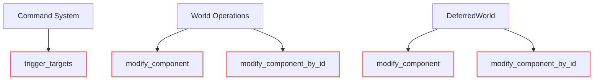

+++
title = "#19769 add missing `#[track_caller]`"
date = "2025-06-21T00:00:00"
draft = false
template = "pull_request_page.html"
in_search_index = true

[taxonomies]
list_display = ["show"]

[extra]
current_language = "en"
available_languages = {"en" = { name = "English", url = "/pull_request/bevy/2025-06/pr-19769-en-20250621" }, "zh-cn" = { name = "中文", url = "/pull_request/bevy/2025-06/pr-19769-zh-cn-20250621" }}
labels = ["C-Bug", "D-Trivial", "A-ECS"]
+++

## Pull Request Analysis: #19769 - add missing `#[track_caller]`

### Basic Information
- **Title**: add missing `#[track_caller]`
- **PR Link**: https://github.com/bevyengine/bevy/pull/19769
- **Author**: eugineerd
- **Status**: MERGED
- **Labels**: C-Bug, D-Trivial, A-ECS, S-Ready-For-Final-Review
- **Created**: 2025-06-21T14:24:55Z
- **Merged**: 2025-06-21T18:25:39Z
- **Merged By**: alice-i-cecile

### Description Translation
**Objective**

I've noticed that some methods with `MaybeLocation::caller` don't have `#[track_caller]` which resulted in wrong locations reported when `track_location` is enabled.

**Solution**

add `#[track_caller]` to them.

### The Story of This Pull Request

This PR addresses a specific debugging issue in Bevy's ECS (Entity Component System) where certain methods weren't properly propagating caller location information. When `track_location` is enabled (Bevy's system for tracking where operations occur), methods using `MaybeLocation::caller` were reporting incorrect locations due to missing `#[track_caller]` attributes. This made debugging more difficult as error traces pointed to internal framework code instead of user code where the actual call originated.

The solution was straightforward but required careful identification of all affected methods. The author added `#[track_caller]` attributes to three methods across different ECS modules:
1. `trigger_targets` in the command system
2. `modify_component` and `modify_component_by_id` in both immediate and deferred world operations

These changes ensure that when these methods are called, the Rust compiler properly propagates the caller's location. This is particularly important for:
1. Error reporting - panic locations now correctly point to user code
2. Debugging - location tracking accurately reflects call hierarchy
3. Diagnostics - Bevy's internal instrumentation shows meaningful locations

The changes required no architectural modifications and maintained full backward compatibility. The implementation follows Rust's standard error location propagation pattern and integrates seamlessly with Bevy's existing `track_location` system.

### Visual Representation



### Key Files Changed

1. **crates/bevy_ecs/src/system/commands/command.rs**
   - Added `#[track_caller]` to `trigger_targets()` command
   - Ensures correct location tracking for entity event triggers

```rust
// Before:
pub fn trigger_targets(
    event: impl EntityEvent,
    targets: impl TriggerTargets + Send + Sync + 'static,
) -> impl Command {

// After:
#[track_caller]
pub fn trigger_targets(
    event: impl EntityEvent,
    targets: impl TriggerTargets + Send + Sync + 'static,
) -> impl Command {
```

2. **crates/bevy_ecs/src/world/deferred_world.rs**
   - Added location tracking to component modification methods
   - Affects both typed and untyped component access

```rust
// Before:
pub(crate) fn modify_component<T: Component, R>(
    &mut self,
    entity: Entity,
    f: impl FnOnce(&mut T) -> R,
) -> R {

// After:
#[track_caller]
pub(crate) fn modify_component<T: Component, R>(
    &mut self,
    entity: Entity,
    f: impl FnOnce(&mut T) -> R,
) -> R {

// Before:
pub(crate) fn modify_component_by_id<R>(
    &mut self,
    entity: Entity,
    component_id: ComponentId,
    f: impl FnOnce(&mut dyn Reflect) -> R,
) -> R {

// After:
#[track_caller]
pub(crate) fn modify_component_by_id<R>(
    &mut self,
    entity: Entity,
    component_id: ComponentId,
    f: impl FnOnce(&mut dyn Reflect) -> R,
) -> R {
```

3. **crates/bevy_ecs/src/world/mod.rs**
   - Added same fixes to immediate world operations
   - Maintains consistency between immediate and deferred APIs

```rust
// Before:
pub fn modify_component<T: Component, R>(
    &mut self,
    entity: Entity,
    f: impl FnOnce(&mut T) -> R,
) -> R {

// After:
#[track_caller]
pub fn modify_component<T: Component, R>(
    &mut self,
    entity: Entity,
    f: impl FnOnce(&mut T) -> R,
) -> R {

// Before:
pub fn modify_component_by_id<R>(
    &mut self,
    entity: Entity,
    component_id: ComponentId,
    f: impl FnOnce(&mut dyn Reflect) -> R,
) -> R {

// After:
#[track_caller]
pub fn modify_component_by_id<R>(
    &mut self,
    entity: Entity,
    component_id: ComponentId,
    f: impl FnOnce(&mut dyn Reflect) -> R,
) -> R {
```

### Further Reading
1. [Rust Documentation: `#[track_caller]`](https://doc.rust-lang.org/reference/attributes/diagnostics.html#the-track_caller-attribute)
2. [Bevy ECS: Commands](https://bevyengine.org/learn/book/next/programming/ecs/commands/)
3. [Bevy Reflection System](https://bevyengine.org/learn/book/next/programming/reflection/)
4. [Rust Error Handling: Unwrapping Explained](https://doc.rust-lang.org/std/result/enum.Result.html#method.unwrap)

### Full Code Diff
```diff
diff --git a/crates/bevy_ecs/src/system/commands/command.rs b/crates/bevy_ecs/src/system/commands/command.rs
index f3fc677e471b1..5f1f611856b83 100644
--- a/crates/bevy_ecs/src/system/commands/command.rs
+++ b/crates/bevy_ecs/src/system/commands/command.rs
@@ -223,6 +223,7 @@ pub fn trigger(event: impl Event) -> impl Command {
 }
 
 /// A [`Command`] that sends an [`EntityEvent`] for the given targets.
+#[track_caller]
 pub fn trigger_targets(
     event: impl EntityEvent,
     targets: impl TriggerTargets + Send + Sync + 'static,
diff --git a/crates/bevy_ecs/src/world/deferred_world.rs b/crates/bevy_ecs/src/world/deferred_world.rs
index edf4b186a37d5..f59f9e88dca28 100644
--- a/crates/bevy_ecs/src/world/deferred_world.rs
+++ b/crates/bevy_ecs/src/world/deferred_world.rs
@@ -96,6 +96,7 @@ impl<'w> DeferredWorld<'w> {
     /// If you do not need to ensure the above hooks are triggered, and your component
     /// is mutable, prefer using [`get_mut`](DeferredWorld::get_mut).
     #[inline]
+    #[track_caller]
     pub(crate) fn modify_component<T: Component, R>(
         &mut self,
         entity: Entity,
@@ -129,6 +130,7 @@ impl<'w> DeferredWorld<'w> {
     /// You should prefer the typed [`modify_component`](DeferredWorld::modify_component)
     /// whenever possible.
     #[inline]
+    #[track_caller]
     pub(crate) fn modify_component_by_id<R>(
         &mut self,
         entity: Entity,
diff --git a/crates/bevy_ecs/src/world/mod.rs b/crates/bevy_ecs/src/world/mod.rs
index fca9091dd5f96..798fd8ef60ae4 100644
--- a/crates/bevy_ecs/src/world/mod.rs
+++ b/crates/bevy_ecs/src/world/mod.rs
@@ -1311,6 +1311,7 @@ impl World {
     /// # assert_eq!(world.get::<Foo>(entity), Some(&Foo(true)));
     /// ```
     #[inline]
+    #[track_caller]
     pub fn modify_component<T: Component, R>(
         &mut self,
         entity: Entity,
@@ -1339,6 +1340,7 @@ impl World {
     /// You should prefer the typed [`modify_component`](World::modify_component)
     /// whenever possible.
     #[inline]
+    #[track_caller]
     pub fn modify_component_by_id<R>(
         &mut self,
         entity: Entity,
```