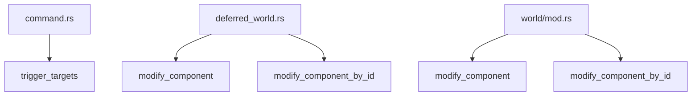

+++
title = "#19769 add missing `#[track_caller]`"
date = "2025-06-21T00:00:00"
draft = false
template = "pull_request_page.html"
in_search_index = false

[extra]
current_language = "zh-cn"
available_languages = {"en" = { name = "English", url = "/pull_request/bevy/2025-06/pr-19769-en-20250621" }, "zh-cn" = { name = "中文", url = "/pull_request/bevy/2025-06/pr-19769-zh-cn-20250621" }}
labels = ["C-Bug", "D-Trivial", "A-ECS"]
+++

# add missing `#[track_caller]`

## Basic Information
- **Title**: add missing `#[track_caller]`
- **PR Link**: https://github.com/bevyengine/bevy/pull/19769
- **Author**: eugineerd
- **Status**: MERGED
- **Labels**: C-Bug, D-Trivial, A-ECS, S-Ready-For-Final-Review
- **Created**: 2025-06-21T14:24:55Z
- **Merged**: 2025-06-21T18:25:39Z
- **Merged By**: alice-i-cecile

## Description Translation
### 目标

我注意到某些使用 `MaybeLocation::caller` 的方法缺少 `#[track_caller]` 属性，导致启用 `track_location` 时报告的位置信息错误。

### 解决方案

为这些方法添加 `#[track_caller]` 属性。

## The Story of This Pull Request

在 Bevy 的 ECS（实体组件系统）模块中，存在几个关键方法使用了 `MaybeLocation::caller` 来获取调用位置信息。这些位置信息主要用于调试和错误报告，特别是在启用 `track_location` 功能时。然而，当开发者 eugineerd 审查代码时，发现部分相关方法缺少 `#[track_caller]` 属性。

Rust 的 `#[track_caller]` 属性控制着 `std::panic::Location::caller()` 的行为。当函数被标记此属性时，`caller()` 会返回该函数的实际调用位置，而不是函数内部的实现位置。缺少此属性会导致位置跟踪系统报告错误的位置，使调试信息变得不准确。

这个问题影响三个核心操作：
1. 命令系统中的 `trigger_targets` 方法
2. 延迟世界(deferred world)中的组件修改方法
3. 主世界(world)中的组件修改方法

eugineerd 的解决方案直接明了：在缺少属性的函数声明前添加 `#[track_caller]` 属性。这个修改不需要调整任何功能逻辑，纯粹是编译器提示属性的补充。修改后，当这些函数被调用时，`MaybeLocation::caller` 将能正确返回调用方的位置信息。

这种修改属于典型的防御性编程实践。虽然表面上是简单的属性补充，但它确保了调试工具链的可靠性。在游戏引擎这种复杂系统中，准确的位置信息对于诊断实体组件操作中的问题至关重要，特别是在异步系统或命令队列等复杂执行环境中。

整个修改是原子性的 - 每个变更只涉及单行属性添加，且完全向后兼容。由于不涉及功能逻辑变更，风险极低，这解释了为什么 PR 能在提交后 4 小时内快速被合并。

## Visual Representation



## Key Files Changed

### 1. `crates/bevy_ecs/src/system/commands/command.rs`
**修改原因**: 修复命令系统中触发实体事件时的位置跟踪  
**关键变更**: 为 `trigger_targets` 函数添加 `#[track_caller]` 属性

```rust
// Before:
pub fn trigger_targets(
    event: impl EntityEvent,
    targets: impl TriggerTargets + Send + Sync + 'static,
) -> impl Command {

// After:
#[track_caller]
pub fn trigger_targets(
    event: impl EntityEvent,
    targets: impl TriggerTargets + Send + Sync + 'static,
) -> impl Command {
```

### 2. `crates/bevy_ecs/src/world/deferred_world.rs`
**修改原因**: 修复延迟世界中组件修改操作的位置跟踪  
**关键变更**: 为两个方法添加属性

```rust
// modify_component 添加:
#[track_caller]
pub(crate) fn modify_component<T: Component, R>(...)

// modify_component_by_id 添加:
#[track_caller]
pub(crate) fn modify_component_by_id<R>(...)
```

### 3. `crates/bevy_ecs/src/world/mod.rs`
**修改原因**: 修复主世界中组件修改操作的位置跟踪  
**关键变更**: 为两个公共方法添加属性

```rust
// modify_component 添加:
#[track_caller]
pub fn modify_component<T: Component, R>(...)

// modify_component_by_id 添加:
#[track_caller]
pub fn modify_component_by_id<R>(...)
```

## Further Reading
1. Rust 官方文档 - `#[track_caller]` 属性:  
   https://doc.rust-lang.org/reference/attributes/diagnostics.html#the-track_caller-attribute
2. Bevy ECS 架构概览:  
   https://bevyengine.org/learn/book/getting-started/ecs/
3. 错误处理中的位置跟踪模式:  
   https://blog.logrocket.com/rust-error-handling-with-location-information/