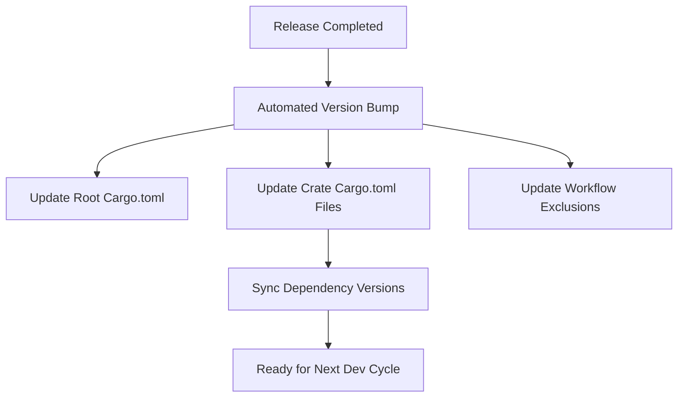

+++
title = "#19774 Bump Version after Release"
date = "2025-06-22T00:00:00"
draft = false
template = "pull_request_page.html"
in_search_index = true

[taxonomies]
list_display = ["show"]

[extra]
current_language = "en"
available_languages = {"en" = { name = "English", url = "/pull_request/bevy/2025-06/pr-19774-en-20250622" }, "zh-cn" = { name = "中文", url = "/pull_request/bevy/2025-06/pr-19774-zh-cn-20250622" }}
labels = ["D-Trivial", "A-Cross-Cutting"]
+++

## Bump Version after Release

### Basic Information
- **Title**: Bump Version after Release
- **PR Link**: https://github.com/bevyengine/bevy/pull/19774
- **Author**: app/github-actions
- **Status**: MERGED
- **Labels**: D-Trivial, S-Ready-For-Final-Review, A-Cross-Cutting
- **Created**: 2025-06-21T21:07:04Z
- **Merged**: 2025-06-22T23:25:08Z
- **Merged By**: alice-i-cecile

### Description Translation
Bump version after release  
This PR has been auto-generated  

Fixes #19766

### The Story of This Pull Request

This PR addresses a routine maintenance task required after each Bevy release. When a release is completed, the development version in all Cargo.toml files must be incremented to prepare for the next development cycle. This version bump is automated through GitHub Actions to ensure consistency and reduce manual errors.

The core problem is straightforward: all crate versions in the repository were set to `0.16.0-dev` after the previous release. To start development on the next version (`0.17.0`), these needed to be updated to `0.17.0-dev`. This change affects dependency specifications throughout the project, as internal crates depend on each other using exact version matches.

The solution implements a systematic version update across 52 crates and the root project configuration. The GitHub Actions workflow (`post-release.yml`) was modified to exclude the new `no_std_library` directory during the PR creation process, ensuring the automation remains compatible with recent repository changes.

The implementation consists of two key changes:
1. **Version increment**: Every occurrence of `version = "0.16.0-dev"` was replaced with `version = "0.17.0-dev"` in all Cargo.toml files
2. **Dependency synchronization**: Inter-crate dependencies were updated to reference the new development version

For example, the root Cargo.toml was updated to establish the new baseline version:

```toml
# File: Cargo.toml
# Before:
[package]
name = "bevy"
version = "0.16.0-dev"

[dependencies]
bevy_internal = { path = "crates/bevy_internal", version = "0.16.0-dev" }

# After:
[package]
name = "bevy"
version = "0.17.0-dev"

[dependencies]
bevy_internal = { path = "crates/bevy_internal", version = "0.17.0-dev" }
```

The same version bump was applied consistently across all crate dependencies. For instance, in `bevy_ecs`:

```toml
# File: crates/bevy_ecs/Cargo.toml
# Before:
[package]
name = "bevy_ecs"
version = "0.16.0-dev"

[dependencies]
bevy_ptr = { path = "../bevy_ptr", version = "0.16.0-dev" }

# After:
[package]
name = "bevy_ecs"
version = "0.17.0-dev"

[dependencies]
bevy_ptr = { path = "../bevy_ptr", version = "0.17.0-dev" }
```

This systematic update ensures all internal dependencies resolve correctly during development. The GitHub Actions workflow was also updated to maintain compatibility with recent repository changes:

```diff
# File: .github/workflows/post-release.yml
-            --exclude build-wasm-example
+            --exclude build-wasm-example \
+            --exclude no_std_library
```

The impact of this change is primarily operational. It enables continued development of Bevy by:
1. Establishing the correct version for all crates
2. Maintaining consistent internal dependencies
3. Ensuring new features and fixes are tracked against the proper version
4. Keeping the automated release process functional with repository updates

### Visual Representation



### Key Files Changed

1. **crates/bevy_internal/Cargo.toml**  
   Updated crate version and dependency versions to `0.17.0-dev`  
   ```diff
   -version = "0.16.0-dev"
   +version = "0.17.0-dev"
   ```

2. **crates/bevy_render/Cargo.toml**  
   Updated crate version and dependency versions to `0.17.0-dev`  
   ```diff
   -version = "0.16.0-dev"
   +version = "0.17.0-dev"
   ```

3. **crates/bevy_ui/Cargo.toml**  
   Updated crate version and dependency versions to `0.17.0-dev`  
   ```diff
   -version = "0.16.0-dev"
   +version = "0.17.0-dev"
   ```

4. **crates/bevy_winit/Cargo.toml**  
   Updated crate version and dependency versions to `0.17.0-dev`  
   ```diff
   -version = "0.16.0-dev"
   +version = "0.17.0-dev"
   ```

5. **crates/bevy_gltf/Cargo.toml**  
   Updated crate version and dependency versions to `0.17.0-dev`  
   ```diff
   -version = "0.16.0-dev"
   +version = "0.17.0-dev"
   ```

### Further Reading
1. [Cargo Documentation: Specifying Dependencies](https://doc.rust-lang.org/cargo/reference/specifying-dependencies.html)
2. [Semantic Versioning Specification](https://semver.org)
3. [GitHub Actions Workflow Syntax](https://docs.github.com/en/actions/using-workflows/workflow-syntax-for-github-actions)