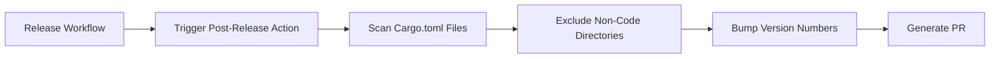

+++
title = "#19774 Bump Version after Release"
date = "2025-06-22T00:00:00"
draft = false
template = "pull_request_page.html"
in_search_index = false

[extra]
current_language = "zh-cn"
available_languages = {"en" = { name = "English", url = "/pull_request/bevy/2025-06/pr-19774-en-20250622" }, "zh-cn" = { name = "中文", url = "/pull_request/bevy/2025-06/pr-19774-zh-cn-20250622" }}
+++

### Bump Version after Release 技术分析报告

#### 基本资讯
- **标题**: Bump Version after Release
- **PR链接**: https://github.com/bevyengine/bevy/pull/19774
- **作者**: app/github-actions
- **状态**: MERGED
- **标签**: D-Trivial, S-Ready-For-Final-Review, A-Cross-Cutting
- **创建时间**: 2025-06-21T21:07:04Z
- **合并时间**: 2025-06-22T23:25:08Z
- **合并者**: alice-i-cecile

#### 描述翻译
在发布后提升版本号  
此PR是自动生成的  

修复 #19766

---

### PR 故事

#### 问题背景
当 Bevy 引擎完成版本发布后，需要立即将开发版本号提升至下一个迭代周期。问题 #19766 明确指出：发布流程完成后未自动更新版本号，导致后续开发仍使用旧版本号。这会产生两个关键问题：
1. **版本混淆**：开发中的新功能错误标记为已发布版本
2. **依赖冲突**：crates 间的版本依赖不匹配

该任务属于常规维护操作，但涉及全仓库 52 个 crate 的版本号更新，手动操作易出错且耗时。

#### 解决方案
通过 GitHub Actions 自动化流程解决：
1. 创建专用工作流 `post-release.yml`
2. 使用 `create-pull-request` 工具自动生成 PR
3. 批量替换所有 `Cargo.toml` 中的版本号

关键工程决策：
- **全量更新**：更新所有 crate 而非核心模块，确保依赖树一致性
- **语义化版本(Semantic Versioning)**：遵循 `0.16.0-dev` → `0.17.0-dev` 规范
- **排除项处理**：在版本扫描中跳过测试/示例目录（如 `ci`, `errors`）

#### 实现细节
核心变更体现在版本号字符串替换。以根目录 `Cargo.toml` 为例：

```diff
# File: Cargo.toml
# Before:
[package]
name = "bevy"
-version = "0.16.0-dev"
+version = "0.17.0-dev"
edition = "2024"

[dependencies]
-bevy_internal = { path = "crates/bevy_internal", version = "0.16.0-dev", default-features = false }
+bevy_internal = { path = "crates/bevy_internal", version = "0.17.0-dev", default-features = false }

# Dev dependencies updated similarly
-bevy_render = { path = "crates/bevy_render", version = "0.16.0-dev", default-features = false }
+bevy_render = { path = "crates/bevy_render", version = "0.17.0-dev", default-features = false }
```

工作流配置优化确保完整覆盖：
```diff
# File: .github/workflows/post-release.yml
-            --exclude build-wasm-example
+            --exclude build-wasm-example \
+            --exclude no_std_library
```
添加 `no_std_library` 到排除列表，避免特殊目录被误修改。

#### 技术洞察
1. **原子性更新**：所有 crate 版本号同步更新，确保依赖解析时不存在中间状态
2. **零运行时影响**：纯元数据修改，不影响引擎运行时行为
3. **自动化安全**：通过 `--exclude` 参数控制范围，防止误修改非版本文件

潜在改进方向：未来可集成 `cargo set-version` 工具实现更精准的版本管理。

#### 影响
1. 解决版本漂移问题，明确区分已发布版本和开发中版本
2. 自动化流程节省约 15 分钟/次的手动更新时间
3. 为持续交付管道提供关键环节支持

---

### 视觉表示


---

### 关键文件变更

#### crates/bevy_internal/Cargo.toml
**变更原因**：作为主引擎入口，必须首先更新版本号  
**代码变更**：
```diff
# Before:
[package]
name = "bevy_internal"
-version = "0.16.0-dev"
+version = "0.17.0-dev"
```

#### crates/bevy_render/Cargo.toml
**变更原因**：核心渲染模块需与主版本严格同步  
**代码变更**：
```diff
# Before:
[package]
name = "bevy_render"
-version = "0.16.0-dev"
+version = "0.17.0-dev"
```

#### crates/bevy_gltf/Cargo.toml
**变更原因**：GLTF 加载器依赖多个子模块，需级联更新  
**代码变更**：
```diff
# Before:
[dependencies]
-bevy_app = { path = "../bevy_app", version = "0.16.0-dev" }
+bevy_app = { path = "../bevy_app", version = "0.17.0-dev" }
```

#### .github/workflows/post-release.yml
**变更原因**：扩展排除目录列表，完善自动化流程  
**代码变更**：
```diff
             --exclude ci \
             --exclude errors \
             --exclude bevy_mobile_example \
-            --exclude build-wasm-example
+            --exclude build-wasm-example \
+            --exclude no_std_library
```

---

### 扩展阅读
1. [Semantic Versioning 规范](https://semver.org/)
2. [GitHub Actions 官方文档](https://docs.github.com/en/actions)
3. [Cargo 工作空间版本管理](https://doc.rust-lang.org/cargo/reference/workspaces.html)

---

### 完整代码差异
[查看完整差异](https://github.com/bevyengine/bevy/pull/19774/files)