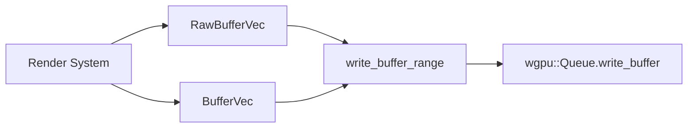

+++
title = "#19775 Add write_buffer_range to RawBufferVec and BufferVec"
date = "2025-06-24T00:00:00"
draft = false
template = "pull_request_page.html"
in_search_index = true

[taxonomies]
list_display = ["show"]

[extra]
current_language = "en"
available_languages = {"en" = { name = "English", url = "/pull_request/bevy/2025-06/pr-19775-en-20250624" }, "zh-cn" = { name = "中文", url = "/pull_request/bevy/2025-06/pr-19775-zh-cn-20250624" }}
labels = ["A-Rendering", "C-Usability", "D-Straightforward"]
+++

### Add write_buffer_range to RawBufferVec and BufferVec

#### Basic Information
- **Title**: Add write_buffer_range to RawBufferVec and BufferVec
- **PR Link**: https://github.com/bevyengine/bevy/pull/19775
- **Author**: IceSentry
- **Status**: MERGED
- **Labels**: A-Rendering, C-Usability, S-Ready-For-Final-Review, D-Straightforward
- **Created**: 2025-06-21T21:27:09Z
- **Merged**: 2025-06-24T01:00:36Z
- **Merged By**: alice-i-cecile

#### Description Translation
# Objective

- Sometimes you only want to write parts of a buffer to the gpu instead of reuploading the entire buffer. For example when doing data streaming.
- wgpu already supports this and you can do it manually from the user side but it would be nice if it was built in.

## Solution

- Add `write_buffer_range()` to `RawBufferVec` and `BufferVec` that will only upload the data contained in the specified range

## Testing

- I did not test it in bevy, but this implementation is copied from something I used and tested at work

---

### The Story of This Pull Request

#### The Problem
When working with GPU buffers in Bevy's rendering system, developers frequently need to update only portions of a buffer rather than re-uploading the entire data structure. This is particularly important for performance-sensitive operations like data streaming where large buffers might only have small sections modified. While wgpu's API supports partial buffer writes, Bevy's abstraction layer didn't expose this capability directly. Users had to implement their own solutions, leading to duplicated effort and potential inconsistencies across implementations.

#### The Solution Approach
The solution adds a dedicated `write_buffer_range` method to both `RawBufferVec` and `BufferVec` - Bevy's core buffer management structures. This approach maintains consistency with existing APIs while exposing wgpu's partial write capability through Bevy's abstraction layer. The implementation focuses on three key requirements:
1. Minimal performance overhead for range operations
2. Backward compatibility with existing buffer workflows
3. Clear API semantics matching wgpu's `write_buffer`

#### Implementation Details
The implementation adds identical methods to both buffer types with careful handling of byte alignment and offset calculations. For `RawBufferVec`, the method:
1. Returns early for empty buffers
2. Ensures adequate buffer capacity
3. Casts only the required data slice to bytes
4. Calculates byte offsets based on item size
5. Calls wgpu's `write_buffer` with the partial range

```rust
// RawBufferVec implementation
pub fn write_buffer_range(
    &mut self,
    device: &RenderDevice,
    render_queue: &RenderQueue,
    range: core::ops::Range<usize>,
) {
    if self.values.is_empty() {
        return;
    }
    self.reserve(self.values.len(), device);
    if let Some(buffer) = &self.buffer {
        let bytes: &[u8] = must_cast_slice(&self.values[range.start..range.end]);
        render_queue.write_buffer(buffer, (range.start * self.item_size) as u64, bytes);
    }
}
```

The `BufferVec` implementation follows the same pattern but accounts for its byte-aligned storage:
```rust
// BufferVec implementation
pub fn write_buffer_range(
    &mut self,
    device: &RenderDevice,
    render_queue: &RenderQueue,
    range: core::ops::Range<usize>,
) {
    if self.data.is_empty() {
        return;
    }
    let item_size = u64::from(T::min_size()) as usize;
    self.reserve(self.data.len() / item_size, device);
    if let Some(buffer) = &self.buffer {
        let bytes = &self.data[range.start..range.end];
        render_queue.write_buffer(buffer, (range.start * item_size) as u64, bytes);
    }
}
```

Key technical considerations:
- **Offset Calculation**: Multiplies the start index by item size to get byte-aligned offsets
- **Safety**: Uses Rust's range indexing for bounds safety
- **Efficiency**: Avoids unnecessary allocations through slice operations
- **Abstraction**: Maintains consistent API across different buffer types

#### Impact and Benefits
This change provides measurable performance improvements for streaming scenarios by:
1. Reducing GPU bandwidth usage (only modified sections are transferred)
2. Minimizing CPU overhead (no full-buffer serialization for partial updates)
3. Enabling new streaming patterns without external workarounds

The implementation maintains all existing functionality while adding new capabilities, making it a non-breaking change. The API design follows established patterns in Bevy's rendering module, ensuring developer familiarity.

### Visual Representation



### Key Files Changed

#### `crates/bevy_render/src/render_resource/buffer_vec.rs`
Added `write_buffer_range` methods to both buffer implementations:

**RawBufferVec:**
```rust
/// Queues writing of data from system RAM to VRAM using the [`RenderDevice`]
/// and the provided [`RenderQueue`].
///
/// Before queuing the write, a [`reserve`](RawBufferVec::reserve) operation
/// is executed.
///
/// This will only write the data contained in the given range. It is useful if you only want
/// to update a part of the buffer.
pub fn write_buffer_range(
    &mut self,
    device: &RenderDevice,
    render_queue: &RenderQueue,
    range: core::ops::Range<usize>,
) {
    if self.values.is_empty() {
        return;
    }
    self.reserve(self.values.len(), device);
    if let Some(buffer) = &self.buffer {
        // Cast only the bytes we need to write
        let bytes: &[u8] = must_cast_slice(&self.values[range.start..range.end]);
        render_queue.write_buffer(buffer, (range.start * self.item_size) as u64, bytes);
    }
}
```

**BufferVec:**
```rust
/// Queues writing of data from system RAM to VRAM using the [`RenderDevice`]
/// and the provided [`RenderQueue`].
///
/// Before queuing the write, a [`reserve`](BufferVec::reserve) operation
/// is executed.
///
/// This will only write the data contained in the given range. It is useful if you only want
/// to update a part of the buffer.
pub fn write_buffer_range(
    &mut self,
    device: &RenderDevice,
    render_queue: &RenderQueue,
    range: core::ops::Range<usize>,
) {
    if self.data.is_empty() {
        return;
    }
    let item_size = u64::from(T::min_size()) as usize;
    self.reserve(self.data.len() / item_size, device);
    if let Some(buffer) = &self.buffer {
        let bytes = &self.data[range.start..range.end];
        render_queue.write_buffer(buffer, (range.start * item_size) as u64, bytes);
    }
}
```

### Further Reading
1. [wgpu Buffer Documentation](https://docs.rs/wgpu/latest/wgpu/struct.Buffer.html#method.slice)
2. [Bevy Render Resources Architecture](https://bevyengine.org/learn/book/getting-started/resources/)
3. [GPU Data Streaming Patterns](https://developer.nvidia.com/gpugems/gpugems3/part-vi-gpu-computing/chapter-39-streaming-architectures-and-technology)