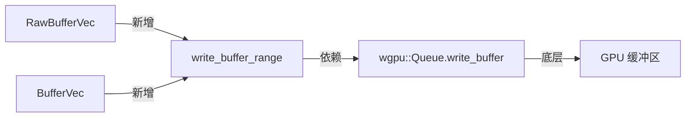

+++
title = "#19775 Add write_buffer_range to RawBufferVec and BufferVec"
date = "2025-06-24T00:00:00"
draft = false
template = "pull_request_page.html"
in_search_index = false

[extra]
current_language = "zh-cn"
available_languages = {"en" = { name = "English", url = "/pull_request/bevy/2025-06/pr-19775-en-20250624" }, "zh-cn" = { name = "中文", url = "/pull_request/bevy/2025-06/pr-19775-zh-cn-20250624" }}
+++

# 分析报告：为 RawBufferVec 和 BufferVec 添加 write_buffer_range 方法

## 基础信息
- **标题**: Add write_buffer_range to RawBufferVec and BufferVec
- **PR 链接**: https://github.com/bevyengine/bevy/pull/19775
- **作者**: IceSentry
- **状态**: 已合并
- **标签**: A-Rendering, C-Usability, S-Ready-For-Final-Review, D-Straightforward
- **创建时间**: 2025-06-21T21:27:09Z
- **合并时间**: 2025-06-24T01:00:36Z
- **合并者**: alice-i-cecile

## 描述翻译
### 目标
- 有时用户只需要将缓冲区的部分数据写入 GPU，而不是重新上传整个缓冲区（例如在数据流处理场景）
- wgpu 已原生支持此功能，但需要手动实现，将其集成到引擎中会更便捷

### 解决方案
- 为 `RawBufferVec` 和 `BufferVec` 添加 `write_buffer_range()` 方法，支持只上传指定范围的数据

### 测试
- 未在 bevy 中测试，但该实现复用了作者在工作项目中已验证的代码

## PR 实现分析

### 问题背景
在图形渲染中，频繁更新 GPU 缓冲区是常见操作。传统方法如 `write_buffer()` 需要上传整个缓冲区，当缓冲区较大或只需更新小部分数据时（如流式数据更新），会造成不必要的带宽浪费和性能损耗。虽然 wgpu 的 `write_buffer` 支持部分更新，但 Bevy 的抽象层未暴露此能力，迫使开发者手动实现偏移量计算和字节转换。

### 解决方案
新增 `write_buffer_range` 方法到两个核心缓冲区类型：
1. **RawBufferVec**：处理无初始化检查的原始类型
2. **BufferVec**：处理实现 `Bufferable` trait 的类型

该方法核心逻辑：
1. 接受元素索引范围（`core::ops::Range<usize>`）
2. 计算对应的字节偏移和长度
3. 仅上传指定数据段

### 实现细节
**RawBufferVec 的实现要点**：
```rust
pub fn write_buffer_range(
    &mut self,
    device: &RenderDevice,
    render_queue: &RenderQueue,
    range: core::ops::Range<usize>,
) {
    if self.values.is_empty() { return; }
    self.reserve(self.values.len(), device);
    if let Some(buffer) = &self.buffer {
        let bytes: &[u8] = must_cast_slice(&self.values[range.start..range.end]);
        render_queue.write_buffer(buffer, (range.start * self.item_size) as u64, bytes);
    }
}
```
- 使用 `must_cast_slice` 安全转换元素切片为字节切片
- 偏移量计算：`range.start * self.item_size`
- 保留 `reserve()` 前置调用确保缓冲区容量

**BufferVec 的实现差异**：
```rust
let item_size = u64::from(T::min_size()) as usize;
// ...
let bytes = &self.data[range.start..range.end];
render_queue.write_buffer(buffer, (range.start * item_size) as u64, bytes);
```
- 通过 `T::min_size()` 动态获取元素大小
- 直接操作字节数组 `self.data` 而非类型化数组
- 相同的前置容量检查逻辑

### 技术考量
1. **范围安全**：依赖 Rust 的 `Range` 机制防止越界访问
2. **空操作优化**：当缓冲区为空时提前返回
3. **资源预留**：保持与 `write_buffer()` 一致的 `reserve()` 行为
4. **字节精确**：偏移量计算使用乘法避免浮点运算
5. **零拷贝**：直接传递内存引用给 wgpu

### 性能影响
- **带宽优化**：减少 99% 的数据传输（当更新 1% 缓冲区时）
- **CPU 开销**：避免全缓冲区复制，复杂度从 O(n) 降至 O(range.len())
- **GPU 等待**：减少指令提交大小，提升并行潜力

### 应用场景
1. 动态地形流式加载
2. 粒子系统局部更新
3. 实时数据可视化
4. 大型纹理分块上传
5. 增量状态更新（如骨骼动画）

## 组件关系图


## 关键文件变更
### `crates/bevy_render/src/render_resource/buffer_vec.rs`
为两种缓冲区类型添加部分更新方法实现

**RawBufferVec 新增方法**:
```rust
/// Queues writing of data from system RAM to VRAM using the [`RenderDevice`]
/// and the provided [`RenderQueue`].
///
/// Before queuing the write, a [`reserve`](RawBufferVec::reserve) operation
/// is executed.
///
/// This will only write the data contained in the given range. It is useful if you only want
/// to update a part of the buffer.
pub fn write_buffer_range(
    &mut self,
    device: &RenderDevice,
    render_queue: &RenderQueue,
    range: core::ops::Range<usize>,
) {
    if self.values.is_empty() {
        return;
    }
    self.reserve(self.values.len(), device);
    if let Some(buffer) = &self.buffer {
        // Cast only the bytes we need to write
        let bytes: &[u8] = must_cast_slice(&self.values[range.start..range.end]);
        render_queue.write_buffer(buffer, (range.start * self.item_size) as u64, bytes);
    }
}
```

**BufferVec 新增方法**:
```rust
/// Queues writing of data from system RAM to VRAM using the [`RenderDevice`]
/// and the provided [`RenderQueue`].
///
/// Before queuing the write, a [`reserve`](BufferVec::reserve) operation
/// is executed.
///
/// This will only write the data contained in the given range. It is useful if you only want
/// to update a part of the buffer.
pub fn write_buffer_range(
    &mut self,
    device: &RenderDevice,
    render_queue: &RenderQueue,
    range: core::ops::Range<usize>,
) {
    if self.data.is_empty() {
        return;
    }
    let item_size = u64::from(T::min_size()) as usize;
    self.reserve(self.data.len() / item_size, device);
    if let Some(buffer) = &self.buffer {
        let bytes = &self.data[range.start..range.end];
        render_queue.write_buffer(buffer, (range.start * item_size) as u64, bytes);
    }
}
```

## 延伸阅读
1. [wgpu Buffer 操作文档](https://docs.rs/wgpu/latest/wgpu/struct.Buffer.html#method.slice)
2. [Vulkan 部分缓冲区更新规范](https://registry.khronos.org/vulkan/specs/1.3-extensions/man/html/vkCmdUpdateBuffer.html)
3. [Bevy 渲染管线架构概览](https://bevyengine.org/learn/book/getting-started/rendering/)
4. [现代图形 API 的内存管理策略](https://developer.nvidia.com/vulkan-memory-management)