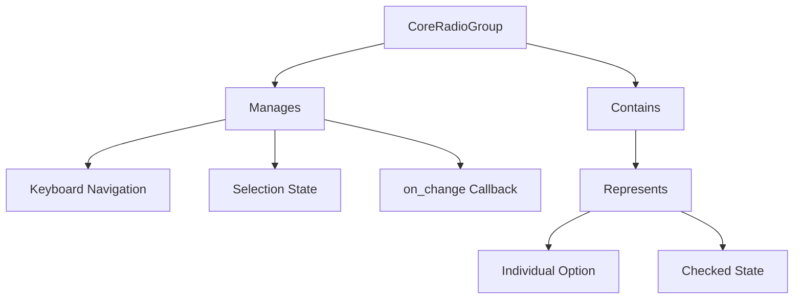

+++
title = "#19778 Core radio button and radio group"
date = "2025-06-24T00:00:00"
draft = false
template = "pull_request_page.html"
in_search_index = true

[taxonomies]
list_display = ["show"]

[extra]
current_language = "en"
available_languages = {"en" = { name = "English", url = "/pull_request/bevy/2025-06/pr-19778-en-20250624" }, "zh-cn" = { name = "中文", url = "/pull_request/bevy/2025-06/pr-19778-zh-cn-20250624" }}
labels = ["C-Feature", "A-UI"]
+++

### Core Radio Button and Radio Group Implementation

## Basic Information
- **Title**: Core radio button and radio group
- **PR Link**: https://github.com/bevyengine/bevy/pull/19778
- **Author**: viridia
- **Status**: MERGED
- **Labels**: C-Feature, A-UI, S-Ready-For-Final-Review, M-Needs-Release-Note
- **Created**: 2025-06-22T16:05:09Z
- **Merged**: 2025-06-24T01:03:29Z
- **Merged By**: alice-i-cecile

## Description Translation
# Objective

Core Radio Button and Radio Group widgets. Part of #19236

## The Story of This Pull Request

### The Problem and Context
Bevy's UI system lacked core radio button and radio group widgets. This created several issues:
1. Developers had to implement radio functionality from scratch
2. Accessibility support was inconsistent
3. Radio groups didn't follow WAI-ARIA best practices where the group handles navigation
4. Existing UI examples couldn't demonstrate radio button patterns

The radio group implementation needed to:
- Manage mutual exclusion between radio buttons
- Handle keyboard navigation (arrow keys, home/end)
- Provide accessibility roles through AccessKit
- Work with Bevy's ECS architecture
- Separate behavior from styling (headless widgets)

### The Solution Approach
The implementation follows WAI-ARIA radio group patterns where:
- The radio group (`CoreRadioGroup`) handles focus and keyboard navigation
- Individual radio buttons (`CoreRadio`) are not focusable
- The group manages selection state through entity IDs rather than values

Key design decisions:
1. **Callback-based state management**: The group exposes an `on_change` callback that provides the selected entity ID
2. **Headless implementation**: No built-in styling, allowing custom UI representations
3. **Accessibility integration**: Uses AccessKit roles for screen reader support
4. **Input handling**: Separate systems for keyboard and pointer events

### The Implementation
The solution adds two new components and their corresponding systems:

**Core Components:**
```rust
#[derive(Component, Debug)]
#[require(AccessibilityNode(accesskit::Node::new(Role::RadioGroup)))]
pub struct CoreRadioGroup {
    pub on_change: Option<SystemId<In<Entity>>>,
}

#[derive(Component, Debug)]
#[require(AccessibilityNode(accesskit::Node::new(Role::RadioButton)), Checked]
pub struct CoreRadio;
```

**Keyboard Navigation System:**
Handles arrow keys, home, and end for selection:
```rust
fn radio_group_on_key_input(...) {
    if let Ok(CoreRadioGroup { on_change }) = q_group.get(ev.target()) {
        // Filter enabled radio descendants
        let radio_buttons = q_children
            .iter_descendants(ev.target())
            .filter_map(|child_id| ...)
            .collect::<Vec<_>>();
        
        // Calculate new selection index based on key press
        let next_index = match key_code {
            KeyCode::ArrowUp | KeyCode::ArrowLeft => ...,
            KeyCode::ArrowDown | KeyCode::ArrowRight => ...,
            KeyCode::Home => 0,
            KeyCode::End => radio_buttons.len() - 1,
            _ => return,
        };
        
        // Trigger on_change callback with new selection
        if let Some(on_change) = on_change {
            commands.run_system_with(*on_change, next_id);
        }
    }
}
```

**Click Handling System:**
Processes radio button selections via pointer clicks:
```rust
fn radio_group_on_button_click(...) {
    if let Ok(CoreRadioGroup { on_change }) = q_group.get(ev.target()) {
        // Find clicked radio button in ancestor chain
        let radio_id = ...;
        
        // Prevent selecting already-checked item
        if current_radio == Some(radio_id) {
            return;
        }
        
        // Trigger on_change callback
        if let Some(on_change) = on_change {
            commands.run_system_with(*on_change, radio_id);
        }
    }
}
```

### Technical Insights
1. **Entity-based Selection**: Using entity IDs instead of values keeps the widget decoupled from app-specific data models
2. **Accessibility Integration**: The `#[require(...)]` attribute ensures accessibility nodes are created
3. **Event Propagation Control**: `ev.propagate(false)` prevents duplicate event processing
4. **Descendant Query Pattern**: `iter_descendants` efficiently finds all radio buttons in a group
5. **System Callbacks**: `run_system_with` allows custom handling of selection changes

### The Impact
This implementation:
1. Completes Bevy's core headless widget set (buttons, checkboxes, sliders, radios)
2. Provides accessible radio groups out-of-the-box
3. Enables consistent radio behavior across applications
4. Adds new UI patterns to the examples
5. Follows W3C accessibility standards for radio groups

## Visual Representation



## Key Files Changed

1. **`crates/bevy_core_widgets/src/core_radio.rs` (+213/-0)**
   - New file implementing radio group functionality
   - Defines `CoreRadioGroup` and `CoreRadio` components
   - Implements keyboard and click handling systems
   - Adds plugin registration

   Key implementation:
   ```rust
   // Radio group keyboard handling
   match key_code {
       KeyCode::ArrowUp | KeyCode::ArrowLeft => {
           if current_index == 0 { radio_buttons.len() - 1 }
           else { current_index - 1 }
       },
       // ... other cases
   }
   ```

2. **`examples/ui/core_widgets.rs` (+151/-19)**
   - Adds radio group demo to UI example
   - Implements styled radio buttons with custom behavior
   - Connects radio selection to existing slider demo

   Radio group creation:
   ```rust
   fn radio_group(...) -> impl Bundle {
       (
           Node { /* ... */ },
           CoreRadioGroup { on_change },
           children![
               radio(..., "Slider Drag"),
               radio(..., "Slider Step"),
               radio(..., "Slider Snap")
           ]
       )
   }
   ```

3. **`crates/bevy_core_widgets/src/lib.rs` (+8/-1)**
   - Integrates radio plugin with core widgets
   - Exports new radio components

   Plugin registration:
   ```rust
   app.add_plugins((
       CoreButtonPlugin,
       CoreCheckboxPlugin,
       CoreRadioGroupPlugin, // New
       CoreSliderPlugin,
   ));
   ```

4. **`crates/bevy_core_widgets/src/core_slider.rs` (+1/-1)**
   - Minor change enabling enum usage in radio demo:
   
   ```rust
   // Before:
   #[derive(Debug, Default)]
   pub enum TrackClick { /* ... */ }
   
   // After:
   #[derive(Debug, Default, PartialEq, Clone, Copy)]
   pub enum TrackClick { /* ... */ }
   ```

5. **`release-content/release-notes/headless-widgets.md` (+1/-1)**
   - Adds PR to headless widgets release notes:
   
   ```markdown
   - pull_requests: [19366, 19584, 19665, 19778]
   ```

## Further Reading
1. [WAI-ARIA Radio Group Pattern](https://www.w3.org/WAI/ARIA/apg/patterns/radio/)
2. [Bevy UI Documentation](https://docs.rs/bevy_ui/latest/bevy_ui/)
3. [Headless UI Concepts](https://headlessui.com/)
4. [AccessKit Implementation Guide](https://accesskit.dev/)