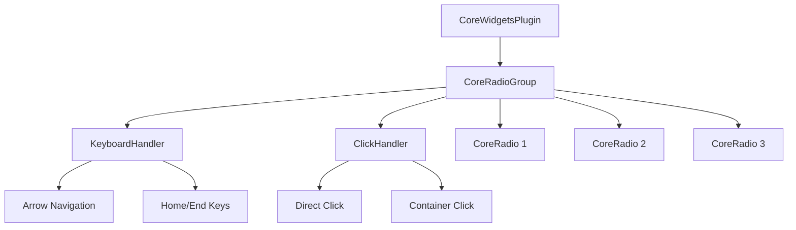

+++
title = "#19778 Core radio button and radio group"
date = "2025-06-24T00:00:00"
draft = false
template = "pull_request_page.html"
in_search_index = false

[extra]
current_language = "zh-cn"
available_languages = {"en" = { name = "English", url = "/pull_request/bevy/2025-06/pr-19778-en-20250624" }, "zh-cn" = { name = "中文", url = "/pull_request/bevy/2025-06/pr-19778-zh-cn-20250624" }}
labels = ["C-Feature", "A-UI"]
+++

# Core Radio Button and Radio Group 技术分析报告

## Basic Information
- **Title**: Core radio button and radio group
- **PR Link**: https://github.com/bevyengine/bevy/pull/19778
- **Author**: viridia
- **Status**: MERGED
- **Labels**: C-Feature, A-UI, S-Ready-For-Final-Review, M-Needs-Release-Note
- **Created**: 2025-06-22T16:05:09Z
- **Merged**: 2025-06-24T01:03:29Z
- **Merged By**: alice-i-cecile

## Description Translation
实现核心单选框和单选按钮组。属于 #19236 的一部分

## The Story of This Pull Request

### 问题背景
Bevy UI 系统缺少原生的单选框组件。单选框需要特殊的行为逻辑：
1. 组内互斥选择（mutual exclusion）
2. 键盘导航支持（方向键、Home/End 键）
3. 无障碍访问支持（WAI-ARIA 规范）
4. 与现有 UI 系统的集成（事件处理、状态管理）

现有按钮和复选框组件无法满足这些需求，因此需要实现新的 headless widget（无样式核心组件）。

### 解决方案
开发者采用符合 WAI-ARIA 规范的设计：
1. `CoreRadioGroup` 作为容器管理单选组状态
2. `CoreRadio` 标记单个单选按钮
3. 两个事件处理器处理交互：
   - 键盘导航 (`radio_group_on_key_input`)
   - 鼠标点击 (`radio_group_on_button_click`)

关键设计决策：
- **组级焦点管理**：遵循 ARIA 最佳实践，整个组接收焦点而非单个按钮
- **状态解耦**：组不直接存储选中值，而是通过实体 ID 回调
- **无障碍集成**：使用 AccessKit 设置正确的 ARIA 角色

### 实现细节
#### 核心组件定义
```rust
// CoreRadioGroup 定义
#[derive(Component, Debug)]
#[require(AccessibilityNode(accesskit::Node::new(Role::RadioGroup)))]
pub struct CoreRadioGroup {
    pub on_change: Option<SystemId<In<Entity>>>,
}

// CoreRadio 定义
#[derive(Component, Debug)]
#[require(AccessibilityNode(accesskit::Node::new(Role::RadioButton)), Checked)]
pub struct CoreRadio;
```

#### 键盘导航实现
```rust
fn radio_group_on_key_input(...) {
    // 过滤方向键/Home/End
    if event.state == ButtonState::Pressed && !event.repeat && matches!(...) {
        // 收集组内所有可用单选按钮
        let radio_buttons = q_children
            .iter_descendants(ev.target())
            .filter_map(|child_id| ...)
            .collect::<Vec<_>>();
        
        // 计算当前选中项索引
        let current_index = ...;
        
        // 根据按键计算新索引
        let next_index = match key_code {
            KeyCode::ArrowUp | KeyCode::ArrowLeft => ...,
            KeyCode::ArrowDown | KeyCode::ArrowRight => ...,
            KeyCode::Home => 0,
            KeyCode::End => radio_buttons.len() - 1,
            _ => return,
        };
        
        // 触发 on_change 回调
        if let Some(on_change) = on_change {
            commands.run_system_with(*on_change, next_id);
        }
    }
}
```
该实现：
1. 处理方向键导航（支持循环）
2. 支持 Home/End 快速跳转
3. 自动跳过禁用项

#### 鼠标点击处理
```rust
fn radio_group_on_button_click(...) {
    // 向上搜索找到实际单选按钮
    let radio_id = if q_radio.contains(...) {
        ...
    } else {
        // 遍历祖先节点查找
        for ancestor in q_parents.iter_ancestors(...) {
            ...
        }
    };
    
    // 收集组内所有可用选项
    let radio_buttons = ...;
    
    // 仅当选择变化时触发回调
    if current_radio != Some(radio_id) {
        if let Some(on_change) = on_change {
            commands.run_system_with(*on_change, radio_id);
        }
    }
}
```
该实现：
1. 处理直接点击和容器点击
2. 确保只响应有效选择变化
3. 自动处理嵌套结构

### 集成与示例
#### 插件注册
```rust
// 在 CoreWidgetsPlugin 中注册
app.add_plugins((
    CoreButtonPlugin,
    CoreCheckboxPlugin,
    CoreRadioGroupPlugin, // 新增
    CoreSliderPlugin,
));
```

#### 示例实现
```rust
// 创建单选组
fn radio_group(...) -> impl Bundle {
    (
        Node { ... },
        CoreRadioGroup { on_change },
        children![
            radio(..., "Slider Drag"),
            radio(..., "Slider Step"),
            radio(..., "Slider Snap")
        ],
    )
}

// 创建单选按钮
fn radio(..., caption: &str) -> impl Bundle {
    (
        Node { ... },
        DemoRadio(value),
        CoreRadio,
        children![
            // 外圆
            Node { 
                border: UiRect::all(Val::Px(2.0)),
                BorderRadius::MAX,
                ...
            },
            // 内圆（选中状态指示器）
            Node {
                width: Val::Px(8.0),
                height: Val::Px(8.0),
                BorderRadius::MAX,
                ...
            },
            // 标签文本
            Text::new(caption)
        ],
    )
}
```

### 技术影响
1. **新功能**：填补了 Bevy UI 的单选框功能空白
2. **无障碍支持**：通过 AccessKit 实现 ARIA 兼容
3. **状态管理**：解耦设计允许灵活的状态绑定
4. **性能**：高效的事件过滤和实体查询
5. **可扩展性**：headless 设计支持自定义样式

## Visual Representation



## Key Files Changed

### 1. `crates/bevy_core_widgets/src/core_radio.rs` (新增文件)
实现核心单选框组件和事件处理

```rust
#[derive(Component, Debug)]
#[require(AccessibilityNode(accesskit::Node::new(Role::RadioGroup)))]
pub struct CoreRadioGroup {
    pub on_change: Option<SystemId<In<Entity>>>,
}

// 完整实现见原始PR
```

### 2. `examples/ui/core_widgets.rs`
扩展示例展示单选框用法

```rust
// 新增资源状态
.insert_resource(DemoWidgetStates {
    slider_value: 50.0,
    slider_click: TrackClick::Snap, // 新增字段
})

// 新增单选组回调
let on_change_radio = commands.register_system(|value: In<Entity>, ...| {
    if let Ok(radio) = q_radios.get(*value) {
        widget_states.slider_click = radio.0;
    }
});

// 新增单选组UI
fn radio_group(...) -> impl Bundle {
    ...
}

// 样式更新函数支持单选框
fn update_checkbox_or_radio_style( // 重命名函数
    query: Or<(With<DemoCheckbox>, With<DemoRadio>)>, // 扩展查询
    ...
)
```

### 3. `crates/bevy_core_widgets/src/lib.rs`
集成新组件到主插件

```rust
pub struct CoreWidgetsPlugin;
impl Plugin for CoreWidgetsPlugin {
    fn build(&self, app: &mut App) {
        app.add_plugins((
            CoreButtonPlugin,
            CoreCheckboxPlugin,
            CoreRadioGroupPlugin, // 新增
            CoreSliderPlugin,
        ));
    }
}
```

### 4. `crates/bevy_core_widgets/src/core_slider.rs`
为示例需求添加 trait 实现

```rust
// Before:
#[derive(Debug, Default)]
pub enum TrackClick { ... }

// After:
#[derive(Debug, Default, PartialEq, Clone, Copy)]
pub enum TrackClick { ... }
```

### 5. `release-content/release-notes/headless-widgets.md`
更新发布说明

```markdown
--- 
title: Headless Widgets
authors: ["@viridia"]
pull_requests: [19366, 19584, 19665, 19778] // 添加PR号
---
```

## Further Reading
1. [WAI-ARIA Radio Group Pattern](https://www.w3.org/WAI/ARIA/apg/patterns/radio/)
2. [Bevy UI System Overview](https://bevyengine.org/learn/book/features/ui/)
3. [AccessKit Documentation](https://accesskit.dev/)
4. [Bevy ECS System Parameters](https://bevyengine.org/learn/book/programming/ecs/system-params/)