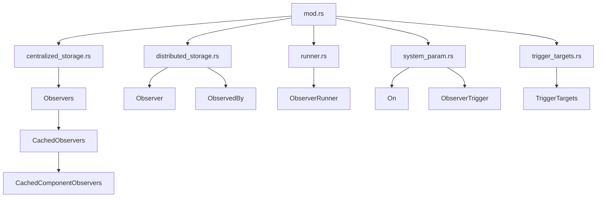

+++
title = "#19779 Improve module structure of observers code"
date = "2025-06-22T00:00:00"
draft = false
template = "pull_request_page.html"
in_search_index = true

[taxonomies]
list_display = ["show"]

[extra]
current_language = "en"
available_languages = {"en" = { name = "English", url = "/pull_request/bevy/2025-06/pr-19779-en-20250622" }, "zh-cn" = { name = "中文", url = "/pull_request/bevy/2025-06/pr-19779-zh-cn-20250622" }}
labels = ["A-ECS", "C-Code-Quality", "D-Straightforward"]
+++

### Improve module structure of observers code

## Basic Information
- **Title**: Improve module structure of observers code
- **PR Link**: https://github.com/bevyengine/bevy/pull/19779
- **Author**: alice-i-cecile
- **Status**: MERGED
- **Labels**: A-ECS, C-Code-Quality, S-Ready-For-Final-Review, X-Uncontroversial, D-Straightforward
- **Created**: 2025-06-22T20:48:59Z
- **Merged**: 2025-06-22T23:43:54Z
- **Merged By**: alice-i-cecile

## Description Translation
# Objective

While working on #17607, I found myself confused and frustrated by the tangled web woven by the various modules inside of our observers code.

Rather than tackle that as part of a big rewrite PR, I've decided to do the mature (if frustrating) thing where you split out your trivial but noisy refactoring first.

There are a large number of moving parts, especially in terms of storage, and these are strewn willy-nilly across the module with no apparent ordering. To make matters worse, this was almost all just dumped into a multi-thousand LOC mod.rs at the root.

## Solution

I've reshuffled the modules, attempting to:
- reduce the size of the mod.rs file
- organize structs so that smaller structs are found after the larger structs that contain them
- group related functionality together
- document why modules exist, and their broad organization

No functional changes have been made here, although I've had to increase the visibility of a few fields from private to pub(crate) or pub(super) to keep things compiling.

During these changes, I've opted for the lazy private module, public re-export strategy, to avoid causing any breakages, both within and outside of `bevy` itself. I think we can do better, but I want to leave that for a proper cleanup pass at the end. There's no sense maintaining migration guides and forcing multiple breaking changes throughout the cycle.

## Testing

No functional changes; relying on existing test suite and the Rust compiler.

## The Story of This Pull Request

The observers system in Bevy ECS had grown complex with multiple responsibilities consolidated into a single large `mod.rs` file. This made the code difficult to navigate and maintain. While working on feature development (#17607), the author encountered significant friction due to this structural issue. Rather than addressing it as part of a larger rewrite, this PR focuses exclusively on reorganizing the existing code into logical modules without altering functionality.

The primary approach was to decompose the monolithic implementation into distinct modules based on responsibility. Key structural changes include:
1. Moving centralized observer storage to `centralized_storage.rs`
2. Relocating distributed observer components to `distributed_storage.rs`
3. Separating observer execution logic into `runner.rs`
4. Extracting system parameters to `system_param.rs`
5. Isolating trigger target handling in `trigger_targets.rs`

Several fields had their visibility increased from private to pub(crate) or pub(super) to enable cross-module access while maintaining encapsulation boundaries. This was a necessary trade-off to achieve the reorganization without functional changes.

The refactoring followed a specific ordering principle: larger container structs appear before smaller contained structs. For example, `Observers` (the primary storage) is defined before `CachedObservers` (a sub-component). This creates a more natural top-down reading flow.

```rust
// Before: All in mod.rs
pub struct Observers { /* ... */ }
pub struct CachedObservers { /* ... */ }
pub struct CachedComponentObservers { /* ... */ }

// After: Hierarchical module structure
// centralized_storage.rs
pub struct Observers { /* ... */ }
pub struct CachedObservers { /* ... */ }
pub struct CachedComponentObservers { /* ... */ }
```

Each new module includes documentation explaining its purpose and relationship to other components. For example, `centralized_storage.rs` begins with:

```rust
//! Centralized storage for observers, allowing for efficient look-ups.
//!
//! This has multiple levels:
//! - [`World::observers`] provides access to [`Observers`], which is a central storage for all observers.
//! - [`Observers`] contains multiple distinct caches in the form of [`CachedObservers`].
```

The reorganization reduces `mod.rs` from 597 lines to just 9 lines, transforming it into a simple module declaration and re-export hub:

```rust
// After in mod.rs:
mod centralized_storage;
mod distributed_storage;
mod entity_cloning;
mod runner;
mod system_param;
mod trigger_targets;

pub use centralized_storage::*;
pub use distributed_storage::*;
pub use runner::*;
pub use system_param::*;
pub use trigger_targets::*;
```

This structure creates clear boundaries between different aspects of the observer system:
- **Centralized storage**: Global observer registrations and lookup
- **Distributed storage**: Observer components attached to entities
- **Execution**: Running observer systems
- **Parameters**: System parameter definitions
- **Targeting**: Handling of observer triggers

The changes improve maintainability by:
1. Reducing cognitive load through logical separation of concerns
2. Enabling focused development within specific subdomains
3. Making dependencies between components explicit
4. Providing clear entry points for future optimizations

While this reorganization doesn't change runtime behavior, it establishes a foundation for subsequent observer system improvements by eliminating structural debt. The explicit module boundaries will make it easier to reason about observer execution flow and storage mechanisms during future development.

## Visual Representation



## Key Files Changed

1. `crates/bevy_ecs/src/observer/mod.rs`
   - Reduced from 597 lines to 9 lines
   - Now serves as module declaration and re-export hub
   
```rust
// Before: Large mod.rs containing all implementations
// ... hundreds of lines of code ...

// After: Clean module declarations
mod centralized_storage;
mod distributed_storage;
// ... other module declarations ...
pub use centralized_storage::*;
// ... other re-exports ...
```

2. `crates/bevy_ecs/src/observer/centralized_storage.rs`
   - New file containing observer storage structures
   - Includes Observers, CachedObservers, and CachedComponentObservers
   - Handles observer lookups and invocation

```rust
// Central storage structure
#[derive(Default, Debug)]
pub struct Observers {
    add: CachedObservers,
    insert: CachedObservers,
    // ... other fields ...
    cache: HashMap<ComponentId, CachedObservers>,
}

// Sub-structure for cached observers
#[derive(Default, Debug)]
pub struct CachedObservers {
    global_observers: ObserverMap,
    component_observers: HashMap<ComponentId, CachedComponentObservers>,
    // ... other fields ...
}
```

3. `crates/bevy_ecs/src/observer/distributed_storage.rs`
   - New file containing entity-based observer components
   - Includes Observer component and ObservedBy relationship

```rust
// Observer component definition
pub struct Observer {
    hook_on_add: ComponentHook,
    pub(crate) error_handler: Option<ErrorHandler>,
    // ... other fields ...
}

// ObservedBy relationship component
#[derive(Default, Debug)]
pub struct ObservedBy(pub(crate) Vec<Entity>);
```

4. `crates/bevy_ecs/src/observer/runner.rs`
   - Contains observer execution logic
   - Defines ObserverRunner function type
   - Implements system running mechanism

```rust
// Observer runner function type
pub type ObserverRunner = fn(DeferredWorld, ObserverTrigger, PtrMut, propagate: &mut bool);

// System runner implementation
pub(super) fn observer_system_runner<E: Event, B: Bundle, S: ObserverSystem<E, B>>(
    mut world: DeferredWorld,
    // ... parameters ...
) {
    // Execution logic
}
```

5. `crates/bevy_ecs/src/observer/system_param.rs`
   - Defines system parameters for observer systems
   - Contains On (previously Trigger) and ObserverTrigger

```rust
// System parameter for observer inputs
pub struct On<'w, E, B: Bundle = ()> {
    event: &'w mut E,
    propagate: &'w mut bool,
    trigger: ObserverTrigger,
    // ... other fields ...
}

// Metadata about observer triggers
#[derive(Debug)]
pub struct ObserverTrigger {
    pub observer: Entity,
    pub event_type: ComponentId,
    // ... other fields ...
}
```

## Further Reading
1. [Bevy ECS Observer Documentation](https://docs.rs/bevy_ecs/latest/bevy_ecs/observer/index.html)
2. [Rust Module System Best Practices](https://doc.rust-lang.org/book/ch07-02-defining-modules-to-control-scope-and-privacy.html)
3. [Software Architecture: Structure and Organization](https://learning.oreilly.com/library/view/software-architecture-the/9781492086888/)