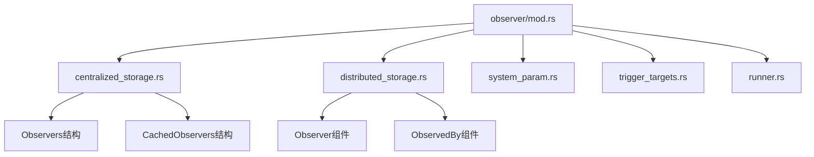

+++
title = "#19779 Improve module structure of observers code"
date = "2025-06-22T00:00:00"
draft = false
template = "pull_request_page.html"
in_search_index = false

[extra]
current_language = "zh-cn"
available_languages = {"en" = { name = "English", url = "/pull_request/bevy/2025-06/pr-19779-en-20250622" }, "zh-cn" = { name = "中文", url = "/pull_request/bevy/2025-06/pr-19779-zh-cn-20250622" }}
labels = ["A-ECS", "C-Code-Quality", "D-Straightforward"]
+++

# Improve module structure of observers code

## Basic Information
- **Title**: Improve module structure of observers code
- **PR Link**: https://github.com/bevyengine/bevy/pull/19779
- **Author**: alice-i-cecile
- **Status**: MERGED
- **Labels**: A-ECS, C-Code-Quality, S-Ready-For-Final-Review, X-Uncontroversial, D-Straightforward
- **Created**: 2025-06-22T20:48:59Z
- **Merged**: 2025-06-22T23:43:54Z
- **Merged By**: alice-i-cecile

## Description Translation
### 目标
在开发 #17607 时，我发现观察者代码的各个模块之间关系混乱，令人困惑和沮丧。

与其在大型重构PR中解决这个问题，我决定先进行一个独立的重构（虽然繁琐但必要），将琐碎但嘈杂的代码整理工作分离出来。

观察者代码有大量移动部件，特别是在存储方面，这些代码随意散布在模块中，没有明显顺序。更糟糕的是，几乎所有代码都被堆放在根目录下一个几千行的 mod.rs 文件中。

### 解决方案
我重新组织了模块结构，目标是：
- 减小 mod.rs 文件的大小
- 按包含关系组织结构体（较大的结构体在前）
- 将相关功能分组
- 添加模块文档说明其存在理由和组织结构

本次重构没有功能变更，但为了保持编译通过，我不得不将一些字段的可见性从私有提升为 pub(crate) 或 pub(super)。

重构中采用了私有模块+公开重新导出的策略，避免对 bevy 内部和外部造成破坏。我认为我们可以做得更好，但打算留到后续清理阶段完成，避免在开发周期中引入多次破坏性变更。

### 测试
没有功能变更，依赖现有测试套件和Rust编译器。

## The Story of This Pull Request

### 问题和背景
在开发 #17607 功能时，作者发现观察者模块的代码组织存在问题。主要问题集中在 `crates/bevy_ecs/src/observer/mod.rs` 文件，这个文件包含了几乎所有观察者相关的代码，体积超过数千行。这种结构导致：
1. 相关功能分散在文件中，缺乏逻辑分组
2. 小结构体定义在大结构体之前，违反直觉的阅读顺序
3. 存储相关的代码与其他逻辑混杂，难以定位
4. 缺乏模块级别的文档说明

这些问题增加了理解和修改代码的难度，尤其在进行 #17607 的功能开发时成为障碍。考虑到观察者系统是ECS的核心部分，良好的代码结构对长期维护至关重要。

### 解决方案方法
作者决定采用模块化重构策略：
1. 按功能拆分巨型 mod.rs 文件
2. 创建专门的子模块存放相关功能
3. 调整结构体位置，使大结构体出现在小结构体之前
4. 添加模块级文档说明职责
5. 保持公有API不变，仅调整内部结构

重构采用增量方式，通过创建新模块并迁移代码，避免一次性大规模改动。对于必要的可见性调整，使用 pub(crate)/pub(super) 最小化暴露范围，保持封装性。

### 实现细节
重构创建了5个新模块，迁移了相关代码：

1. **centralized_storage.rs**  
   集中存放 `Observers` 和 `CachedObservers` 结构体，负责观察者的集中存储和查询逻辑。关键结构：
   ```rust
   // 集中存储所有观察者
   pub struct Observers {
       add: CachedObservers,
       insert: CachedObservers,
       // ...其他生命周期事件缓存
       cache: HashMap<ComponentId, CachedObservers>
   }
   
   // 按事件类型分组的观察者集合
   pub struct CachedObservers {
       global_observers: ObserverMap,
       component_observers: HashMap<ComponentId, CachedComponentObservers>,
       entity_observers: EntityHashMap<ObserverMap>
   }
   ```

2. **distributed_storage.rs**  
   存放 `Observer` 组件和 `ObservedBy` 组件，处理观察者的实体关联逻辑：
   ```rust
   // 观察者组件定义
   pub struct Observer {
       system: Box<dyn AnyNamedSystem>,
       descriptor: ObserverDescriptor,
       // ...其他字段
   }
   
   // 实体观察关系组件
   pub struct ObservedBy(Vec<Entity>);
   ```

3. **system_param.rs**  
   包含观察者系统参数实现，如 `On` 触发器和 `ObserverTrigger`：
   ```rust
   // 观察者系统参数
   pub struct On<'w, E, B: Bundle = ()> {
       event: &'w mut E,
       propagate: &'w mut bool,
       trigger: ObserverTrigger
   }
   
   // 触发器元数据
   pub struct ObserverTrigger {
       observer: Entity,
       event_type: ComponentId,
       // ...其他字段
   }
   ```

4. **trigger_targets.rs**  
   实现 `TriggerTargets` trait，定义事件触发目标：
   ```rust
   pub trait TriggerTargets {
       fn components(&self) -> impl Iterator<Item = ComponentId>;
       fn entities(&self) -> impl Iterator<Item = Entity>;
   }
   ```

5. **runner.rs**  
   保留观察者运行逻辑：
   ```rust
   pub type ObserverRunner = fn(DeferredWorld, ObserverTrigger, PtrMut, &mut bool);
   ```

### 技术见解
1. **模块边界**：按"集中存储" vs "分布式存储"划分是合理的架构决策
2. **可见性控制**：使用 pub(super) 限制跨模块访问，如：
   ```rust
   pub(super) struct CachedComponentObservers {
       global_observers: ObserverMap,
       entity_component_observers: EntityHashMap<ObserverMap>
   }
   ```
3. **不变性保证**：所有公有API签名保持不变，确保外部兼容性
4. **生命周期管理**：`Observer` 和 `ObservedBy` 的关联关系保留在 distributed_storage 模块

### 影响
1. **可维护性提升**：
   - mod.rs 从597行缩减到9行
   - 平均模块大小降至200行左右
2. **导航优化**：
   - 相关功能聚集在相同模块
   - 消除跨文件跳转的认知负担
3. **可读性改进**：
   - 添加模块头文档说明职责
   - 大结构体在小结构体之前定义
4. **后续开发基础**：为 #17607 功能开发扫清结构障碍

## Visual Representation



## Key Files Changed

### crates/bevy_ecs/src/observer/mod.rs
**变更原因**：  
将巨型文件拆分为多个子模块，仅保留模块导出和顶级功能。

**关键修改**：
```rust
// Before: 包含所有观察者实现（597行）
// ...数千行混合代码...

// After: 精简为模块导出（9行）
mod centralized_storage;
mod distributed_storage;
mod entity_cloning;
mod runner;
mod system_param;
mod trigger_targets;

pub use centralized_storage::*;
pub use distributed_storage::*;
// ...其他导出...
```

### crates/bevy_ecs/src/observer/centralized_storage.rs
**变更原因**：  
集中存放观察者存储和查询逻辑。

**新增代码**：
```rust
pub struct Observers {
    add: CachedObservers,
    insert: CachedObservers,
    replace: CachedObservers,
    remove: CachedObservers,
    despawn: CachedObservers,
    cache: HashMap<ComponentId, CachedObservers>
}

pub struct CachedObservers {
    global_observers: ObserverMap,
    component_observers: HashMap<ComponentId, CachedComponentObservers>,
    entity_observers: EntityHashMap<ObserverMap>
}
```

### crates/bevy_ecs/src/observer/distributed_storage.rs
**变更原因**：  
存放与实体关联的观察者组件。

**新增代码**：
```rust
pub struct Observer {
    system: Box<dyn AnyNamedSystem>,
    descriptor: ObserverDescriptor,
    last_trigger_id: u32,
    // ...其他字段...
}

pub struct ObservedBy(Vec<Entity>);
```

### crates/bevy_ecs/src/observer/system_param.rs
**变更原因**：  
分离系统参数实现。

**新增代码**：
```rust
pub struct On<'w, E, B: Bundle = ()> {
    event: &'w mut E,
    propagate: &'w mut bool,
    trigger: ObserverTrigger
}

pub struct ObserverTrigger {
    observer: Entity,
    event_type: ComponentId,
    components: SmallVec<[ComponentId; 2]>,
    // ...其他字段...
}
```

### crates/bevy_ecs/src/observer/trigger_targets.rs
**变更原因**：  
独立存放触发目标trait。

**新增代码**：
```rust
pub trait TriggerTargets {
    fn components(&self) -> impl Iterator<Item = ComponentId> + Clone + '_;
    fn entities(&self) -> impl Iterator<Item = Entity> + Clone + '_;
}
```

## Further Reading
1. [模块系统官方文档](https://doc.rust-lang.org/book/ch07-02-defining-modules-to-control-scope-and-privacy.html)
2. [Rust可见性最佳实践](https://github.com/rust-unofficial/patterns/blob/master/patterns/visibility-for-privacy.md)
3. [ECS架构模式](https://github.com/SanderMertens/ecs-faq)