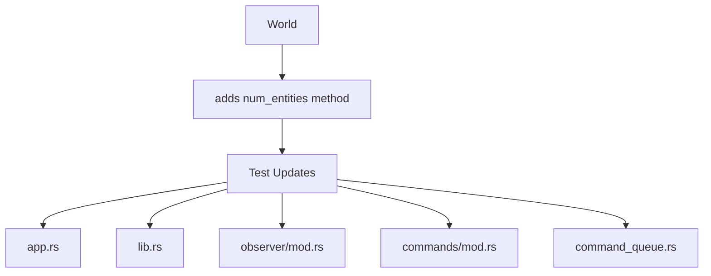

+++
title = "#19780 Add `num_entities()` to World"
date = "2025-06-22T00:00:00"
draft = false
template = "pull_request_page.html"
in_search_index = true

[taxonomies]
list_display = ["show"]

[extra]
current_language = "en"
available_languages = {"en" = { name = "English", url = "/pull_request/bevy/2025-06/pr-19780-en-20250622" }, "zh-cn" = { name = "中文", url = "/pull_request/bevy/2025-06/pr-19780-zh-cn-20250622" }}
labels = ["D-Trivial", "A-ECS"]
+++

# Add `num_entities()` to World

## Basic Information
- **Title**: Add `num_entities()` to World
- **PR Link**: https://github.com/bevyengine/bevy/pull/19780
- **Author**: Trashtalk217
- **Status**: MERGED
- **Labels**: D-Trivial, A-ECS, S-Ready-For-Final-Review
- **Created**: 2025-06-22T21:42:32Z
- **Merged**: 2025-06-22T23:09:19Z
- **Merged By**: alice-i-cecile

## Description Translation
# Objective

There is a lot of `world.entities().len()`, especially in tests. In tests, usually, the assumption is made that empty worlds do not contain any entities. This is about to change (#19711), and as such all of these tests are failing for that PR.

## Solution

`num_entities` is a convenience method that returns the number of entities inside a world. It can later be adapted to exclude 'unexpected' entities, associated with internal data structures such as Resources, Queries, Systems. In general I argue for a separation of concepts where `World` ignores internal entities in methods such as `iter_entities()` and `clear_entities()`, that discussion is, however, separate from this PR.

## Testing

I replaced most occurrences of `world.entities().len()` with `world.num_entities()` and the tests passed.

## The Story of This Pull Request

The need for this change arose from an upcoming modification to Bevy's ECS (#19711) that would break numerous tests. These tests relied on checking entity counts through `world.entities().len()`, assuming empty worlds contain no entities. The upcoming change introduced internal entities that would be counted by this method, causing test failures.

To address this, we introduced a dedicated `num_entities()` method in the `World` struct. This provides a clearer abstraction for retrieving entity counts and centralizes the counting logic. The implementation leverages the existing `Entities::len()` method but wraps it in a more discoverable API:

```rust
#[inline]
pub fn num_entities(&self) -> u32 {
    self.entities.len()
}
```

This method serves two primary purposes: First, it replaces verbose `world.entities().len()` calls with a more readable alternative. Second, it creates a clear extension point for future modifications where we might want to exclude internal entities from the count.

The bulk of the PR updates test assertions across multiple modules to use the new method. This required modifying six files containing tests that previously checked entity counts. For example:

```rust
// Before
assert_eq!(world.entities().len(), 2);

// After
assert_eq!(world.num_entities(), 2);
```

These changes maintain test functionality while preparing the codebase for the upcoming ECS changes. The approach is minimally invasive, focusing only on the counting mechanism without altering core ECS behavior. The new method provides a foundation for potential future enhancements where entity counting logic might need to differentiate between user-visible entities and internal framework entities.

## Visual Representation



## Key Files Changed

1. **crates/bevy_ecs/src/world/mod.rs** (+8/-0)  
   Added the `num_entities()` method implementation:

```rust
/// Retrieves the number of [`Entities`] in the world.
///
/// This is helpful as a diagnostic, but it can also be used effectively in tests.
#[inline]
pub fn num_entities(&self) -> u32 {
    self.entities.len()
}
```

2. **crates/bevy_app/src/app.rs** (+1/-1)  
   Updated test assertion:

```rust
// Before:
assert_eq!(app.world().entities().len(), 2);

// After:
assert_eq!(app.world().num_entities(), 2);
```

3. **crates/bevy_ecs/src/lib.rs** (+2/-2)  
   Updated two test assertions:

```rust
// Before:
assert_eq!(world.entities().len(), 2);

// After:
assert_eq!(world.num_entities(), 2);
```

4. **crates/bevy_ecs/src/observer/mod.rs** (+1/-1)  
   Updated test assertion:

```rust
// Before:
assert_eq!(world.entities().len(), 3);

// After:
assert_eq!(world.num_entities(), 3);
```

5. **crates/bevy_ecs/src/system/commands/mod.rs** (+1/-1)  
   Updated test assertion:

```rust
// Before:
assert_eq!(world.entities().len(), 1);

// After:
assert_eq!(world.num_entities(), 1);
```

6. **crates/bevy_ecs/src/world/command_queue.rs** (+3/-3)  
   Updated three test assertions:

```rust
// Before:
assert_eq!(world.entities().len(), 2);

// After:
assert_eq!(world.num_entities(), 2);
```

## Further Reading
- [Bevy ECS World Documentation](https://docs.rs/bevy_ecs/latest/bevy_ecs/world/struct.World.html)
- [Entity Component System Pattern](https://en.wikipedia.org/wiki/Entity_component_system)
- Related PR: [#19711 - ECS Internal Entities](https://github.com/bevyengine/bevy/pull/19711)