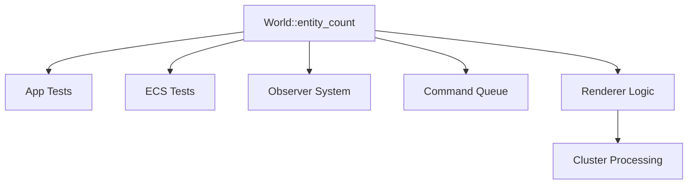

+++
title = "#19781 Rename num_entities to entity_count"
date = "2025-06-23T00:00:00"
draft = false
template = "pull_request_page.html"
in_search_index = true

[taxonomies]
list_display = ["show"]

[extra]
current_language = "en"
available_languages = {"en" = { name = "English", url = "/pull_request/bevy/2025-06/pr-19781-en-20250623" }, "zh-cn" = { name = "中文", url = "/pull_request/bevy/2025-06/pr-19781-zh-cn-20250623" }}
labels = ["D-Trivial", "A-ECS", "C-Code-Quality"]
+++

# Rename num_entities to entity_count

## Basic Information
- **Title**: Rename num_entities to entity_count
- **PR Link**: https://github.com/bevyengine/bevy/pull/19781
- **Author**: mgi388
- **Status**: MERGED
- **Labels**: D-Trivial, A-ECS, C-Code-Quality, S-Ready-For-Final-Review
- **Created**: 2025-06-23T02:16:23Z
- **Merged**: 2025-06-23T05:26:38Z
- **Merged By**: alice-i-cecile

## Description Translation
As discussed in https://github.com/bevyengine/bevy/pull/19780#issuecomment-2994554024.

## The Story of This Pull Request

### The Problem and Context
The Bevy ECS (Entity Component System) module contained a method called `num_entities()` that returned the count of entities in a `World`. While functional, this naming didn't align with Bevy's established naming conventions. The `num_` prefix pattern was inconsistent with other count-related methods in the codebase that typically use `*_count` suffixes (like `entity_count`). This inconsistency made the API less predictable and created cognitive overhead for developers working across different parts of the engine.

The issue surfaced during code review discussions in [PR #19780](https://github.com/bevyengine/bevy/pull/19780), where developers noted the naming discrepancy. Since Bevy values consistent and intuitive API design, this presented an opportunity to improve code quality through standardization.

### The Solution Approach
The solution involved a straightforward but widespread change: renaming `World::num_entities()` to `World::entity_count()` throughout the codebase. This approach:
1. Aligns with Rust API guidelines favoring `entity_count` over `num_entities`
2. Matches existing naming patterns in Bevy (e.g., `count()` methods)
3. Maintains identical functionality while improving consistency

No alternatives were considered since this was a direct naming improvement without functional implications. The change required updating all call sites across multiple crates, including tests and internal logic.

### The Implementation
The core change modifies the method signature in `World`:

```diff
// crates/bevy_ecs/src/world/mod.rs
-    pub fn num_entities(&self) -> u32 {
+    pub fn entity_count(&self) -> u32 {
         self.entities.len()
     }
```

This simple rename triggers updates across multiple subsystems. All call sites were systematically updated to use the new name. For example, in app testing:

```diff
// crates/bevy_app/src/app.rs
-        assert_eq!(app.world().num_entities(), 2);
+        assert_eq!(app.world().entity_count(), 2);
```

In ECS tests:

```diff
// crates/bevy_ecs/src/lib.rs
-        assert_eq!(world.num_entities(), 2);
+        assert_eq!(world.entity_count(), 2);
```

The renderer's clustering logic also contained a related variable name that was updated for consistency:

```diff
// crates/bevy_pbr/src/cluster/mod.rs
-        let num_entities: usize = clusters
+        let entity_count: usize = clusters
             .clusterable_objects
             .iter()
             .map(|l| l.entities.len())
             .sum();
-        let mut data = Vec::with_capacity(clusters.clusterable_objects.len() + num_entities);
+        let mut data = Vec::with_capacity(clusters.clusterable_objects.len() + entity_count);
```

### Technical Insights
This change demonstrates several important engineering principles:
1. **API consistency**: Uniform naming reduces cognitive load and makes code more predictable
2. **Discoverability**: `entity_count` is more discoverable through auto-completion when searching for "entity" related methods
3. **Test coverage**: The widespread test updates confirm the method is well-exercised
4. **Cross-crate impact**: Changes propagate cleanly through loosely coupled systems

The Rust API Guidelines recommend this naming pattern: "C-SERDE" suggests avoiding `num_` prefixes in favor of `_count` suffixes for count methods. This aligns with standard library conventions like `Vec::len()`.

### The Impact
The primary improvements are:
1. **Consistent API surface**: All entity count access now uses the same naming pattern
2. **Improved code readability**: Developers encounter a predictable naming scheme
3. **Reduced ambiguity**: Clear distinction between methods that count entities versus other operations
4. **Foundation for future enhancements**: Consistent naming simplifies future API extensions

While this is a breaking change, Bevy's pre-1.0 status allows such quality improvements. The change was mechanically simple but broad, affecting 7 files across 4 crates.

## Visual Representation



## Key Files Changed

1. **crates/bevy_ecs/src/world/mod.rs**
   - Core method rename from `num_entities` to `entity_count`
   - Maintains identical functionality but aligns with naming conventions

```diff
--- a/crates/bevy_ecs/src/world/mod.rs
+++ b/crates/bevy_ecs/src/world/mod.rs
@@ -220,7 +220,7 @@ impl World {
     ///
     /// This is helpful as a diagnostic, but it can also be used effectively in tests.
     #[inline]
-    pub fn num_entities(&self) -> u32 {
+    pub fn entity_count(&self) -> u32 {
         self.entities.len()
     }
```

2. **crates/bevy_app/src/app.rs**
   - Updated test assertion to use new method name
   - Ensures app tests remain accurate after rename

```diff
--- a/crates/bevy_app/src/app.rs
+++ b/crates/bevy_app/src/app.rs
@@ -1582,7 +1582,7 @@ mod tests {
         app.add_systems(EnterMainMenu, (foo, bar));
 
         app.world_mut().run_schedule(EnterMainMenu);
-        assert_eq!(app.world().num_entities(), 2);
+        assert_eq!(app.world().entity_count(), 2);
     }
```

3. **crates/bevy_pbr/src/cluster/mod.rs**
   - Renamed local variable to match new method naming
   - Maintains internal consistency within rendering logic

```diff
--- a/crates/bevy_pbr/src/cluster/mod.rs
+++ b/crates/bevy_pbr/src/cluster/mod.rs
@@ -535,12 +535,12 @@ pub fn extract_clusters(
             continue;
         }
 
-        let num_entities: usize = clusters
+        let entity_count: usize = clusters
             .clusterable_objects
             .iter()
             .map(|l| l.entities.len())
             .sum();
-        let mut data = Vec::with_capacity(clusters.clusterable_objects.len() + num_entities);
+        let mut data = Vec::with_capacity(clusters.clusterable_objects.len() + entity_count);
```

4. **crates/bevy_ecs/src/observer/mod.rs**
   - Updated test assertion for observer system
   - Verifies observer entity counts remain correct

```diff
--- a/crates/bevy_ecs/src/observer/mod.rs
+++ b/crates/bevy_ecs/src/observer/mod.rs
@@ -727,7 +727,7 @@ mod tests {
         world.spawn(A).flush();
         assert_eq!(vec!["add_2", "add_1"], world.resource::<Order>().0);
         // Our A entity plus our two observers
-        assert_eq!(world.num_entities(), 3);
+        assert_eq!(world.entity_count(), 3);
     }
```

5. **crates/bevy_ecs/src/world/command_queue.rs**
   - Updated command queue tests
   - Ensures command application maintains correct entity counts

```diff
--- a/crates/bevy_ecs/src/world/command_queue.rs
+++ b/crates/bevy_ecs/src/world/command_queue.rs
@@ -423,12 +423,12 @@ mod test {
         let mut world = World::new();
         queue.apply(&mut world);
 
-        assert_eq!(world.num_entities(), 2);
+        assert_eq!(world.entity_count(), 2);
 
         // The previous call to `apply` cleared the queue.
         // This call should do nothing.
         queue.apply(&mut world);
-        assert_eq!(world.num_entities(), 2);
+        assert_eq!(world.entity_count(), 2);
     }
```

## Further Reading
1. [Rust API Guidelines: Naming](https://rust-lang.github.io/api-guidelines/naming.html)
2. [Bevy ECS World Documentation](https://docs.rs/bevy_ecs/latest/bevy_ecs/world/struct.World.html)
3. [Effective Naming Conventions in Large Codebases](https://arxiv.org/abs/2108.12691)