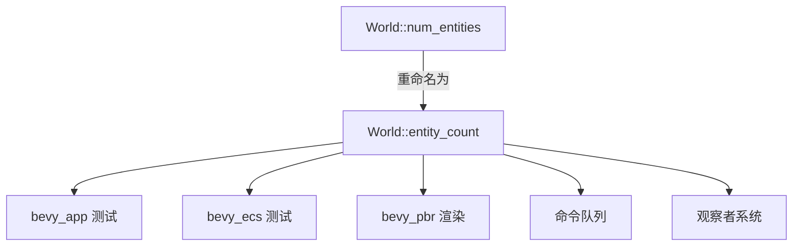

+++
title = "#19781 Rename num_entities to entity_count"
date = "2025-06-23T00:00:00"
draft = false
template = "pull_request_page.html"
in_search_index = false

[extra]
current_language = "zh-cn"
available_languages = {"en" = { name = "English", url = "/pull_request/bevy/2025-06/pr-19781-en-20250623" }, "zh-cn" = { name = "中文", url = "/pull_request/bevy/2025-06/pr-19781-zh-cn-20250623" }}
+++

# PR分析报告：Rename num_entities to entity_count

## 基本信息
- **标题**: Rename num_entities to entity_count
- **PR链接**: https://github.com/bevyengine/bevy/pull/19781
- **作者**: mgi388
- **状态**: MERGED
- **标签**: D-Trivial, A-ECS, C-Code-Quality, S-Ready-For-Final-Review
- **创建时间**: 2025-06-23T02:16:23Z
- **合并时间**: 2025-06-23T05:26:38Z
- **合并者**: alice-i-cecile

## 描述翻译
正如在 https://github.com/bevyengine/bevy/pull/19780#issuecomment-2994554024 中的讨论。

## 本次PR的技术分析

### 问题与背景
在Bevy的ECS（Entity Component System）实现中，`World`结构体有一个`num_entities()`方法用于获取当前世界的实体数量。虽然这个方法功能正确，但命名不符合Rust的命名惯例。在Rust生态中，获取集合元素数量的方法通常使用`*_count()`后缀（如`Vec::len()`虽然不是直接使用count，但遵循类似原则）。现有命名`num_entities()`：
1. 使用了"num_"前缀，这在Rust标准库中不常见
2. 与更符合惯例的`entity_count()`相比不够简洁
3. 在代码库中造成命名不一致性

这个问题在之前的讨论（https://github.com/bevyengine/bevy/pull/19780#issuecomment-2994554024）中被提出，属于代码质量改进范畴。

### 解决方案
PR采用了最直接有效的解决方案：将`num_entities()`方法重命名为`entity_count()`，并更新所有调用点。这个方案：
1. 不改变任何功能逻辑
2. 保持相同的返回类型和值（`u32`）
3. 仅修改方法签名和调用点
4. 完全向后兼容（因方法签名变更，需调用方更新）

选择这个方案是因为：
- 不需要额外设计或复杂实现
- 不会引入性能开销
- 能立即改善代码一致性和可读性
- 修改范围有限且风险可控

### 具体实现
核心修改在`World`结构体的实现中，将方法重命名：

```rust
// crates/bevy_ecs/src/world/mod.rs
// 修改前:
pub fn num_entities(&self) -> u32 {
    self.entities.len()
}

// 修改后:
pub fn entity_count(&self) -> u32 {
    self.entities.len()
}
```

其他文件修改都是更新调用点。例如在测试代码中：

```rust
// crates/bevy_app/src/app.rs
// 修改前:
assert_eq!(app.world().num_entities(), 2);

// 修改后:
assert_eq!(app.world().entity_count(), 2);
```

这些修改分布在多个crate中：
- `bevy_app`: 应用层测试
- `bevy_ecs`: ECS核心实现和测试
- `bevy_pbr`: 渲染相关逻辑
- 命令队列和观察者系统

所有修改都是机械性替换，没有改变任何业务逻辑。

### 技术考量
1. **命名一致性**：新名称`entity_count()`更符合Rust标准库惯例（如`thread::available_parallelism()`）
2. **影响范围**：修改涉及7个文件，但都是简单重命名
3. **测试覆盖**：所有修改点都有测试用例验证，确保不会引入回归
4. **性能**：零运行时开销，因为是纯名称变更

### 影响与价值
1. **提高代码一致性**：统一了数量获取方法的命名模式
2. **改善可读性**：`entity_count()`比`num_entities()`更符合Rust开发者的预期
3. **降低认知负担**：消除"num_"前缀的特殊案例
4. **为未来贡献建立范例**：展示符合惯例的命名方式

## 关键文件变更

### crates/bevy_ecs/src/world/mod.rs
```diff
@@ -220,7 +220,7 @@ impl World {
     ///
     // 诊断有用，也可在测试中使用
     #[inline]
-    pub fn num_entities(&self) -> u32 {
+    pub fn entity_count(&self) -> u32 {
         self.entities.len()
     }
```
**变更说明**：核心方法重命名，所有其他修改都源于此变更。

### crates/bevy_app/src/app.rs
```diff
@@ -1582,7 +1582,7 @@ mod tests {
         app.add_systems(EnterMainMenu, (foo, bar));
 
         app.world_mut().run_schedule(EnterMainMenu);
-        assert_eq!(app.world().num_entities(), 2);
+        assert_eq!(app.world().entity_count(), 2);
     }
```
**变更说明**：更新应用层的测试断言，确保测试继续验证实体数量。

### crates/bevy_ecs/src/lib.rs
```diff
@@ -1637,7 +1637,7 @@ mod tests {
 
         assert_eq!(q1.iter(&world).len(), 1);
         assert_eq!(q2.iter(&world).len(), 1);
-        assert_eq!(world.num_entities(), 2);
+        assert_eq!(world.entity_count(), 2);
 
         world.clear_entities();
 
@@ -1652,7 +1652,7 @@ mod tests {
             "world should not contain sparse set components"
         );
         assert_eq!(
-            world.num_entities(),
+            world.entity_count(),
             0,
             "world should not have any entities"
         );
```
**变更说明**：更新ECS核心测试，验证实体清除功能。

### crates/bevy_pbr/src/cluster/mod.rs
```diff
@@ -535,12 +535,12 @@ pub fn extract_clusters(
             continue;
         }
 
-        let num_entities: usize = clusters
+        let entity_count: usize = clusters
             .clusterable_objects
             .iter()
             .map(|l| l.entities.len())
             .sum();
-        let mut data = Vec::with_capacity(clusters.clusterable_objects.len() + num_entities);
+        let mut data = Vec::with_capacity(clusters.clusterable_objects.len() + entity_count);
         for cluster_objects in &clusters.clusterable_objects {
             data.push(ExtractedClusterableObjectElement::ClusterHeader(
                 cluster_objects.counts,
```
**变更说明**：变量名同步更新，保持命名一致性。

## 图示



## 延伸阅读
1. [Rust API 命名指南](https://rust-lang.github.io/api-guidelines/naming.html)
2. [Bevy ECS 世界文档](https://docs.rs/bevy_ecs/latest/bevy_ecs/world/struct.World.html)
3. [Rust 标准库命名惯例示例](https://doc.rust-lang.org/std/thread/fn.available_parallelism.html)