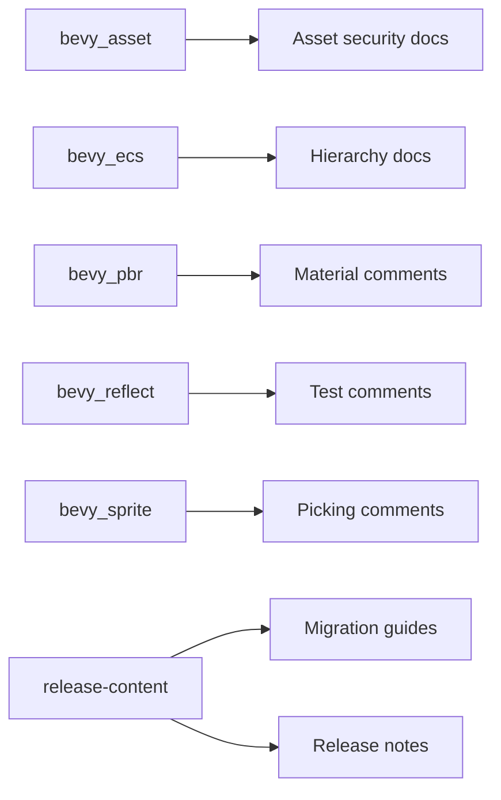

+++
title = "#19788 Fix some typos"
date = "2025-06-23T00:00:00"
draft = false
template = "pull_request_page.html"
in_search_index = true

[taxonomies]
list_display = ["show"]

[extra]
current_language = "en"
available_languages = {"en" = { name = "English", url = "/pull_request/bevy/2025-06/pr-19788-en-20250623" }, "zh-cn" = { name = "中文", url = "/pull_request/bevy/2025-06/pr-19788-zh-cn-20250623" }}
labels = ["C-Docs", "D-Trivial"]
+++

# Fix some typos

## Basic Information
- **Title**: Fix some typos
- **PR Link**: https://github.com/bevyengine/bevy/pull/19788
- **Author**: rparrett
- **Status**: MERGED
- **Labels**: C-Docs, D-Trivial, S-Ready-For-Final-Review
- **Created**: 2025-06-23T22:13:12Z
- **Merged**: 2025-06-23T22:52:34Z
- **Merged By**: mockersf

## Description Translation
# Objective

- Notice a word duplication typo
- Small quest to fix similar or nearby typos with my faithful companion `\b(\w+)\s+\1\b`

## Solution

Fix em

## The Story of This Pull Request

While working with the Bevy codebase, the author noticed a duplicated word typo in documentation comments. This observation triggered a systematic review using the regular expression `\b(\w+)\s+\1\b` to identify similar word duplication errors across the codebase. The regex efficiently matches repeated words separated by whitespace, enabling targeted fixes for documentation clarity.

The changes focus exclusively on documentation and comments - no functional code modifications were made. Documentation quality is critical in large projects like Bevy since unclear explanations can confuse contributors and users. The PR addresses this by eliminating redundant words that could impede readability.

The implementation approach was straightforward: run the regex search across the codebase, manually verify each match, and correct the duplicated words. The author focused on comments and documentation files where these typos were most likely to cause confusion. All changes were simple string replacements that maintained existing technical meaning while improving clarity.

These typo fixes improve the developer experience by making documentation more professional and readable. Clear documentation reduces cognitive load for contributors reading code comments and helps users understand migration guides and release notes. The changes demonstrate how small, focused improvements can incrementally enhance a large codebase's maintainability.

## Visual Representation



## Key Files Changed

1. **crates/bevy_asset/src/lib.rs**: Fixed duplicated words in `UnapprovedPathMode` docs
```rust
// Before:
// could allow allow arbitrary file
// that is is unapproved

// After:
// could allow arbitrary file
// that is unapproved
```

2. **crates/bevy_ecs/src/hierarchy.rs**: Removed duplicated words in panic documentation
```rust
// Before:
// if an invariant is is broken

// After:
// if an invariant is broken
```

3. **crates/bevy_pbr/src/material_bind_groups.rs**: Corrected typo in data validation comment
```rust
// Before:
// Make the the data is of the right length.

// After:
// Make sure the data is of the right length.
```

4. **crates/bevy_reflect/src/lib.rs**: Fixed duplicated word in test explanation
```rust
// Before:
// we do do that correctly

// After:
// we do that correctly
```

5. **crates/bevy_sprite/src/picking_backend.rs**: Removed duplicated preposition
```rust
// Before:
// in in world space

// After:
// in world space
```

6. **release-content/migration-guides/relative_cursor_position_is_object_centered.md**: Fixed duplicated article
```markdown
<!-- Before: -->
at the the center

<!-- After: -->
at the center
```

7. **release-content/release-notes/bevy_solari.md**: Corrected two documentation typos
```markdown
<!-- Before: -->
light that that is emitted
look forwards

<!-- After: -->
light that is emitted
look forward
```

## Further Reading
- [Regular Expressions for Pattern Matching](https://docs.rs/regex/latest/regex/)
- [Bevy Contribution Guidelines](https://github.com/bevyengine/bevy/blob/main/CONTRIBUTING.md)
- [Technical Documentation Best Practices](https://documentation.divio.com/)