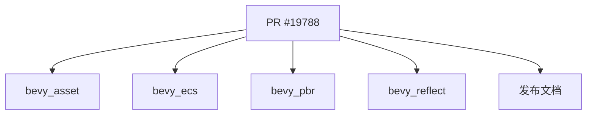

+++
title = "#19788 Fix some typos"
date = "2025-06-23T00:00:00"
draft = false
template = "pull_request_page.html"
in_search_index = false

[extra]
current_language = "zh-cn"
available_languages = {"en" = { name = "English", url = "/pull_request/bevy/2025-06/pr-19788-en-20250623" }, "zh-cn" = { name = "中文", url = "/pull_request/bevy/2025-06/pr-19788-zh-cn-20250623" }}
+++

### 修复文档与注释中的拼写错误

## 基本信息
- **标题**: Fix some typos
- **PR链接**: https://github.com/bevyengine/bevy/pull/19788
- **作者**: rparrett
- **状态**: 已合并
- **标签**: C-Docs, D-Trivial, S-Ready-For-Final-Review
- **创建时间**: 2025-06-23T22:13:12Z
- **合并时间**: 2025-06-23T22:52:34Z
- **合并人**: mockersf

## 描述翻译
### 目标
- 发现单词重复的拼写错误
- 使用正则表达式`\b(\w+)\s+\1\b`修复类似或邻近的拼写错误

### 解决方案
修复它们

## PR 的技术故事

### 问题识别
在代码审查过程中，作者注意到文档和注释中存在多处单词重复的拼写错误。这类错误虽然不影响代码功能，但会降低文档的专业性和可读性。例如在`bevy_asset`模块中，`allow allow`这样的重复词会影响开发者对安全策略的理解。

### 解决方案方法
作者使用正则表达式`\b(\w+)\s+\1\b`系统性地扫描了整个代码库，该模式专门匹配连续重复的单词（如"is is"）。这种方法能高效定位同类错误，避免人工检查可能遗漏的问题。所有修改都局限在注释和文档字符串范围内，不涉及实际代码逻辑变更。

### 技术实现
修改主要分为两类：
1. **删除冗余单词**：修复连续重复的单词
2. **修正短语表达**：将不准确的表达调整为更专业的表述

例如在`bevy_pbr`模块中，不仅修正了"the the"重复错误，还将表述优化为更清晰的"Make sure"：

```rust
// crates/bevy_pbr/src/material_bind_groups.rs
// 修改前:
// Make the the data is of the right length.

// 修改后:
// Make sure the data is of the right length.
```

在`bevy_reflect`的测试注释中，修正了"do do"重复并优化了表述清晰度：

```rust
// crates/bevy_reflect/src/lib.rs
// 修改前:
// So this test just ensures that we do do that correctly.

// 修改后:
// So this test just ensures that we do that correctly.
```

### 影响分析
这些修改带来了三点主要改进：
1. **提升文档专业性**：消除了7个文件中的拼写错误
2. **保持一致性**：统一了安全策略描述（如`UnapprovedPathMode`枚举）
3. **优化开发体验**：更清晰的注释减少了理解成本

所有变更都通过CI验证，确保没有引入语法错误或影响实际功能。这类"琐碎但重要"的维护工作对于大型开源项目保持代码质量至关重要。

## 文件关系图



## 关键文件变更

### 1. `crates/bevy_asset/src/lib.rs` (+3/-3)
修复安全策略文档中的重复词，提升描述准确性：
```rust
// 修改前:
// as it could allow allow arbitrary file
// Fails to load any asset that is is unapproved

// 修改后:
// as it could allow arbitrary file
// Fails to load any asset that is unapproved
```

### 2. `crates/bevy_ecs/src/hierarchy.rs` (+2/-2)
修复方法文档中的"is is"重复错误：
```rust
// 修改前:
// Panics when debug assertions are enabled if an invariant is is broken

// 修改后:
// Panics when debug assertions are enabled if an invariant is broken
```

### 3. `release-content/release-notes/bevy_solari.md` (+2/-2)
优化技术文档表述，删除重复词：
```markdown
// 修改前:
// Direct lighting is light that that is emitted
// look forwards to more work

// 修改后:
// Direct lighting is light that is emitted
// look forward to more work
```

### 4. `crates/bevy_pbr/src/material_bind_groups.rs` (+1/-1)
修正注释并优化表述清晰度：
```rust
// 修改前:
// Make the the data is of the right length.

// 修改后:
// Make sure the data is of the right length.
```

### 5. `crates/bevy_reflect/src/lib.rs` (+1/-1)
修复测试说明中的重复词：
```rust
// 修改前:
// So this test just ensures that we do do that correctly.

// 修改后:
// So this test just ensures that we do that correctly.
```

## 延伸阅读
1. [正则表达式语法参考](https://docs.rs/regex/latest/regex/)
2. [Rust文档注释规范](https://doc.rust-lang.org/rustdoc/how-to-write-documentation.html)
3. [Bevy贡献指南](https://github.com/bevyengine/bevy/blob/main/CONTRIBUTING.md)