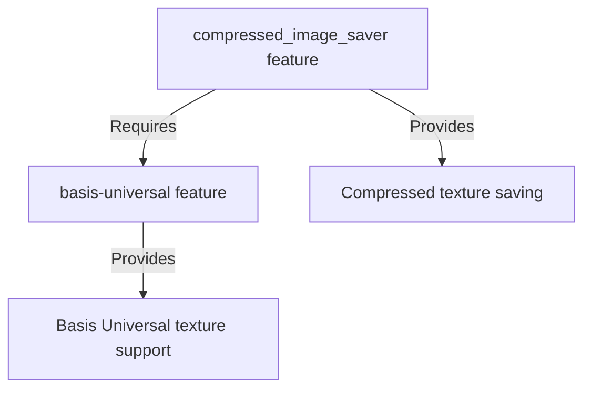

+++
title = "#19789 Split overloaded basis-universal feature into compressed_image_saver"
date = "2025-06-24T00:00:00"
draft = false
template = "pull_request_page.html"
in_search_index = true

[taxonomies]
list_display = ["show"]

[extra]
current_language = "en"
available_languages = {"en" = { name = "English", url = "/pull_request/bevy/2025-06/pr-19789-en-20250624" }, "zh-cn" = { name = "中文", url = "/pull_request/bevy/2025-06/pr-19789-zh-cn-20250624" }}
labels = ["A-Rendering", "D-Straightforward"]
+++

# Technical Analysis of PR #19789: Split overloaded basis-universal feature into compressed_image_saver

## Basic Information
- **Title**: Split overloaded basis-universal feature into compressed_image_saver
- **PR Link**: https://github.com/bevyengine/bevy/pull/19789
- **Author**: atlv24
- **Status**: MERGED
- **Labels**: A-Rendering, D-Straightforward, S-Needs-Review
- **Created**: 2025-06-24T01:46:38Z
- **Merged**: 2025-06-24T03:32:09Z
- **Merged By**: superdump

## Description Translation
# Objective

- basis-universal feature is overloaded, you might not want the compressed_image_saver but you may want basis-universal

## Solution

- split out compressed_image_saver

## Testing

- cargo clippy

## The Story of This Pull Request

### The Problem and Context
The `basis-universal` feature in Bevy had become overloaded with two distinct responsibilities: enabling Basis Universal texture support and enabling compressed image saving functionality. This coupling created an unnecessary dependency where users who wanted Basis Universal texture support were forced to include the compressed image saver functionality as well. In practice, these are separate concerns - a project might need to read Basis Universal textures without requiring the asset processor to save compressed KTX2 UASTC textures. The current implementation didn't allow this separation, limiting configuration flexibility.

### The Solution Approach
The straightforward solution was to decouple these features by creating a new dedicated `compressed_image_saver` feature. This maintains the existing functionality while allowing users to choose whether to include the compressed image saving capability. The implementation required:
1. Creating a new feature flag for compressed image saving
2. Updating all conditional compilation attributes to use the new feature where appropriate
3. Maintaining the dependency chain where compressed image saving requires Basis Universal support
4. Documenting the new feature for users

The approach preserves backward compatibility while providing more granular control over dependencies. No alternatives were considered since the change is a clean separation of existing functionality.

### The Implementation
The implementation involved coordinated changes across multiple files. First, the new `compressed_image_saver` feature was added to the root Cargo.toml:

```diff
# File: Cargo.toml
# Before:
# (No separate compressed_image_saver feature)

# After:
+ # Enables compressed KTX2 UASTC texture output on the asset processor
+ compressed_image_saver = ["bevy_internal/compressed_image_saver"]
```

The bevy_image crate was updated to conditionally include the compressed image saver module only when the new feature is enabled:

```diff
# File: crates/bevy_image/src/lib.rs
# Before:
#[cfg(feature = "basis-universal")]
mod compressed_image_saver;

#[cfg(feature = "basis-universal")]
pub use compressed_image_saver::*;

# After:
#[cfg(feature = "compressed_image_saver")]
mod compressed_image_saver;

#[cfg(feature = "compressed_image_saver")]
pub use compressed_image_saver::*;
```

Dependency relationships were established in the bevy_internal crate's Cargo.toml:

```diff
# File: crates/bevy_internal/Cargo.toml
# After:
+ compressed_image_saver = [
+   "bevy_image/compressed_image_saver",
+   "bevy_render/compressed_image_saver",
+ ]
```

The bevy_render crate was updated to only initialize the compressed image saver when the new feature is active:

```diff
# File: crates/bevy_render/src/texture/mod.rs
# Before:
#[cfg(feature = "basis-universal")]
use bevy_image::CompressedImageSaver;

if let Some(processor) = ... {
    #[cfg(feature = "basis-universal")]
    processor.register_asset_saver(CompressedImageSaver);
}

# After:
#[cfg(feature = "compressed_image_saver")]
use bevy_image::CompressedImageSaver;

if let Some(processor) = ... {
    #[cfg(feature = "compressed_image_saver")]
    processor.register_asset_saver(CompressedImageSaver);
}
```

Finally, documentation was updated to reflect the new feature:

```diff
# File: docs/cargo_features.md
+ |compressed_image_saver|Enables compressed KTX2 UASTC texture output on the asset processor|
```

### Technical Insights
This change demonstrates good feature flag management by:
1. Keeping features focused on single responsibilities
2. Maintaining clear dependency relationships between features
3. Using conditional compilation effectively
4. Providing backward compatibility

The compressed image saver remains dependent on Basis Universal through the crate dependency chain, but this dependency is now explicit rather than implicit through a shared feature flag.

### The Impact
These changes provide tangible benefits:
1. Reduced binary size for users who don't need compressed texture saving
2. Cleaner separation of concerns in the codebase
3. More flexible configuration options
4. Maintained functionality for existing users who enable both features

The changes affect multiple crates but are localized to feature configuration and conditional compilation. The implementation is straightforward with minimal risk of regressions.

## Visual Representation



## Key Files Changed

1. `crates/bevy_internal/Cargo.toml` (+6/-0)  
   Added the new `compressed_image_saver` feature with dependencies on the image and render crate implementations.

```diff
+ compressed_image_saver = [
+   "bevy_image/compressed_image_saver",
+   "bevy_render/compressed_image_saver",
+ ]
```

2. `crates/bevy_image/src/lib.rs` (+2/-2)  
   Changed feature gates for compressed image saver from `basis-universal` to the new `compressed_image_saver`.

```diff
- #[cfg(feature = "basis-universal")]
+ #[cfg(feature = "compressed_image_saver")]
```

3. `crates/bevy_render/src/texture/mod.rs` (+2/-2)  
   Updated conditions for using the compressed image saver to match the new feature.

```diff
- #[cfg(feature = "basis-universal")]
+ #[cfg(feature = "compressed_image_saver")]
```

4. `Cargo.toml` (+3/-0)  
   Added root-level feature definition for `compressed_image_saver`.

```diff
+ # Enables compressed KTX2 UASTC texture output on the asset processor
+ compressed_image_saver = ["bevy_internal/compressed_image_saver"]
```

5. `crates/bevy_image/Cargo.toml` (+3/-0)  
   Added crate-level feature definition linking to basis-universal dependency.

```diff
+ # Enables compressed KTX2 UASTC texture output on the asset processor
+ compressed_image_saver = ["basis-universal"]
```

6. `docs/cargo_features.md` (+1/-0)  
   Documented the new feature for users.

```diff
+ |compressed_image_saver|Enables compressed KTX2 UASTC texture output on the asset processor|
```

## Further Reading
1. [Bevy Engine Features Documentation](https://github.com/bevyengine/bevy/blob/main/docs/cargo_features.md)
2. [The Cargo Book: Features](https://doc.rust-lang.org/cargo/reference/features.html)
3. [Conditional Compilation in Rust](https://doc.rust-lang.org/reference/conditional-compilation.html)
4. [Basis Universal Texture Format](https://github.com/BinomialLLC/basis_universal)