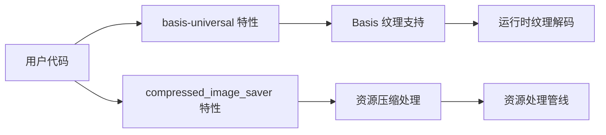

+++
title = "#19789 Split overloaded basis-universal feature into compressed_image_saver"
date = "2025-06-24T00:00:00"
draft = false
template = "pull_request_page.html"
in_search_index = false

[extra]
current_language = "zh-cn"
available_languages = {"en" = { name = "English", url = "/pull_request/bevy/2025-06/pr-19789-en-20250624" }, "zh-cn" = { name = "中文", url = "/pull_request/bevy/2025-06/pr-19789-zh-cn-20250624" }}
+++

# 拆分过载的 basis-universal 功能为 compressed_image_saver

## 基本信息
- **标题**: Split overloaded basis-universal feature into compressed_image_saver
- **PR 链接**: https://github.com/bevyengine/bevy/pull/19789
- **作者**: atlv24
- **状态**: MERGED
- **标签**: A-Rendering, D-Straightforward, S-Needs-Review
- **创建时间**: 2025-06-24T01:46:38Z
- **合并时间**: 2025-06-24T03:32:09Z
- **合并者**: superdump

## 描述翻译
# Objective

- basis-universal 功能是过载的(overloaded)，你可能不想要 compressed_image_saver 但你可能想要 basis-universal

## Solution

- 拆分出 compressed_image_saver

## Testing

- cargo clippy

## 这个 Pull Request 的故事

### 问题与背景
在 Bevy 引擎的现有实现中，`basis-universal` 特性存在功能耦合问题。这个特性同时控制着两个独立的功能：Basis Universal 纹理格式的支持和在资源处理(asset processing)阶段压缩输出 KTX2 UASTC 纹理的能力。这种设计导致用户无法单独启用 Basis Universal 支持而不启用资源处理阶段的纹理压缩功能。

具体来说，`basis-universal` 特性包含两个主要部分：
1. Basis Universal 纹理的解码支持（运行时功能）
2. `CompressedImageSaver`（资源处理阶段功能）

这种耦合带来了不必要的依赖关系。用户可能只需要 Basis Universal 格式支持而不需要资源处理阶段的压缩功能，但在现有实现中无法实现这种选择性启用。

### 解决方案
为了解决这个问题，PR 将 `CompressedImageSaver` 功能从 `basis-universal` 特性中分离出来，创建了一个新的独立特性 `compressed_image_saver`。这样用户可以根据需求选择启用：
- 仅 `basis-universal`：获得 Basis Universal 纹理支持
- 仅 `compressed_image_saver`：启用资源处理阶段的纹理压缩
- 同时启用两者：获得完整功能

这个方案保持了向后兼容性，因为现有启用 `basis-universal` 的用户不会受到影响。同时提供了更细粒度的功能控制。

### 实现细节
实现主要涉及修改特性定义和条件编译语句：

1. **在根 Cargo.toml 添加新特性**：
```diff
# Cargo.toml
# Basis Universal compressed texture support
basis-universal = ["bevy_internal/basis-universal"]
 
+# Enables compressed KTX2 UASTC texture output on the asset processor
+compressed_image_saver = ["bevy_internal/compressed_image_saver"]
+
# BMP image format support
bmp = ["bevy_internal/bmp"]
```

2. **在 bevy_image 中定义新特性**：
```diff
# crates/bevy_image/Cargo.toml
zlib = ["flate2"]
zstd = ["ruzstd"]
 
+# Enables compressed KTX2 UASTC texture output on the asset processor
+compressed_image_saver = ["basis-universal"]
+
[dependencies]
```

3. **修改模块条件编译**：
```diff
// crates/bevy_image/src/lib.rs
#[cfg(feature = "basis-universal")]
mod basis;
-#[cfg(feature = "basis-universal")]
+#[cfg(feature = "compressed_image_saver")]
mod compressed_image_saver;
```

4. **更新 bevy_render 中的使用点**：
```diff
// crates/bevy_render/src/texture/mod.rs
-#[cfg(feature = "basis-universal")]
+#[cfg(feature = "compressed_image_saver")]
use bevy_image::CompressedImageSaver;
```

5. **添加文档说明**：
```diff
# docs/cargo_features.md
|bevy_solari|Provides raytraced lighting (experimental)|
|bevy_ui_debug|Provides a debug overlay for bevy UI|
|bmp|BMP image format support|
+|compressed_image_saver|Enables compressed KTX2 UASTC texture output on the asset processor|
|critical-section|`critical-section` provides the building blocks for synchronization primitives on all platforms, including `no_std`.|
```

### 技术洞察
这个修改展示了良好的特性设计原则：
1. **关注点分离**：将运行时功能和资源处理功能解耦
2. **向后兼容**：现有用户不受影响
3. **依赖关系明确化**：新特性声明了它对 basis-universal 的依赖
4. **文档同步更新**：所有修改点都同步更新了文档

特别值得注意的是条件编译的修改方式：
```rust
#[cfg(feature = "compressed_image_saver")]
```
这种条件编译确保只有在启用新特性时才会编译相关代码，减少了不必要的编译开销。

### 影响
这个修改带来了以下实际改进：
1. 减少编译时间：用户可以选择不编译不需要的压缩保存器功能
2. 降低二进制大小：未使用的功能不会包含在最终二进制中
3. 提高灵活性：用户可以根据需求精确控制功能启用
4. 更好的模块化：功能边界更加清晰

## 视觉表示



## 关键文件变更

1. **`Cargo.toml` (根目录)**
   - 添加新特性定义
   ```diff
   # Before: 无 compressed_image_saver 特性
   # After:
   +compressed_image_saver = ["bevy_internal/compressed_image_saver"]
   ```

2. **`crates/bevy_image/Cargo.toml`**
   - 定义新特性及其依赖关系
   ```diff
   # Before: 无独立压缩保存器特性
   # After:
   +compressed_image_saver = ["basis-universal"]
   ```

3. **`crates/bevy_image/src/lib.rs`**
   - 修改条件编译条件
   ```diff
   # Before:
   #[cfg(feature = "basis-universal")]
   mod compressed_image_saver;
   
   # After:
   #[cfg(feature = "compressed_image_saver")]
   mod compressed_image_saver;
   ```

4. **`crates/bevy_render/src/texture/mod.rs`**
   - 更新特性使用点
   ```diff
   # Before:
   #[cfg(feature = "basis-universal")]
   use bevy_image::CompressedImageSaver;
   
   # After:
   #[cfg(feature = "compressed_image_saver")]
   use bevy_image::CompressedImageSaver;
   ```

5. **`docs/cargo_features.md`**
   - 添加新特性文档
   ```diff
   +|compressed_image_saver|Enables compressed KTX2 UASTC texture output on the asset processor|
   ```

## 进一步阅读

1. [Cargo 特性文档](https://doc.rust-lang.org/cargo/reference/features.html) - 了解 Rust 特性系统
2. [Bevy 资源处理管线](https://bevyengine.org/learn/book/getting-started/resources/) - 理解资源处理机制
3. [条件编译](https://doc.rust-lang.org/reference/conditional-compilation.html) - Rust 的条件编译系统
4. [KTX2 纹理格式](https://www.khronos.org/registry/KTX/specs/2.0/ktxspec.v2.html) - 关于 KTX2 格式的技术细节