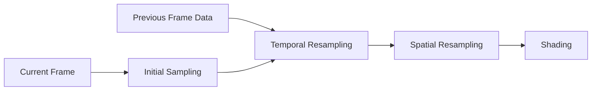

+++
title = "#19790 bevy_solari ReSTIR DI"
date = "2025-06-29T00:00:00"
draft = false
template = "pull_request_page.html"
in_search_index = true

[taxonomies]
list_display = ["show"]

[extra]
current_language = "en"
available_languages = {"en" = { name = "English", url = "/pull_request/bevy/2025-06/pr-19790-en-20250629" }, "zh-cn" = { name = "中文", url = "/pull_request/bevy/2025-06/pr-19790-zh-cn-20250629" }}
labels = ["C-Feature", "A-Rendering"]
+++

### Technical Report: bevy_solari ReSTIR DI Implementation

#### Basic Information
- **Title**: bevy_solari ReSTIR DI
- **PR Link**: https://github.com/bevyengine/bevy/pull/19790
- **Author**: JMS55
- **Status**: MERGED
- **Labels**: C-Feature, A-Rendering, S-Ready-For-Final-Review, M-Needs-Release-Note
- **Created**: 2025-06-24T01:56:52Z
- **Merged**: 2025-06-29T19:20:54Z
- **Merged By**: alice-i-cecile

#### Description Translation
# Objective
- Add temporal and spatial resampling to bevy_solari.

# Showcase
ReSTIR:


Previous RIS: 


---

### The Story of This Pull Request

The PR implements ReSTIR (Reservoir Spatio-Temporal Importance Resampling) DI for Bevy's real-time lighting system. The existing Reservoir-based Importance Sampling (RIS) approach suffered from noise artifacts with limited samples. ReSTIR addresses this by combining temporal reuse (leveraging data from previous frames) and spatial reuse (sharing data with neighboring pixels).

We start with the problem of noisy real-time lighting. RIS requires many samples per pixel for acceptable quality, which isn't feasible at real-time performance targets. The solution combines two techniques: temporal reprojection reuses reservoirs from previous frames using motion vectors, while spatial resampling shares data between adjacent pixels. This reduces required samples by reusing information across both time and space.

The implementation required several coordinated changes. First, we added storage for previous frame data (GBuffer and depth textures). These are copied each frame after rendering:

```rust
// File: crates/bevy_solari/src/realtime/prepare.rs
command_encoder.copy_texture_to_texture(
    view_prepass_textures.deferred.clone().unwrap().texture.texture.as_image_copy(),
    solari_lighting_resources.previous_gbuffer.0.as_image_copy(),
    viewport.to_extents(),
);
```

Second, we implemented temporal reservoir loading in the shader by reprojecting pixel positions using motion vectors. The shader checks for disocclusions using depth and normal similarity:

```wgsl
// File: crates/bevy_solari/src/realtime/restir_di.wgsl
let motion_vector = textureLoad(motion_vectors, pixel_id, 0).xy;
let temporal_pixel_id_float = round(vec2<f32>(pixel_id) - (motion_vector * view.viewport.zw));
if pixel_dissimilar(depth, world_position, temporal_world_position, world_normal, temporal_world_normal) {
    return empty_reservoir();
}
```

Third, we added spatial resampling that selects neighboring pixels within a fixed radius. The reservoir merging logic uses Multiple Importance Sampling (MIS) weights to combine samples:

```wgsl
// File: crates/bevy_solari/src/realtime/reservoir.wgsl
fn merge_reservoirs(...) -> ReservoirMergeResult {
    let mis_weight_denominator = 1.0 / (canonical_reservoir.confidence_weight + other_reservoir.confidence_weight);
    // ... MIS weight calculations
    if rand_f(rng) < other_resampling_weight / combined_reservoir.weight_sum {
        // Select other reservoir's sample
    } else {
        // Select canonical reservoir's sample
    }
}
```

A critical challenge was handling changing lights between frames. We implemented light ID translation by tracking light entities across frames:

```rust
// File: crates/bevy_solari/src/scene/binder.rs
for previous_frame_light_entity in previous_frame_light_entities {
    let current_frame_index = this_frame_entity_to_light_id
        .get(&previous_frame_light_entity)
        .copied()
        .unwrap_or(LIGHT_NOT_PRESENT_THIS_FRAME);
    previous_frame_light_id_translations.get_mut().push(current_frame_index);
}
```

Performance considerations guided several decisions:
1. Visibility reuse stores visibility in reservoirs to avoid recomputation
2. Confidence weights cap temporal influence to prevent error accumulation
3. Temporary texture copies (marked with TODO) will be replaced with double buffering

The implementation shows significant quality improvements over basic RIS, as demonstrated in the PR's comparison images. Noise is substantially reduced while maintaining real-time performance. Future work includes replacing temporary copies with double buffering and optimizing the spatial reuse radius.

#### Visual Representation



#### Key Files Changed

1. **crates/bevy_solari/src/realtime/restir_di.wgsl** (+102/-12)  
   Core ReSTIR implementation with temporal/spatial passes
   ```wgsl
   // After:
   fn initial_and_temporal() {
       let initial_reservoir = ...;
       let temporal_reservoir = ...;
       let combined_reservoir = merge_reservoirs(...);
       reservoirs_b[pixel_index] = combined_reservoir;
   }
   ```

2. **crates/bevy_solari/src/realtime/reservoir.wgsl** (+60/-2)  
   Reservoir merging logic with MIS weighting
   ```wgsl
   // After:
   struct Reservoir {
       ...
       visibility: f32, // New field
   }
   fn merge_reservoirs(...) { ... }
   ```

3. **crates/bevy_solari/src/realtime/node.rs** (+48/-2)  
   Rendering node updates for temporal data
   ```rust
   // After:
   pass.set_bind_group(1, &bind_group, &[
       view_uniform_offset.offset,
       previous_view_uniform_offset.offset, // New
   ]);
   ```

4. **crates/bevy_solari/src/scene/binder.rs** (+41/-4)  
   Light ID translation system
   ```rust
   // After:
   #[resource]
   pub struct RaytracingSceneBindings {
       ...
       previous_frame_light_entities: Vec<Entity>, // New
   }
   ```

5. **crates/bevy_solari/src/realtime/prepare.rs** (+34/-1)  
   Previous frame texture setup
   ```rust
   // After:
   pub struct SolariLightingResources {
       ...
       previous_gbuffer: (Texture, TextureView), // New
       previous_depth: (Texture, TextureView),   // New
   }
   ```

#### Further Reading
1. [ReSTIR Paper](https://research.nvidia.com/publication/2020-07_restir)
2. [Visibility Reuse Supplementary](https://yusuketokuyoshi.com/papers/2024/Efficient_Visibility_Reuse_for_Real-time_ReSTIR_(Supplementary_Document).pdf)
3. [Bevy Rendering Architecture](https://bevyengine.org/learn/book/rendering/)