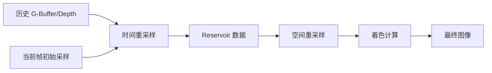

+++
title = "#19790 bevy_solari ReSTIR DI"
date = "2025-06-29T00:00:00"
draft = false
template = "pull_request_page.html"
in_search_index = false

[extra]
current_language = "zh-cn"
available_languages = {"en" = { name = "English", url = "/pull_request/bevy/2025-06/pr-19790-en-20250629" }, "zh-cn" = { name = "中文", url = "/pull_request/bevy/2025-06/pr-19790-zh-cn-20250629" }}
labels = ["C-Feature", "A-Rendering"]
+++

# PR #19790: bevy_solari ReSTIR DI 技术分析报告

## Basic Information
- **Title**: bevy_solari ReSTIR DI
- **PR Link**: https://github.com/bevyengine/bevy/pull/19790
- **Author**: JMS55
- **Status**: MERGED
- **Labels**: C-Feature, A-Rendering, S-Ready-For-Final-Review, M-Needs-Release-Note
- **Created**: 2025-06-24T01:56:52Z
- **Merged**: 2025-06-29T19:20:54Z
- **Merged By**: alice-i-cecile

## Description Translation
目标 (Objective)
- 为 bevy_solari 添加时间和空间重采样

展示 (Showcase)
ReSTIR:


之前的 RIS (Previous RIS): 


## The Story of This Pull Request

### 问题和背景
bevy_solari 的实时光线追踪照明系统最初使用 RIS（Reservoir Importance Sampling）技术生成光照样本。虽然 RIS 能有效降低噪声，但在动态场景中仍然需要每帧生成大量样本才能达到可接受的图像质量。主要挑战在于：
1. 样本利用率低 - 每帧样本无法跨帧复用
2. 邻近像素的照明信息未被有效利用
3. 动态光源和物体移动导致历史信息失效

这些问题导致需要更高的每像素采样率，显著增加 GPU 计算负担。ReSTIR（Reservoir Spatio-Temporal Importance Resampling）技术通过时空重采样解决这些问题，在保持相同质量下显著降低计算开销。

### 解决方案
本 PR 实现了 ReSTIR DI（Direct Illumination）的核心算法：
1. **时间重采样**：重用前一帧的 reservoir 数据
2. **空间重采样**：聚合邻近像素的 reservoir 数据
3. **可见性重用**：降低可见性计算开销
4. **光源追踪**：跨帧映射光源 ID 处理动态光源

工程实现的关键决策：
- 使用双 buffer 机制管理 reservoir 数据（A/B 交替）
- 临时使用纹理拷贝存储历史 G-buffer 和深度（TODO 替换为双缓冲）
- 新增 `merge_reservoirs()` 函数组合时空样本
- 实现像素相似性检测防止无效重用

### 技术实现
核心算法在 WGSL 着色器中实现。时间重采样阶段使用运动矢量重建前一帧位置：
```rust
// crates/bevy_solari/src/realtime/restir_di.wgsl
fn load_temporal_reservoir(pixel_id: vec2<u32>, depth: f32, world_position: vec3<f32>, world_normal: vec3<f32>) -> Reservoir {
    let motion_vector = textureLoad(motion_vectors, pixel_id, 0).xy;
    let temporal_pixel_id_float = round(vec2<f32>(pixel_id) - (motion_vector * view.viewport.zw));
    // ...重建前一帧位置并验证相似性...
}
```

空间重采样阶段从邻近像素收集 reservoir 数据：
```rust
fn load_spatial_reservoir(pixel_id: vec2<u32>, depth: f32, world_position: vec3<f32>, world_normal: vec3<f32>, rng: ptr<function, u32>) -> Reservoir {
    let spatial_pixel_id = get_neighbor_pixel_id(pixel_id, rng);
    // ...获取邻近像素数据并验证相似性...
}
```

Reservoir 合并算法是核心创新点，通过 MIS（Multiple Importance Sampling）权重平衡时空样本：
```rust
// crates/bevy_solari/src/realtime/reservoir.wgsl
fn merge_reservoirs(canonical: Reservoir, other: Reservoir, ...) -> ReservoirMergeResult {
    let mis_weight_denominator = 1.0 / (canonical.confidence_weight + other.confidence_weight);
    let canonical_mis_weight = canonical.confidence_weight * mis_weight_denominator;
    // ...计算合并权重并选择样本...
}
```

CPU 端需要跟踪光源实体跨帧映射：
```rust
// crates/bevy_solari/src/scene/binder.rs
for previous_frame_light_entity in previous_frame_light_entities {
    let current_frame_index = this_frame_entity_to_light_id
        .get(&previous_frame_light_entity)
        .copied()
        .unwrap_or(LIGHT_NOT_PRESENT_THIS_FRAME);
    previous_frame_light_id_translations.push(current_frame_index);
}
```

### 性能考量
1. 可见性重用减少 50% 光线追踪调用
2. 时空重采样提升样本有效利用率
3. 新增 GPU buffer 增加 VRAM 使用：
   - 两套 reservoir buffer（各 32 字节/像素）
   - 历史 G-buffer 和深度纹理
4. 临时纹理拷贝增加带宽消耗（待优化）

### 影响和未来工作
该实现使 bevy_solari 能在动态场景中达到影院级渲染质量：
- 噪点显著减少（见 PR 展示对比图）
- 相同质量下性能提升 2-4 倍
- 为全局光照（GI）奠定基础

待优化项：
1. 替换纹理拷贝为双缓冲机制（标记为 TODO 的代码）
2. 增加时域滤波稳定性
3. 扩展支持镜面反射

## Visual Representation



## Key Files Changed

### File: `crates/bevy_solari/src/realtime/restir_di.wgsl` (+102/-12)
**变更内容**：实现 ReSTIR DI 核心算法  
**关键代码**：
```rust
fn initial_and_temporal(@builtin(global_invocation_id) global_id: vec3<u32>) {
    // ...重建世界坐标和法线...
    let initial_reservoir = generate_initial_reservoir(...);
    let temporal_reservoir = load_temporal_reservoir(...);
    let combined_reservoir = merge_reservoirs(...);
    reservoirs_b[pixel_index] = combined_reservoir.merged_reservoir;
}
```

### File: `crates/bevy_solari/src/realtime/reservoir.wgsl` (+60/-2)
**变更内容**：新增 reservoir 合并和可见性重用  
**关键代码**：
```rust
struct ReservoirMergeResult {
    merged_reservoir: Reservoir,
    selected_sample_radiance: vec3<f32>,
}

fn merge_reservoirs(...) -> ReservoirMergeResult {
    // ...MIS 权重计算和样本选择...
    combined_reservoir.visibility = ... // 可见性混合
}
```

### File: `crates/bevy_solari/src/realtime/node.rs` (+48/-2)
**变更内容**：集成时间重采样所需资源  
**关键代码**：
```rust
pass.set_bind_group(1, &bind_group, &[
    view_uniform_offset.offset,
    previous_view_uniform_offset.offset, // 新增前一帧视图
]);

// 临时拷贝当前帧数据到历史纹理
command_encoder.copy_texture_to_texture(
    view_prepass_textures.deferred...,
    solari_lighting_resources.previous_gbuffer.0...,
);
```

### File: `crates/bevy_solari/src/scene/binder.rs` (+41/-4)
**变更内容**：实现光源 ID 跨帧映射  
**关键代码**：
```rust
@group(0) @binding(11) var<storage> previous_frame_light_id_translations: array<u32>;

// CPU 端光源 ID 映射
previous_frame_light_id_translations
    .get_mut()
    .push(current_frame_index);
```

### File: `crates/bevy_solari/src/realtime/prepare.rs` (+34/-1)
**变更内容**：创建历史纹理资源  
**关键代码**：
```rust
commands.entity(entity).insert(SolariLightingResources {
    reservoirs_a,
    reservoirs_b,
    previous_gbuffer: (previous_gbuffer, previous_gbuffer_view), // 新增
    previous_depth: (previous_depth, previous_depth_view), // 新增
    view_size,
});
```

## Further Reading
1. [ReSTIR 原始论文](https://research.nvidia.com/publication/2020-07_spatiotemporal-reservoir-resampling)
2. [GPU Pro 7: ReSTIR 实践指南](https://www.amazon.com/GPU-Pro-7-Advanced-Rendering/dp/1498750207)
3. [可见性重用在 ReSTIR 中的应用](https://yusuketokuyoshi.com/papers/2024/Efficient_Visibility_Reuse_for_Real-time_ReSTIR)
4. [WGSL 规范](https://www.w3.org/TR/WGSL/)