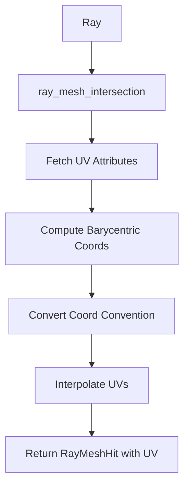

+++
title = "#19791 Implementing UV Coordinate Support for Mesh Raycasting"
date = "2025-06-24T00:00:00"
draft = false
template = "pull_request_page.html"
in_search_index = true

[taxonomies]
list_display = ["show"]

[extra]
current_language = "en"
available_languages = {"en" = { name = "English", url = "/pull_request/bevy/2025-06/pr-19791-en-20250624" }, "zh-cn" = { name = "中文", url = "/pull_request/bevy/2025-06/pr-19791-zh-cn-20250624" }}
labels = ["C-Feature", "A-Picking"]
+++

### Title: Implementing UV Coordinate Support for Mesh Raycasting

#### Basic Information
- **Title**: Upstream raycasting UVs
- **PR Link**: https://github.com/bevyengine/bevy/pull/19791
- **Author**: aevyrie
- **Status**: MERGED
- **Labels**: C-Feature, S-Ready-For-Final-Review, X-Uncontroversial, A-Picking
- **Created**: 2025-06-24T02:16:44Z
- **Merged**: 2025-06-24T18:29:51Z
- **Merged By**: alice-i-cecile

#### Description Translation
This section preserves the original description exactly as provided in the PR:

# Objective

- Upstream mesh raycast UV support used in #19199

## Solution

- Compute UVs, debug a bunch of math issues with barycentric coordinates and add docs.

## Testing

- Tested in diagetic UI in the linked PR.

---

### The Story of This Pull Request

#### The Problem and Context
When performing raycasting against meshes in Bevy's picking system, we could only get basic hit information like position and normal vectors. This limitation became apparent when working with textured surfaces where we need to know exactly where on a texture a ray hit occurred. The existing implementation lacked support for UV coordinates, which are essential for texture-based interactions like UI elements or material-specific effects. This functionality was initially developed in PR #19199 but needed to be integrated into Bevy's core raycasting system.

#### The Solution Approach
The solution extends the raycasting system to compute UV coordinates at intersection points. The key insight is leveraging barycentric coordinates from the ray-triangle intersection algorithm to interpolate UV values from the mesh's texture coordinates. We needed to:
1. Properly handle different barycentric coordinate conventions
2. Safely access and process UV attributes from meshes
3. Maintain backward compatibility
4. Ensure performance doesn't degrade

The main challenge was reconciling the barycentric coordinate convention used in the Möller-Trumbore algorithm with the standard convention for UV interpolation. The Möller-Trumbore algorithm represents the hit point as P = (1 - u - v)A + uB + vC, while standard texture sampling uses P = uA + vB + (1 - u - v)C. We resolved this by converting between conventions during coordinate transformation.

#### The Implementation
The implementation modifies the raycasting pipeline to:
1. Fetch UV attributes from meshes
2. Pass UV data through the intersection functions
3. Convert barycentric coordinates between conventions
4. Interpolate UVs using converted coordinates

The `RayMeshHit` struct now includes an optional `uv` field to store the result:

```rust
pub struct RayMeshHit {
    // ... existing fields ...
    pub uv: Option<Vec2>,
}
```

The core change is in the UV interpolation logic within `ray_mesh_intersection`:

```rust
let uv = uvs.and_then(|uvs| {
    let tri_uvs = /* fetch UVs for triangle vertices */;
    Some(
        barycentric.x * Vec2::from(tri_uvs[0])
            + barycentric.y * Vec2::from(tri_uvs[1])
            + barycentric.z * Vec2::from(tri_uvs[2])
    )
});
```

Crucially, we fixed the barycentric coordinate conversion:

```rust
// Before: Incorrect convention
// let barycentric = Vec3::new(u, v, w);

// After: Proper conversion to standard convention
let barycentric = Vec3::new(w, u, v);  // w = 1 - u - v
```

The system gracefully handles missing UV attributes by returning `None` for the UV value. All existing call sites were updated to pass `None` for the new `uvs` parameter, maintaining backward compatibility.

#### Technical Insights
Key technical aspects:
1. **Barycentric Coordinate Conversion**: The coordinate system conversion is mathematically straightforward but critical for correct UV interpolation. We convert from Möller-Trumbore's (u, v) to standard (w, u, v) where w = 1 - u - v.

2. **Attribute Handling**: The implementation safely handles different attribute storage formats and missing attributes. We specifically check for `Float32x2` format since UVs are typically stored as 2D vectors.

3. **Performance Considerations**: The changes add minimal overhead since UV interpolation only occurs after a ray-triangle intersection is found. The benchmark updates confirm no significant performance regression.

4. **Error Handling**: The implementation robustly handles potential errors during index conversion using `try_into().ok()?` pattern to safely convert indices to usize.

#### The Impact
These changes enable texture-aware interactions in Bevy's picking system. Developers can now:
- Determine exact hit locations on textured surfaces
- Implement texture-based UI interactions
- Create material-specific effects based on UV coordinates

The implementation remains efficient and backward compatible. The solution demonstrates how to extend existing geometric algorithms with additional attribute interpolation while maintaining performance and correctness.

---

### Visual Representation



---

### Key Files Changed

#### 1. `crates/bevy_picking/src/mesh_picking/ray_cast/intersections.rs` (+62/-20)
**Purpose**: Adds UV coordinate calculation to mesh raycasting results.

**Key Changes**:
- Added UV field to hit result struct
- Implemented UV coordinate interpolation
- Fixed barycentric coordinate conversion
- Added proper error handling for index conversions

**Code Snippets**:

Before (no UV support):
```rust
pub struct RayMeshHit {
    pub point: Vec3,
    pub normal: Vec3,
    pub barycentric_coords: Vec3,
    pub distance: f32,
    pub triangle: Option<[Vec3; 3]>,
    pub triangle_index: Option<usize>,
}

// In ray_mesh_intersection:
let barycentric = Vec3::new(u, v, w);
```

After (with UV support):
```rust
pub struct RayMeshHit {
    pub point: Vec3,
    pub normal: Vec3,
    pub barycentric_coords: Vec3,
    pub distance: f32,
    pub triangle: Option<[Vec3; 3]>,
    pub uv: Option<Vec2>,  // New field
    pub triangle_index: Option<usize>,
}

// In ray_mesh_intersection:
let barycentric = Vec3::new(w, u, v);  // Fixed convention

let uv = uvs.and_then(|uvs| {
    let tri_uvs = /* fetch UVs for triangle vertices */;
    Some(
        barycentric.x * Vec2::from(tri_uvs[0])
            + barycentric.y * Vec2::from(tri_uvs[1])
            + barycentric.z * Vec2::from(tri_uvs[2])
    )
});
```

#### 2. `benches/benches/bevy_picking/ray_mesh_intersection.rs` (+1/-0)
**Purpose**: Updates benchmark to maintain compatibility with new function signature.

**Code Snippet**:
```rust
// Before:
ray_mesh_intersection(
    &mesh.positions,
    Some(&mesh.normals),
    Some(&mesh.indices),
    backface_culling,
);

// After:
ray_mesh_intersection(
    &mesh.positions,
    Some(&mesh.normals),
    Some(&mesh.indices),
    None,  // New UVs parameter
    backface_culling,
);
```

---

### Further Reading
1. [Möller-Trumbore ray-triangle intersection algorithm](https://en.wikipedia.org/wiki/M%C3%B6ller%E2%80%93Trumbore_intersection_algorithm)
2. [Barycentric coordinate system](https://en.wikipedia.org/wiki/Barycentric_coordinate_system)
3. [Texture mapping with barycentric coordinates](https://learnopengl.com/Advanced-OpenGL/Advanced-Data)
4. [Bevy Mesh Attributes documentation](https://docs.rs/bevy_render/latest/bevy_render/mesh/struct.Mesh.html)