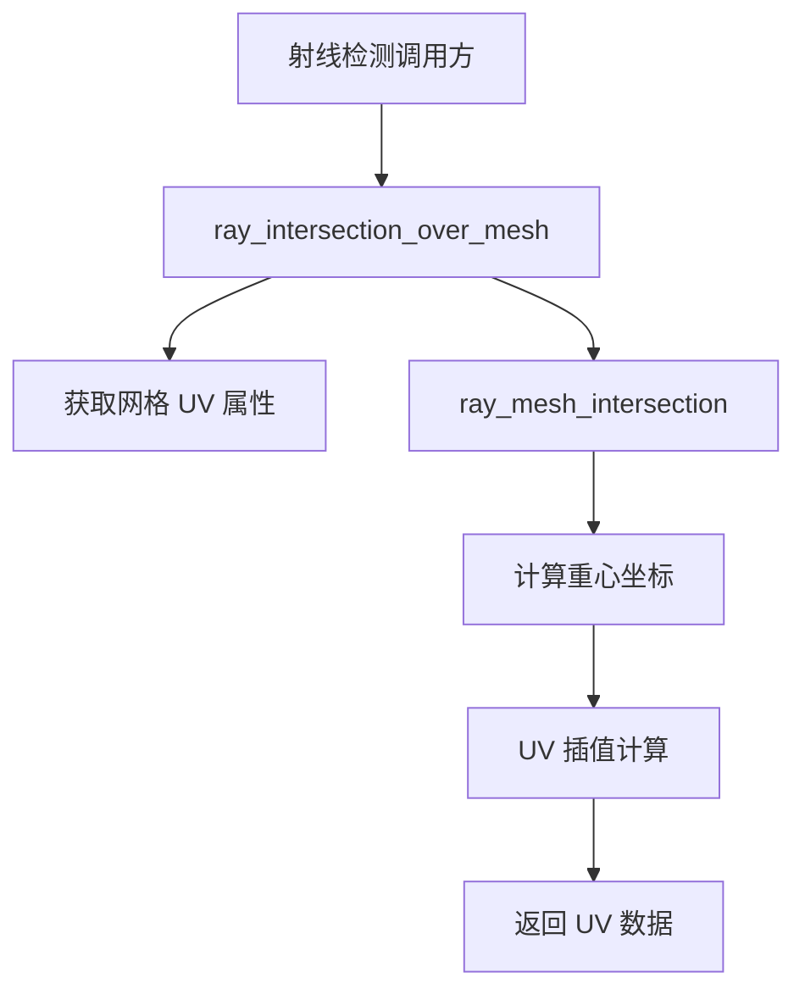

+++
title = "#19791 Upstream raycasting UVs"
date = "2025-06-24T00:00:00"
draft = false
template = "pull_request_page.html"
in_search_index = false

[extra]
current_language = "zh-cn"
available_languages = {"en" = { name = "English", url = "/pull_request/bevy/2025-06/pr-19791-en-20250624" }, "zh-cn" = { name = "中文", url = "/pull_request/bevy/2025-06/pr-19791-zh-cn-20250624" }}
labels = ["C-Feature", "A-Picking"]
+++

# Upstream raycasting UVs

## Basic Information
- **Title**: Upstream raycasting UVs
- **PR Link**: https://github.com/bevyengine/bevy/pull/19791
- **Author**: aevyrie
- **Status**: MERGED
- **Labels**: C-Feature, S-Ready-For-Final-Review, X-Uncontroversial, A-Picking
- **Created**: 2025-06-24T02:16:44Z
- **Merged**: 2025-06-24T18:29:51Z
- **Merged By**: alice-i-cecile

## Description Translation
### 目标
- 上游化网格射线检测 UV 支持，用于 #19199

### 解决方案
- 计算 UV 坐标，修复了重心坐标相关的数学问题并添加文档说明

### 测试
- 在关联 PR 的 diegetic UI 中测试通过

## The Story of This Pull Request

在实现交互式 UI 拾取功能(#19199)时，开发者需要获取射线与网格碰撞点的 UV 坐标。原有射线检测系统仅返回位置和法线信息，无法支持需要纹理坐标的应用场景。为解决此问题，开发者决定扩展现有射线检测系统，使其能返回 UV 坐标。

UV 坐标计算的核心在于正确处理重心坐标。原始实现使用 Möller-Trumbore 算法的坐标约定(P = (1 - u - v)A + uB + vC)，但标准约定是 P = uA + vB + (1 - u - v)C。开发者首先修正了坐标转换逻辑：

```rust
// 转换重心坐标约定
let u = hit.barycentric_coords.0;
let v = hit.barycentric_coords.1;
let w = 1.0 - u - v;
let barycentric = Vec3::new(w, u, v);  // 标准：wA + uB + vC
```

接着添加了 UV 数据获取路径。系统首先检查网格是否包含 UV 属性，若存在则进行插值计算：

```rust
let uv = uvs.and_then(|uvs| {
    // 获取三角形顶点 UV
    let tri_uvs = /* ... */;
    Some(
        barycentric.x * Vec2::from(tri_uvs[0])
            + barycentric.y * Vec2::from(tri_uvs[1])
            + barycentric.z * Vec2::from(tri_uvs[2])
    )
});
```

索引处理逻辑也进行了加固，使用更健壮的逐元素处理替代批量转换：

```rust
// 加固索引处理
[
    indices.get(i).copied()?.try_into().ok()?,
    indices.get(j).copied()?.try_into().ok()?,
    indices.get(k).copied()?.try_into().ok()?,
]
```

该实现保持向后兼容——当网格无 UV 数据时返回 `None`。性能方面，仅当存在 UV 属性时才进行额外计算，且通过重心坐标的线性组合实现高效插值。

修改后，`RayMeshHit` 结构体新增 `uv` 字段，使调用方能获取碰撞点纹理坐标：

```rust
pub struct RayMeshHit {
    // ...原有字段
    pub uv: Option<Vec2>, // 新增 UV 字段
}
```

所有测试用例都更新为传入 `None` 作为 UV 参数，确保原有功能不受影响。此实现已被整合到 diegetic UI 系统中，用于精确的纹理坐标拾取。

## Visual Representation



## Key Files Changed

### `crates/bevy_picking/src/mesh_picking/ray_cast/intersections.rs` (+62/-20)
主逻辑修改文件，实现 UV 计算功能

```rust
// 新增 UV 字段
pub struct RayMeshHit {
    // ...
    pub uv: Option<Vec2>,
}

// 修改函数签名
pub fn ray_mesh_intersection<I>(
    // ...
    uvs: Option<&[[f32; 2]]>, // 新增 UV 参数
    // ...
) 

// UV 插值计算
let uv = uvs.and_then(|uvs| {
    // 获取三角形顶点 UV
    let tri_uvs = /* ... */;
    Some(barycentric.x * Vec2::from(tri_uvs[0]) 
        + barycentric.y * Vec2::from(tri_uvs[1])
        + barycentric.z * Vec2::from(tri_uvs[2]))
});
```

### `benches/benches/bevy_picking/ray_mesh_intersection.rs` (+1/-0)
更新性能测试调用点

```rust
// 新增 UV 参数
ray_mesh_intersection(
    // ...
    None, // 新增 UV 参数
    backface_culling,
);
```

## Further Reading
1. [Möller-Trumbore 算法论文](https://www.cs.virginia.edu/~gfx/Courses/2003/ImageSynthesis/papers/Acceleration/Fast%20MinimumStorage%20RayTriangle%20Intersection.pdf)
2. [Barycentric coordinate system](https://en.wikipedia.org/wiki/Barycentric_coordinate_system)
3. [Texture mapping fundamentals](https://learnopengl.com/Getting-started/Textures)