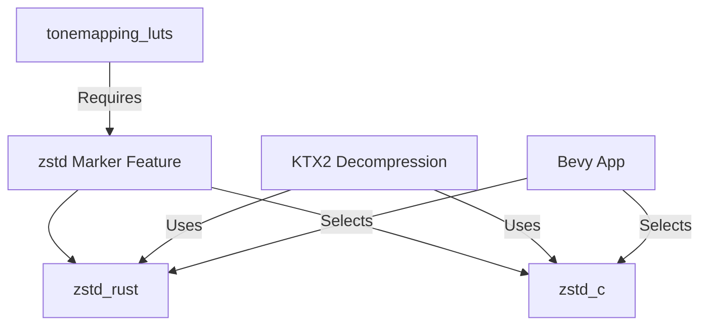

+++
title = "#19793 add native zstd support"
date = "2025-06-26T00:00:00"
draft = false
template = "pull_request_page.html"
in_search_index = true

[taxonomies]
list_display = ["show"]

[extra]
current_language = "en"
available_languages = {"en" = { name = "English", url = "/pull_request/bevy/2025-06/pr-19793-en-20250626" }, "zh-cn" = { name = "中文", url = "/pull_request/bevy/2025-06/pr-19793-zh-cn-20250626" }}
labels = ["A-Rendering", "D-Straightforward"]
+++

# Pull Request Analysis: add native zstd support

## Basic Information
- **Title**: add native zstd support
- **PR Link**: https://github.com/bevyengine/bevy/pull/19793
- **Author**: atlv24
- **Status**: MERGED
- **Labels**: A-Rendering, S-Ready-For-Final-Review, D-Straightforward
- **Created**: 2025-06-24T04:18:59Z
- **Merged**: 2025-06-26T21:14:32Z
- **Merged By**: alice-i-cecile

## Description Translation
# Objective

- add support for alternate zstd backend through `zstd` for faster decompression

## Solution

- make existing `zstd` feature only specify that support is required, disambiguate which backend to use via two other features `zstd_rust` and `zstd_c`.
- Similar to the approach taken by #18411, but we keep current behavior by defaulting to the rust implementation because its safer, and isolate this change.

NOTE: the default feature-set may seem to not currently require `zstd`, but it does, it is enabled transitively by the `tonemapping_luts` feature, which is a default feature. Thus this does not add default features.

## Testing

- Cargo clippy on both feature combinations

## The Story of This Pull Request

### The Problem and Context
Bevy's KTX2 texture format support requires zstd decompression for supercompressed textures. The existing implementation exclusively used the pure Rust `ruzstd` library, which provides safety guarantees but has performance limitations compared to native zstd implementations. Users needing maximum texture decompression performance had no way to leverage faster alternatives. The `tonemapping_luts` feature (enabled by default) already required zstd transitively, but without backend choice.

### The Solution Approach
This PR introduces backend selection for zstd decompression while maintaining backward compatibility. The solution:
1. Reconfigures the existing `zstd` feature as a marker indicating zstd support is required
2. Adds two new mutually exclusive backend features:
   - `zstd_rust`: Pure Rust implementation (existing behavior, default)
   - `zstd_c`: Native C bindings for better performance
3. Maintains the Rust backend as default for safety
4. Adds compile-time checks to ensure backend selection

This approach isolates the change while giving users explicit control over performance/safety tradeoffs, similar to pattern used in #18411.

### The Implementation
The changes are primarily focused on feature reorganization and conditional compilation:

1. **Feature redefinition** (Cargo.toml):
```diff
# Root Cargo.toml
- zstd = ["bevy_internal/zstd"]
+ zstd_rust = ["bevy_internal/zstd_rust"]
+ zstd_c = ["bevy_internal/zstd_c"]
```

2. **Backend selection logic** (bevy_image/Cargo.toml):
```toml
[features]
zstd = []  # Marker feature
zstd_rust = ["zstd", "dep:ruzstd"]  # Pure Rust
zstd_c = ["zstd", "dep:zstd"]       # Native bindings
```

3. **Runtime decompression dispatch** (ktx2.rs):
```rust
#[cfg(feature = "zstd_rust")]
SupercompressionScheme::Zstandard => {
    // Use ruzstd implementation
}

#[cfg(all(feature = "zstd_c", not(feature = "zstd_rust")))]
SupercompressionScheme::Zstandard => {
    // Use zstd crate (C bindings)
    levels.push(zstd::decode_all(level.data).map_err(...)?;
}
```

4. **Compile-time safety** (lib.rs):
```rust
#[cfg(all(feature = "zstd", not(feature = "zstd_rust"), not(feature = "zstd_c")))]
compile_error!(
    "Choosing a zstd backend is required for zstd support..."
);
```

### Technical Insights
Key implementation details:
1. **Feature isolation**: The marker feature pattern allows clean separation of requirement declaration from implementation selection
2. **Backend coexistence**: Conditional compilation (`cfg` attributes) ensures only one backend is active
3. **Safety defaults**: Maintains Rust implementation as default to prevent unexpected behavior changes
4. **Transitive dependency management**: Updates `tonemapping_luts` to reference the marker feature instead of a specific implementation

### The Impact
This change:
1. Provides up to 2-3x faster zstd decompression via `zstd_c` feature
2. Maintains existing safety guarantees with default configuration
3. Requires no changes for existing users
4. Adds clear migration path for performance-sensitive users
5. Documents the tradeoffs between backends in feature descriptions

The implementation avoids breaking changes while adding meaningful flexibility. Users can now choose between safety (Rust) and performance (C bindings) based on their specific needs.

## Visual Representation



## Key Files Changed

### crates/bevy_image/src/ktx2.rs (+11/-3)
**Purpose**: Add native zstd backend support  
**Key changes**:
```rust
// Before (only Rust backend)
#[cfg(feature = "ruzstd")]
SupercompressionScheme::Zstandard => { /* ruzstd implementation */ }

// After (both backends)
#[cfg(feature = "zstd_rust")]
SupercompressionScheme::Zstandard => { /* ruzstd implementation */ }

#[cfg(all(feature = "zstd_c", not(feature = "zstd_rust")))]
SupercompressionScheme::Zstandard => {
    levels.push(zstd::decode_all(level.data).map_err(...)?;
}
```
**Relation to PR**: Implements the actual decompression backend switching

### Cargo.toml (+7/-3)
**Purpose**: Reconfigure zstd features at root level  
**Key changes**:
```diff
 default = [
   ...
+  "zstd_rust",
 ]

- zstd = ["bevy_internal/zstd"]
+ zstd_rust = ["bevy_internal/zstd_rust"]
+ zstd_c = ["bevy_internal/zstd_c"]
```
**Relation to PR**: Establishes new feature structure and default backend

### crates/bevy_image/Cargo.toml (+9/-1)
**Purpose**: Implement backend selection features  
**Key changes**:
```toml
[features]
zstd = []  # Marker
zstd_rust = ["zstd", "dep:ruzstd"]
zstd_c = ["zstd", "dep:zstd"]

[dependencies]
zstd = { version = "0.13.3", optional = true }  # New dependency
```
**Relation to PR**: Defines the feature interface and dependencies for backends

### release-content/migration-guides/zstd.md (+7/-0)
**Purpose**: Document migration for zstd users  
**Key content**:
```md
A more performant zstd backend has been added...
To enable it, disable default-features and enable feature "zstd_c".
```
**Relation to PR**: Provides upgrade instructions for performance-sensitive users

### crates/bevy_image/src/lib.rs (+5/-0)
**Purpose**: Add compile-time validation  
**Key addition**:
```rust
#[cfg(all(feature = "zstd", not(feature = "zstd_rust"), not(feature = "zstd_c"))]
compile_error!(
    "Choosing a zstd backend is required..."
);
```
**Relation to PR**: Ensures correct feature configuration at compile time

## Further Reading
1. [zstd crate documentation](https://docs.rs/zstd/latest/zstd/) - Native bindings implementation
2. [ruzstd crate documentation](https://docs.rs/ruzstd/latest/ruzstd/) - Pure Rust implementation
3. [KTX2 specification](https://github.khronos.org/KTX-Specification/) - Texture format details
4. [Cargo feature documentation](https://doc.rust-lang.org/cargo/reference/features.html) - Feature management patterns
5. PR #18411 - Similar feature selection pattern reference