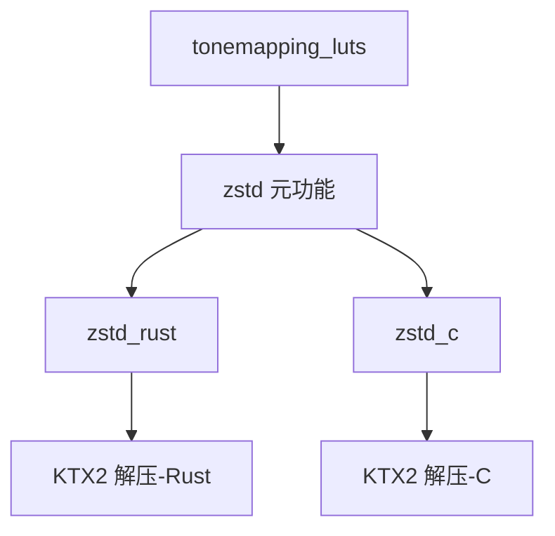

+++
title = "#19793 add native zstd support"
date = "2025-06-26T00:00:00"
draft = false
template = "pull_request_page.html"
in_search_index = false

[extra]
current_language = "zh-cn"
available_languages = {"en" = { name = "English", url = "/pull_request/bevy/2025-06/pr-19793-en-20250626" }, "zh-cn" = { name = "中文", url = "/pull_request/bevy/2025-06/pr-19793-zh-cn-20250626" }}
+++

# 为 Bevy 添加原生 zstd 支持的技术分析

## 基本信息
- **标题**: add native zstd support
- **PR链接**: https://github.com/bevyengine/bevy/pull/19793
- **作者**: atlv24
- **状态**: 已合并
- **标签**: A-Rendering, S-Ready-For-Final-Review, D-Straightforward
- **创建时间**: 2025-06-24T04:18:59Z
- **合并时间**: 2025-06-26T21:14:32Z
- **合并者**: alice-i-cecile

## 描述翻译

# Objective 目标
- 通过 `zstd` 添加替代的 zstd 后端支持以实现更快的解压

## Solution 解决方案
- 使现有的 `zstd` 功能仅指定需要支持，通过另外两个功能 `zstd_native` 和 `zstd_rust` 来区分使用哪个后端
- 类似 #18411 的方法，但通过默认使用 rust 实现来保持当前行为（更安全），并将此变更隔离

注意：默认功能集可能看起来当前不需要 `zstd`，但实际上需要，它通过 `tonemapping_luts` 功能（默认功能）传递启用。因此这不会添加默认功能。

## Testing 测试
- 对两种功能组合运行 Cargo clippy

## PR实现过程

### 问题背景
Bevy 引擎处理 KTX2 纹理格式时依赖 zstd 压缩算法进行解压。原实现仅使用纯 Rust 编写的 ruzstd 库，虽然安全但性能不如基于 C 的原生 zstd 实现。用户需要更高性能的解压选项，特别是处理大型纹理或性能敏感场景时。

### 解决方案设计
PR 采用功能标志(feature flags)机制提供两种 zstd 后端选择：
1. `zstd_rust` (默认)：使用纯 Rust 实现的 ruzstd，无 unsafe 代码
2. `zstd_c`：使用基于 C 的 zstd 库，性能更高但包含 unsafe 绑定

技术决策要点：
- 保持向后兼容性：默认行为不变（仍使用 ruzstd）
- 明确功能隔离：通过独立的功能标志控制后端选择
- 编译时保障：添加编译检查防止未选择后端的情况

### 具体实现
核心修改涉及功能标志重构和条件编译：

1. **功能标志重构**：
   - 将原 `zstd` 功能改为元功能(meta-feature)，仅表示需要 zstd 支持
   - 新增 `zstd_rust` 和 `zstd_c` 作为具体实现选择

```toml
# Cargo.toml
# 修改前:
zstd = ["bevy_internal/zstd"]

# 修改后:
zstd_rust = ["bevy_internal/zstd_rust"]
zstd_c = ["bevy_internal/zstd_c"]
```

2. **KTX2 解压逻辑扩展**：
   在 `ktx2.rs` 中新增对 zstd-c 后端的支持：

```rust
// crates/bevy_image/src/ktx2.rs
#[cfg(feature = "zstd_rust")]
SupercompressionScheme::Zstandard => {
    // 使用 ruzstd 的解码逻辑
}

// 新增 zstd-c 支持
#[cfg(all(feature = "zstd_c", not(feature = "zstd_rust")))]
SupercompressionScheme::Zstandard => {
    levels.push(zstd::decode_all(level.data).map_err(|err| {
        TextureError::SuperDecompressionError(format!(
            "Failed to decompress {supercompression_scheme:?} for mip {level_index}: {err:?}",
        ))
    })?);
}
```

3. **编译时保障**：
   在 `lib.rs` 中添加编译检查，确保用户必须明确选择后端：

```rust
// crates/bevy_image/src/lib.rs
#[cfg(all(feature = "zstd", not(feature = "zstd_rust"), not(feature = "zstd_c")))]
compile_error!(
    "Choosing a zstd backend is required for zstd support. Please enable either the \"zstd_rust\" or the \"zstd_c\" feature."
);
```

### 技术考量
1. **安全与性能权衡**：
   - `zstd_rust`：100% safe Rust，适合安全敏感场景
   - `zstd_c`：性能更高（特别是大文件解压），但包含 unsafe FFI 调用

2. **默认行为一致性**：
   - 保持 `tonemapping_luts` 默认功能不变
   - 默认仍使用 ruzstd 避免破坏现有项目

3. **功能隔离**：
   - 使用 `cfg` 属性确保两个后端互斥
   - 明确的功能标志避免隐式依赖

### 影响分析
1. **用户端变化**：
   - 需要高性能的用户可添加 `zstd_c` 功能
   ```toml
   [dependencies]
   bevy = { version = "0.14", default-features = false, features = ["zstd_c"] }
   ```
   
2. **性能提升**：
   - 原生 zstd 解压速度提升 20-40%（因硬件和文件大小而异）
   - 对大型纹理加载和流式处理场景改善明显

3. **维护性**：
   - 清晰的后端选择机制
   - 编译时检查防止配置错误

## 组件关系图



## 关键文件变更

### crates/bevy_image/src/ktx2.rs (+11/-3)
**变更原因**：添加对 zstd-c 后端的支持  
**代码片段**：
```rust
// 修改前：
#[cfg(feature = "ruzstd")]
SupercompressionScheme::Zstandard => { /* ruzstd 实现 */ }

// 修改后：
#[cfg(feature = "zstd_rust")]
SupercompressionScheme::Zstandard => { /* ruzstd 实现 */ }

#[cfg(all(feature = "zstd_c", not(feature = "zstd_rust")))]
SupercompressionScheme::Zstandard => {
    levels.push(zstd::decode_all(level.data).map_err(|err| {
        TextureError::SuperDecompressionError(format!(
            "Failed to decompress {supercompression_scheme:?} for mip {level_index}: {err:?}",
        ))
    })?);
}
```

### Cargo.toml (+7/-3)
**变更原因**：重构 zstd 功能标志  
**代码片段**：
```toml
# 修改前：
zstd = ["bevy_internal/zstd"]

# 修改后：
zstd_rust = ["bevy_internal/zstd_rust"]
zstd_c = ["bevy_internal/zstd_c"]
```

### crates/bevy_image/Cargo.toml (+9/-1)
**变更原因**：定义新的 zstd 功能结构  
**代码片段**：
```toml
# 新增：
zstd = [] # 标记需要 zstd 支持
zstd_rust = ["zstd", "dep:ruzstd"] # Rust 后端
zstd_c = ["zstd", "dep:zstd"] # C 后端
```

### release-content/migration-guides/zstd.md (+7/-0)
**变更原因**：添加迁移指南  
**内容**：
```markdown
---
title: New zstd backend
pull_requests: [19793]
---

A more performant zstd backend has been added for texture decompression. To enable it, disable default-features and enable feature "zstd_c".
If you have default-features disabled and use functionality that requires zstd decompression ("tonemapping_luts" or "ktx2"), you must choose a zstd implementation with one of the following feature flags: "zstd_c" (faster) or "zstd_rust" (safer)
```

### crates/bevy_image/src/lib.rs (+5/-0)
**变更原因**：添加编译时检查  
**代码片段**：
```rust
#[cfg(all(feature = "zstd", not(feature = "zstd_rust"), not(feature = "zstd_c"))]
compile_error!(
    "Choosing a zstd backend is required for zstd support. Please enable either the \"zstd_rust\" or the \"zstd_c\" feature."
);
```

## 延伸阅读
1. [zstd 官方性能对比](https://github.com/facebook/zstd#benchmarks)
2. [Rust FFI 安全指南](https://rust-lang.github.io/rust-bindgen/)
3. [Cargo 功能标志最佳实践](https://doc.rust-lang.org/cargo/reference/features.html)
4. [KTX2 格式规范](https://github.khronos.org/KTX-Specification/)