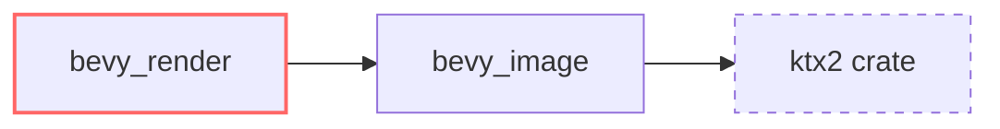

+++
title = "#19794 remove unneeded dependency from bevy_render"
date = "2025-06-24T00:00:00"
draft = false
template = "pull_request_page.html"
in_search_index = true

[taxonomies]
list_display = ["show"]

[extra]
current_language = "en"
available_languages = {"en" = { name = "English", url = "/pull_request/bevy/2025-06/pr-19794-en-20250624" }, "zh-cn" = { name = "中文", url = "/pull_request/bevy/2025-06/pr-19794-zh-cn-20250624" }}
labels = ["D-Trivial", "A-Rendering"]
+++

## remove unneeded dependency from bevy_render

### Basic Information
- **Title**: remove unneeded dependency from bevy_render
- **PR Link**: https://github.com/bevyengine/bevy/pull/19794
- **Author**: atlv24
- **Status**: MERGED
- **Labels**: D-Trivial, A-Rendering, S-Ready-For-Final-Review
- **Created**: 2025-06-24T04:37:37Z
- **Merged**: 2025-06-24T06:40:44Z
- **Merged By**: mockersf

### Description Translation
# Objective

- yeet cruft

## Solution

- yeet cruft

## Testing

- cargo clippy

### The Story of This Pull Request
This PR addresses a straightforward dependency management issue in the Bevy renderer. The `bevy_render` crate contained an unnecessary explicit dependency on the `ktx2` crate. This dependency was redundant because the `ktx2` functionality was already being properly managed through the `bevy_image` crate's feature flags.

The problem was identified through routine dependency inspection. Maintaining duplicate dependencies increases build times, complicates dependency resolution, and introduces potential version conflict risks. Since `bevy_image` already provided the KTX2 functionality through its own feature flag, the explicit dependency in `bevy_render` served no purpose.

The solution involved two coordinated changes to `bevy_render`'s Cargo.toml file. First, the `ktx2` feature definition was modified to remove the explicit `dep:ktx2` requirement while preserving the `bevy_image/ktx2` feature propagation. Second, the explicit `ktx2` dependency declaration was completely removed from the dependencies section. These changes eliminate redundant dependency declarations while maintaining all existing functionality through the transitive dependency chain.

The implementation follows Rust's best practices for feature management in workspace environments. By relying on `bevy_image` to manage the actual `ktx2` dependency, we maintain a single source of truth for this dependency while reducing the maintenance surface area. The changes were validated with `cargo clippy` to ensure no regressions or build issues were introduced.

The impact of this change is primarily in build optimization. Removing unnecessary dependencies reduces compile times, minimizes the dependency tree, and decreases the attack surface for potential security vulnerabilities. This aligns with Bevy's ongoing efforts to maintain a lean and efficient codebase.

### Visual Representation


### Key Files Changed
#### `crates/bevy_render/Cargo.toml`
**Changes:**
1. Modified `ktx2` feature definition to remove redundant `dep:ktx2`
2. Removed explicit `ktx2` dependency declaration

**Code Diff:**
```diff
--- a/crates/bevy_render/Cargo.toml
+++ b/crates/bevy_render/Cargo.toml
@@ -28,7 +28,7 @@ compressed_image_saver = ["bevy_image/compressed_image_saver"]
 basis-universal = ["bevy_image/basis-universal"]
 exr = ["bevy_image/exr"]
 hdr = ["bevy_image/hdr"]
-ktx2 = ["dep:ktx2", "bevy_image/ktx2"]
+ktx2 = ["bevy_image/ktx2"]
 
 multi_threaded = ["bevy_tasks/multi_threaded"]
 
@@ -104,7 +104,6 @@ downcast-rs = { version = "2", default-features = false, features = ["std"] }
 thiserror = { version = "2", default-features = false }
 derive_more = { version = "1", default-features = false, features = ["from"] }
 futures-lite = "2.0.1"
-ktx2 = { version = "0.4.0", optional = true }
 encase = { version = "0.10", features = ["glam"] }
 # For wgpu profiling using tracing. Use `RUST_LOG=info` to also capture the wgpu spans.
 profiling = { version = "1", features = [
```

### Further Reading
- [Cargo Features Documentation](https://doc.rust-lang.org/cargo/reference/features.html)
- [Rust Dependency Management Best Practices](https://doc.rust-lang.org/cargo/guide/dependencies.html)
- [Bevy Engine Architecture Overview](https://bevyengine.org/learn/book/getting-started/architecture/)