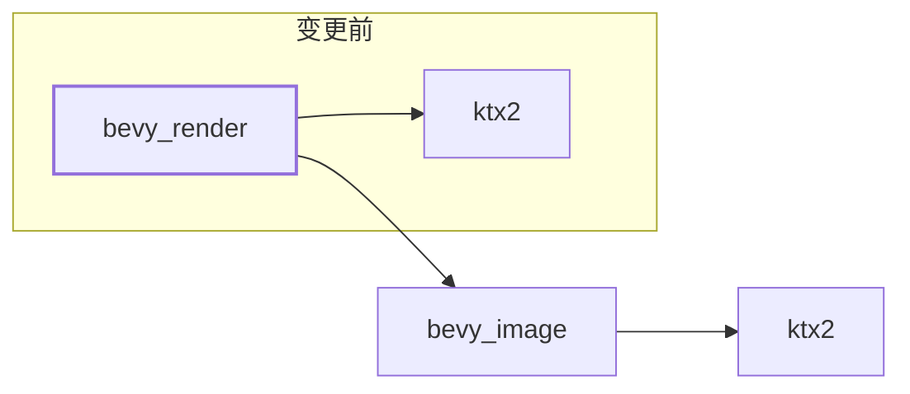

+++
title = "#19794 remove unneeded dependency from bevy_render"
date = "2025-06-24T00:00:00"
draft = false
template = "pull_request_page.html"
in_search_index = false

[extra]
current_language = "zh-cn"
available_languages = {"en" = { name = "English", url = "/pull_request/bevy/2025-06/pr-19794-en-20250624" }, "zh-cn" = { name = "中文", url = "/pull_request/bevy/2025-06/pr-19794-zh-cn-20250624" }}
+++

## 技术分析报告

### 基本概况
- **标题**: remove unneeded dependency from bevy_render
- **PR链接**: https://github.com/bevyengine/bevy/pull/19794
- **作者**: atlv24
- **状态**: 已合并
- **标签**: D-Trivial, A-Rendering, S-Ready-For-Final-Review
- **创建时间**: 2025-06-24T04:37:37Z
- **合并时间**: 2025-06-24T06:40:44Z
- **合并者**: mockersf

### 描述翻译
# Objective
- 移除不必要的依赖

# Solution
- 移除不必要的依赖

# Testing
- cargo clippy

## PR变更分析

### 问题背景
在Bevy渲染模块的依赖配置中，存在冗余的ktx2依赖项。虽然bevy_image模块已经提供了ktx2格式支持，但bevy_render的Cargo.toml仍显式声明了对ktx2 crate的直接依赖。这种冗余会导致：
1. 增加不必要的构建复杂度
2. 可能引发版本冲突风险
3. 扩大最终二进制文件体积

### 解决方案
通过分析依赖传递关系，发现bevy_image已通过其"ktx2"特性提供了完整的ktx2支持。因此可以直接移除bevy_render中：
1. 对ktx2 crate的直接依赖声明
2. 特性配置中的冗余依赖标记

### 技术实现
主要修改集中在Cargo.toml文件的依赖管理部分：
1. 简化特性配置，移除冗余依赖声明
2. 删除不必要的直接依赖项

关键变更点：
```toml
# 修改前
ktx2 = ["dep:ktx2", "bevy_image/ktx2"]

# 修改后
ktx2 = ["bevy_image/ktx2"]
```
此变更确保当启用ktx2特性时，仅通过bevy_image模块间接引入ktx2依赖，消除冗余的直接依赖。

依赖项声明部分：
```toml
# 移除的依赖项
ktx2 = { version = "0.4.0", optional = true }
```
此变更直接删除不必要的依赖声明，简化依赖树。

### 技术影响
1. **依赖树优化**：减少一层不必要的依赖关系
2. **构建效率**：避免重复解析相同crate
3. **维护性**：降低未来版本冲突的可能性
4. **二进制体积**：潜在减小最终产物体积

### 验证方式
通过`cargo clippy`验证变更未引入新的编译警告或错误，确保变更符合项目代码质量标准。

## 依赖关系变更图示

图示说明：
- 实线表示保留的依赖关系
- 虚线框表示被移除的直接依赖
- 移除后依赖路径简化为：bevy_render → bevy_image → ktx2

## 关键文件变更

### crates/bevy_render/Cargo.toml
**变更说明**：清理冗余的ktx2依赖声明

```toml
# 变更前
ktx2 = ["dep:ktx2", "bevy_image/ktx2"]
# ...
ktx2 = { version = "0.4.0", optional = true }

# 变更后
ktx2 = ["bevy_image/ktx2"]
# (ktx2依赖项声明已移除)
```

**完整变更点**：
```diff
diff --git a/crates/bevy_render/Cargo.toml b/crates/bevy_render/Cargo.toml
index 7a1b8bc8d5a08..3797c51e00f10 100644
--- a/crates/bevy_render/Cargo.toml
+++ b/crates/bevy_render/Cargo.toml
@@ -28,7 +28,7 @@ compressed_image_saver = ["bevy_image/compressed_image_saver"]
 basis-universal = ["bevy_image/basis-universal"]
 exr = ["bevy_image/exr"]
 hdr = ["bevy_image/hdr"]
-ktx2 = ["dep:ktx2", "bevy_image/ktx2"]
+ktx2 = ["bevy_image/ktx2"]
 
 multi_threaded = ["bevy_tasks/multi_threaded"]
 
@@ -104,7 +104,6 @@ downcast-rs = { version = "2", default-features = false, features = ["std"] }
 thiserror = { version = "2", default-features = false }
 derive_more = { version = "1", default-features = false, features = ["from"] }
 futures-lite = "2.0.1"
-ktx2 = { version = "0.4.0", optional = true }
 encase = { version = "0.10", features = ["glam"] }
 # For wgpu profiling using tracing. Use `RUST_LOG=info` to also capture the wgpu spans.
 profiling = { version = "1", features = [
```

## 延伸阅读
1. [Cargo特性文档](https://doc.rust-lang.org/cargo/reference/features.html) - 官方特性管理机制说明
2. [依赖管理最佳实践](https://doc.rust-lang.org/cargo/guide/dependencies.html) - Cargo依赖配置指南
3. [Bevy模块架构](https://bevyengine.org/learn/book/getting-started/ecs/) - Bevy引擎组件设计理念

## 总结
此PR通过移除bevy_render中冗余的ktx2依赖项，简化了项目的依赖结构。变更保持了原有功能的完整性，同时优化了构建过程和最终产物。这类依赖清理工作有助于维持大型项目的长期可维护性，是值得遵循的良好实践。