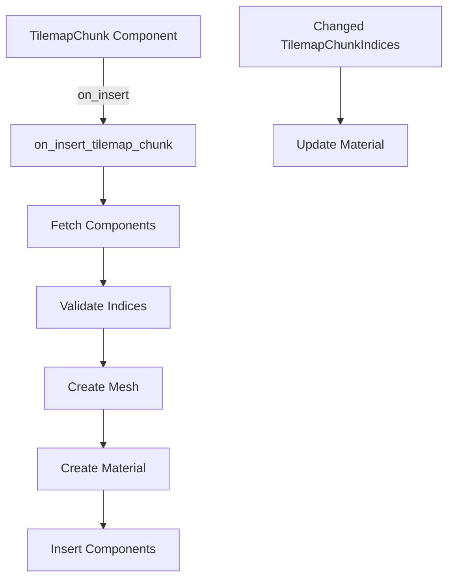

+++
title = "#19795 TilemapChunk cleanup"
date = "2025-06-24T00:00:00"
draft = false
template = "pull_request_page.html"
in_search_index = true

[taxonomies]
list_display = ["show"]

[extra]
current_language = "en"
available_languages = {"en" = { name = "English", url = "/pull_request/bevy/2025-06/pr-19795-en-20250624" }, "zh-cn" = { name = "中文", url = "/pull_request/bevy/2025-06/pr-19795-zh-cn-20250624" }}
labels = ["A-Rendering", "C-Code-Quality", "D-Straightforward"]
+++

# TilemapChunk Cleanup Analysis

## Basic Information
- **Title**: TilemapChunk cleanup
- **PR Link**: https://github.com/bevyengine/bevy/pull/19795
- **Author**: ConnerPetzold
- **Status**: MERGED
- **Labels**: A-Rendering, C-Code-Quality, S-Ready-For-Final-Review, D-Straightforward
- **Created**: 2025-06-24T05:07:51Z
- **Merged**: 2025-06-24T22:46:22Z
- **Merged By**: alice-i-cecile

## The Story of This Pull Request

This PR addresses technical debt from the initial tilemap chunk implementation (#18866), focusing on improving component lifecycle management and reducing unnecessary dependencies. The changes center around three main improvements: switching to an insertion hook, making components immutable, and simplifying component requirements.

The original implementation used an `Add` observer to initialize rendering components when a `TilemapChunk` was added. While functional, this approach had several limitations. First, it required multiple components (`Mesh2d`, `MeshMaterial2d`, etc.) to be present immediately after component creation, creating tight coupling. Second, the observer pattern was being superseded by Bevy's newer hook system, which provides better integration with the ECS lifecycle.

The solution migrates from the observer to an `on_insert` hook registered directly on the `TilemapChunk` component. This change simplifies the initialization logic by handling it at the component level rather than through a separate system. The hook function `on_insert_tilemap_chunk` now handles the setup process when the component is inserted into an entity.

```rust
// Before: Separate observer system
fn on_add_tilemap_chunk(trigger: On<Add, TilemapChunk>, ...) { ... }

// After: Direct hook registration
#[component(immutable, on_insert = on_insert_tilemap_chunk)]
pub struct TilemapChunk { ... }
```

The implementation uses `DeferredWorld` to access components and resources within the hook. This approach allows fetching required data directly from the ECS world while maintaining proper access patterns. The hook first validates that required components (`TilemapChunk`, `TilemapChunkIndices`, and `Anchor`) exist on the entity, logging warnings if any are missing.

```rust
let Some(tilemap_chunk) = world.get::<TilemapChunk>(entity) else {
    warn!("TilemapChunk not found for tilemap chunk {}", entity);
    return;
};
```

The mesh creation logic was refactored to use the cache directly. Instead of modifying the cache through an `Entry` API, the new implementation checks the cache and creates a new mesh only when necessary. This maintains the original caching behavior while fitting the hook's access patterns.

```rust
let mesh = if let Some(mesh) = tilemap_chunk_mesh_cache.get(&mesh_key) {
    mesh.clone()
} else {
    let mut meshes = world.resource_mut::<Assets<Mesh>>();
    meshes.add(make_chunk_mesh(&chunk_size, &display_size, &anchor))
};
```

The component requirements were simplified by removing unnecessary dependencies. The `#[require]` attribute now only mandates the `Anchor` component instead of requiring rendering components that are added by the hook. This reduces boilerplate when creating tilemap chunks.

```rust
// Before: Multiple required components
#[require(Mesh2d, MeshMaterial2d<TilemapChunkMaterial>, TilemapChunkIndices, Anchor)]

// After: Only Anchor required
#[require(Anchor)]
```

The `TilemapChunk` component was made immutable to enforce that its properties don't change after initialization. This guarantees consistency between the component state and the rendered output, as changing these properties would require recreating the mesh anyway.

```rust
#[component(immutable, ...)]
pub struct TilemapChunk { ... }
```

The update system `update_tilemap_chunk_indices` was adjusted to only run when indices actually change, using `Changed<TilemapChunkIndices>`. The comment clarifies that getting the material mutably triggers change detection, which is necessary for the renderer to pick up updates.

```rust
fn update_tilemap_chunk_indices(
    mut materials: ResMut<Assets<TilemapChunkMaterial>>,
    mut images: ResMut<Assets<Image>>,
    query: Query<(Entity, &TilemapChunk, &TilemapChunkIndices), Changed<TilemapChunkIndices>>,
) { ... }
```

A minor cleanup was made to `TilemapChunkMaterialPlugin` by removing the unnecessary `Default` derivation since the plugin doesn't use default initialization.

## Visual Representation



## Key Files Changed

### `crates/bevy_sprite/src/tilemap_chunk/mod.rs`
**Changes:**
- Replaced observer with `on_insert` hook
- Simplified component requirements
- Made `TilemapChunk` immutable
- Refactored mesh/material creation
- Optimized update system with `Changed` filter

**Key Code Snippets:**
```rust
// Component definition with hook and reduced requirements
#[derive(Component, Clone, Debug, Default)]
#[require(Anchor)]
#[component(immutable, on_insert = on_insert_tilemap_chunk)]
pub struct TilemapChunk { ... }

// Hook implementation
fn on_insert_tilemap_chunk(mut world: DeferredWorld, HookContext { entity, .. }: HookContext) {
    let Some(tilemap_chunk) = world.get::<TilemapChunk>(entity) else { ... };
    // ... rest of initialization logic
}

// Optimized update system
fn update_tilemap_chunk_indices(
    mut materials: ResMut<Assets<TilemapChunkMaterial>>,
    mut images: ResMut<Assets<Image>>,
    query: Query<(Entity, &TilemapChunk, &TilemapChunkIndices), Changed<TilemapChunkIndices>>,
) { ... }
```

### `crates/bevy_sprite/src/tilemap_chunk/tilemap_chunk_material.rs`
**Changes:**
- Removed unnecessary `Default` derivation

**Code Snippet:**
```rust
// Before:
#[derive(Default)]
pub struct TilemapChunkMaterialPlugin;

// After:
pub struct TilemapChunkMaterialPlugin;
```

## Further Reading
- [Bevy ECS Observers Documentation](https://docs.rs/bevy_ecs/latest/bevy_ecs/observer/index.html)
- [Bevy Component Hooks RFC](https://github.com/bevyengine/rfcs/pull/45)
- [Entity Component System Best Practices](https://github.com/bevyengine/bevy/discussions/4683)