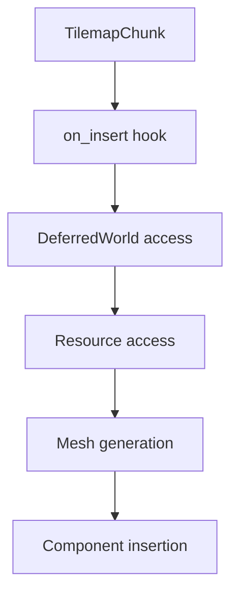

+++
title = "#19795 TilemapChunk cleanup"
date = "2025-06-24T00:00:00"
draft = false
template = "pull_request_page.html"
in_search_index = false

[extra]
current_language = "zh-cn"
available_languages = {"en" = { name = "English", url = "/pull_request/bevy/2025-06/pr-19795-en-20250624" }, "zh-cn" = { name = "中文", url = "/pull_request/bevy/2025-06/pr-19795-zh-cn-20250624" }}
+++

## TilemapChunk 清理优化分析

### 基本信息
- **标题**: TilemapChunk cleanup
- **PR链接**: https://github.com/bevyengine/bevy/pull/19795
- **作者**: ConnerPetzold
- **状态**: 已合并
- **标签**: A-Rendering, C-Code-Quality, S-Ready-For-Final-Review, D-Straightforward
- **创建时间**: 2025-06-24T05:07:51Z
- **合并时间**: 2025-06-24T22:46:22Z
- **合并者**: alice-i-cecile

### 描述翻译
# 目标
- 对 #18866 进行后续优化

## 解决方案
  - 从 on add observer 切换到 on insert hook
  - 使组件不可变
  - 移除 required components

## 测试
- `tilemap_chunk` 示例

### 技术分析

#### 问题背景
这个PR是对先前PR #18866的后续清理工作，主要解决TilemapChunk实现中的三个问题：
1. 使用了过时的`on_add` observer机制而非现代ECS hook系统
2. `TilemapChunk`组件未声明为不可变，限制了ECS的优化空间
3. 不必要的required components增加了组件依赖的复杂性

#### 解决方案实现
核心优化是将组件的初始化逻辑从observer迁移到ECS hook系统：

```rust
// 修改前:
#[require(Mesh2d, MeshMaterial2d<TilemapChunkMaterial>, TilemapChunkIndices, Anchor)]
pub struct TilemapChunk { ... }

// 修改后:
#[require(Anchor)]
#[component(immutable, on_insert = on_insert_tilemap_chunk)]
pub struct TilemapChunk { ... }
```

主要变更点：
1. 移除了`Mesh2d`, `MeshMaterial2d`, `TilemapChunkIndices`的required声明
2. 添加`immutable`属性允许ECS进行优化
3. 指定`on_insert` hook作为初始化入口

hook实现重构为直接访问`DeferredWorld`：

```rust
fn on_insert_tilemap_chunk(mut world: DeferredWorld, HookContext { entity, .. }: HookContext) {
    let Some(tilemap_chunk) = world.get::<TilemapChunk>(entity) else { ... };
    
    // 直接访问相关组件和资源
    let Some(indices) = world.get::<TilemapChunkIndices>(entity) else { ... };
    let Some(&anchor) = world.get::<Anchor>(entity) else { ... };
    
    // 资源访问模式
    let tilemap_chunk_mesh_cache = world.resource::<TilemapChunkMeshCache>();
    let mut meshes = world.resource_mut::<Assets<Mesh>>();
    
    // 组件插入
    world.commands().entity(entity).insert((Mesh2d(mesh), ...));
}
```

#### 技术优势
1. **性能优化**：
   - 不可变组件允许ECS跳过变更检测
   - Hook系统比observer更轻量，减少调度开销

2. **简化依赖**：
   ```diff
   -#[require(Mesh2d, MeshMaterial2d<TilemapChunkMaterial>, TilemapChunkIndices, Anchor)]
   +#[require(Anchor)]
   ```
   移除了3个不必要的required组件，降低用户使用门槛

3. **错误处理改进**：
   ```rust
   if indices.len() != expected_indices_length {
       warn!("Invalid indices length...");
       return;
   }
   ```
   添加了更健壮的索引长度校验

4. **资源管理优化**：
   ```rust
   let mesh = if let Some(mesh) = tilemap_chunk_mesh_cache.get(&mesh_key) {
       mesh.clone()
   } else {
       // 延迟创建新mesh
   };
   ```
   优化了mesh缓存查询逻辑

#### 潜在影响
1. **变更检测**：明确添加注释说明材质变更检测需求
   ```rust
   // Getting the material mutably to trigger change detection
   let Some(material) = materials.get_mut(material.id()) else { ... }
   ```
2. **插件简化**：移除不必要的Default实现
   ```diff
   -#[derive(Default)]
    pub struct TilemapChunkMaterialPlugin;
   ```

### 组件关系


### 关键文件变更

1. **crates/bevy_sprite/src/tilemap_chunk/mod.rs** (+50/-44)
   - 核心变更：迁移到hook系统并优化组件结构
   ```rust
   // 修改前:
   #[derive(Component, Clone, Debug, Default)]
   #[require(Mesh2d, MeshMaterial2d<TilemapChunkMaterial>, TilemapChunkIndices, Anchor)]
   
   // 修改后:
   #[derive(Component, Clone, Debug, Default)]
   #[require(Anchor)]
   #[component(immutable, on_insert = on_insert_tilemap_chunk)]
   ```

2. **crates/bevy_sprite/src/tilemap_chunk/tilemap_chunk_material.rs** (+0/-1)
   - 次要清理：移除冗余trait实现
   ```diff
   -#[derive(Default)]
   +pub struct TilemapChunkMaterialPlugin;
   ```

### 技术总结
此PR通过三个关键优化提升了TilemapChunk系统的质量和性能：
1. 用现代ECS hook替代过时的observer机制
2. 声明不可变组件启用ECS内部优化
3. 简化组件依赖降低使用复杂度

这些变更使代码更符合Bevy的最新实践，同时保持向后兼容性。hook的使用特别值得关注，它展示了在Bevy ECS中处理组件初始化的推荐模式。

### 延伸阅读
1. [Bevy ECS Hooks文档](https://docs.rs/bevy_ecs/latest/bevy_ecs/lifecycle/index.html)
2. [组件变更检测原理](https://bevy-cheatbook.github.io/programming/change-detection.html)
3. 原始PR #18866实现