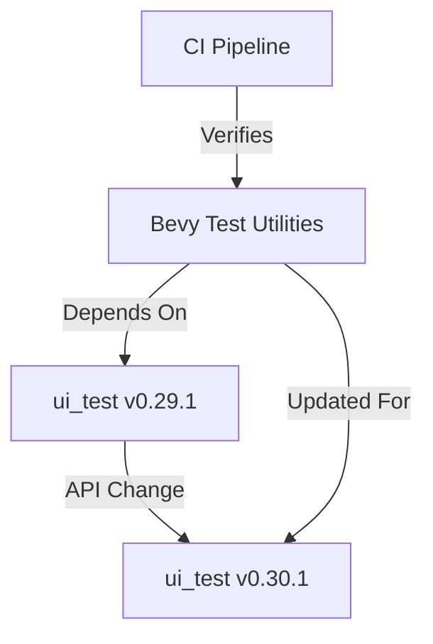

+++
title = "#19799 Update ui_test requirement from 0.29.1 to 0.30.1"
date = "2025-06-30T00:00:00"
draft = false
template = "pull_request_page.html"
in_search_index = true

[taxonomies]
list_display = ["show"]

[extra]
current_language = "en"
available_languages = {"en" = { name = "English", url = "/pull_request/bevy/2025-06/pr-19799-en-20250630" }, "zh-cn" = { name = "中文", url = "/pull_request/bevy/2025-06/pr-19799-zh-cn-20250630" }}
labels = ["C-Dependencies", "D-Straightforward"]
+++

## Pull Request Analysis: Update ui_test requirement from 0.29.1 to 0.30.1

### Basic Information
- **Title**: Update ui_test requirement from 0.29.1 to 0.30.1
- **PR Link**: https://github.com/bevyengine/bevy/pull/19799
- **Author**: mnmaita
- **Status**: MERGED
- **Labels**: C-Dependencies, S-Ready-For-Final-Review, D-Straightforward
- **Created**: 2025-06-24T09:07:11Z
- **Merged**: 2025-06-30T18:40:08Z
- **Merged By**: mockersf

### Description Translation
# Objective

- Fixes #19670

## Solution

- Updated breaking code to be able to upgrade `ui_test` to the latest version.

## Testing

- CI checks.

### The Story of This Pull Request

#### The Problem and Context
The Bevy project needed to update its `ui_test` dependency from version 0.29.1 to 0.30.1. This update was required to incorporate improvements and fixes from the latest `ui_test` release. However, the new version introduced breaking API changes that affected Bevy's compile-fail test utilities. Specifically, the `Gha` struct in `ui_test` had its interface modified, replacing a const generic parameter with a regular struct field. This broke existing code that instantiated `Gha` using the old syntax.

#### The Solution Approach
The solution involved two coordinated changes:
1. Update the dependency version in Cargo.toml
2. Modify the code to conform to `ui_test`'s new API requirements

The author identified that the `Gha` struct's instantiation needed adjustment. Previously, it used a const generic parameter (`<true>`) to configure its behavior. In the new version, this was replaced with a `group` boolean field in the struct. The solution maintains identical functionality while adapting to the updated API.

#### The Implementation
The implementation consisted of two minimal but essential changes. First, the dependency version was updated in Cargo.toml. Second, the `Gha` instantiation was modified to use the new struct field syntax instead of const generics. This change preserved the existing behavior (`group: true`) while complying with the updated API.

#### Technical Insights
The change demonstrates a common dependency management pattern:
1. Identify breaking API changes in dependencies
2. Update dependency version specifier
3. Modify calling code to match new interface
4. Verify through CI that functionality remains correct

The modification from const generic to struct field represents a common evolution in Rust APIs. Const generics work well for simple configurations but become limiting when more complex state is needed. The move to a struct field provides greater flexibility for future expansion.

#### The Impact
This update allows Bevy to:
1. Receive latest improvements and fixes from `ui_test`
2. Maintain compatibility with the evolving Rust testing ecosystem
3. Keep dependency versions current to avoid technical debt
4. Ensure compile-fail tests continue functioning as expected

The changes are localized to test utilities, so they don't affect Bevy's core functionality. The solution was verified through CI checks, ensuring no regressions in test behavior.

### Visual Representation



### Key Files Changed

#### 1. `tools/compile_fail_utils/Cargo.toml`
**Change**: Updated `ui_test` dependency version  
**Reason**: To incorporate the latest version of the testing dependency

```toml
# Before:
ui_test = "0.29.1"

# After:
ui_test = "0.30.1"
```

#### 2. `tools/compile_fail_utils/src/lib.rs`
**Change**: Adapted to `ui_test`'s updated API  
**Reason**: The `Gha` struct's interface changed in the new version

```rust
// Before:
Box::new((
    Text::verbose(),
    Gha::<true> {
        name: test_name.into(),
    },
))

// After:
Box::new((
    Text::verbose(),
    Gha {
        group: true,
        name: test_name.into(),
    },
))
```

### Further Reading
1. [ui_test crate documentation](https://docs.rs/ui_test/)
2. [Rust Const Generics RFC](https://github.com/rust-lang/rfcs/blob/master/text/2000-const-generics.md)
3. [Semantic Versioning in Rust](https://doc.rust-lang.org/cargo/reference/semver.html)

### Full Code Diff
```diff
diff --git a/tools/compile_fail_utils/Cargo.toml b/tools/compile_fail_utils/Cargo.toml
index 453b7ea7ad9f1..8668fdaa9e94f 100644
--- a/tools/compile_fail_utils/Cargo.toml
+++ b/tools/compile_fail_utils/Cargo.toml
@@ -8,7 +8,7 @@ license = "MIT OR Apache-2.0"
 publish = false
 
 [dependencies]
-ui_test = "0.29.1"
+ui_test = "0.30.1"
 
 [[test]]
 name = "example"
diff --git a/tools/compile_fail_utils/src/lib.rs b/tools/compile_fail_utils/src/lib.rs
index ecd4f34c687d7..28157400a7cdb 100644
--- a/tools/compile_fail_utils/src/lib.rs
+++ b/tools/compile_fail_utils/src/lib.rs
@@ -123,7 +123,8 @@ pub fn test_with_multiple_configs(
     let emitter: Box<dyn StatusEmitter + Send> = if env::var_os("CI").is_some() {
         Box::new((
             Text::verbose(),
-            Gha::<true> {
+            Gha {
+                group: true,
                 name: test_name.into(),
             },
         ))
```