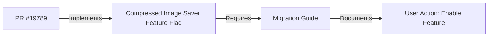

+++
title = "#19800 Adding Migration Guide for Compressed Image Saver Feature Flag"
date = "2025-06-24T00:00:00"
draft = false
template = "pull_request_page.html"
in_search_index = true

[taxonomies]
list_display = ["show"]

[extra]
current_language = "en"
available_languages = {"en" = { name = "English", url = "/pull_request/bevy/2025-06/pr-19800-en-20250624" }, "zh-cn" = { name = "中文", url = "/pull_request/bevy/2025-06/pr-19800-zh-cn-20250624" }}
+++

### Title: Adding Migration Guide for Compressed Image Saver Feature Flag

## Basic Information
- **Title**: add forgotten migration guide
- **PR Link**: https://github.com/bevyengine/bevy/pull/19800
- **Author**: atlv24
- **Status**: MERGED
- **Labels**: None
- **Created**: 2025-06-24T10:26:42Z
- **Merged**: 2025-06-24T11:37:33Z
- **Merged By**: mockersf

## Description Translation
# Objective

- Forgot to add a migration guide on #19789

## Solution

- Add one

## The Story of This Pull Request

The PR addresses an oversight in a previous change (#19789) where the compressed image saver functionality was moved behind a dedicated feature flag. While that PR implemented the technical change correctly, it failed to document the migration path for users. This omission created a risk that users upgrading Bevy might encounter unexpected behavior when using compressed image saving without realizing they needed to explicitly enable the new feature.

The solution was straightforward: create a migration guide document that clearly explains the change and required action. Migration guides are essential in Bevy's release process as they help users transition between versions without breaking their projects. The guide needed to:
1. Clearly identify which PR introduced the change
2. Explain what was modified in simple terms
3. Provide explicit instructions for affected users

The implementation consists of a single Markdown file in Bevy's migration guide directory. The file follows Bevy's standard migration guide format with frontmatter metadata including the title and related PR number, followed by a concise explanation of the change. The content directly states that the compressed image saver is now behind a feature flag and specifies exactly which feature needs to be enabled.

This change demonstrates the importance of maintaining complete documentation alongside code changes. While feature flag changes are technically sound when implemented, they create breaking changes for users who aren't aware of the new requirements. The quick turnaround (created and merged within 71 minutes) shows the team's commitment to maintaining good documentation practices.

## Visual Representation



## Key Files Changed

1. `release-content/migration-guides/compressed-image-saver.md`  
   (New file created to document migration requirements)

```markdown
---
title: Compressed image saver feature
pull_requests: [19789]
---

The compressed image saver has been gated behind its own dedicated feature flag now. If you were using it, you need to enable the "compressed_image_saver" feature.
```

## Further Reading
- [Bevy Migration Guide Documentation](https://github.com/bevyengine/bevy/blob/main/docs/migration_guide.md)
- [Original PR #19789 implementing the feature flag](https://github.com/bevyengine/bevy/pull/19789)
- [Bevy Feature Flags Documentation](https://github.com/bevyengine/bevy/blob/main/docs/features.md)