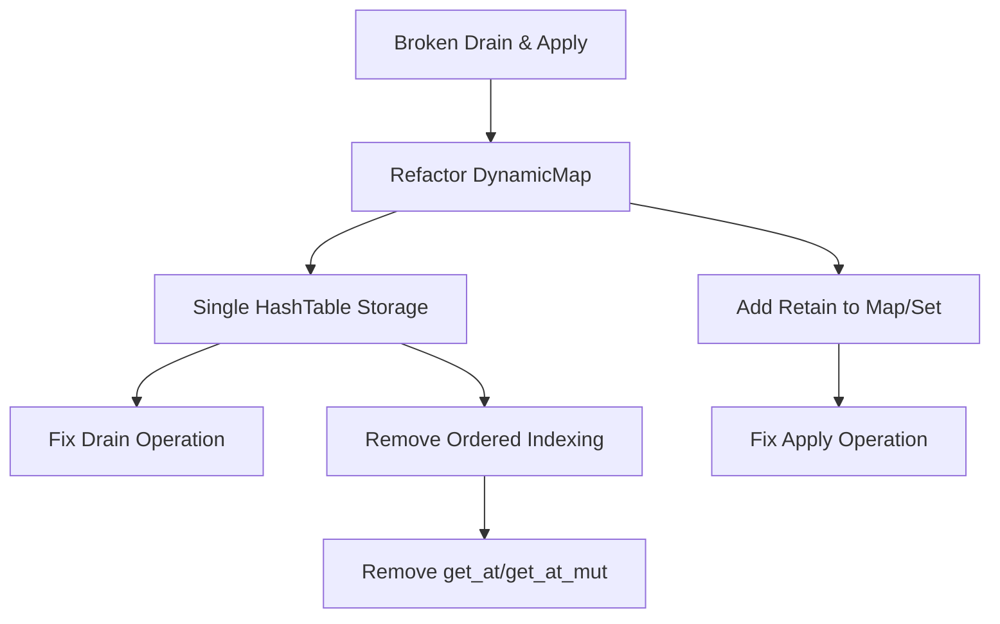

+++
title = "#19802"
date = "2025-06-25T00:00:00"
draft = false
template = "pull_request_page.html"
in_search_index = true

[taxonomies]
list_display = ["show"]

[extra]
current_language = "en"
available_languages = {"en" = { name = "English", url = "/pull_request/bevy/2025-06/pr-19802-en-20250625" }, "zh-cn" = { name = "中文", url = "/pull_request/bevy/2025-06/pr-19802-zh-cn-20250625" }}
+++

### Fixing Map and Set Reflection: A Deep Dive into PR #19802

#### The Problem and Context
The Bevy reflection system had two critical issues in its handling of maps and sets. First, `DynamicMap::drain()` was broken - it failed to clear internal indices, causing panics during subsequent reads. Second, the `PartialReflect::apply()` implementation for maps and sets was fundamentally flawed. When applying changes from a reflected map/set to another, it would only add/update existing entries but never remove entries missing from the applied map. This caused accumulation of stale entries, particularly problematic when reapplying changes to components like `HashMap<Entity, T>`.

The core issue stemmed from how `DynamicMap` managed data. It maintained:
1. A `Vec` for ordered storage of key-value pairs
2. A `HashTable` for quick lookups
This dual-structure approach created complexity and synchronization issues, especially during drain operations.

#### The Solution Approach
The solution had three main objectives:
1. Fix the drain operation by simplifying `DynamicMap`'s storage
2. Ensure `apply` removes missing entries by introducing retention logic
3. Remove unused ordered-index APIs now that maps are unordered

Key engineering decisions:
- Align `DynamicMap` with `DynamicSet`'s single-storage approach using only `HashTable`
- Add `retain()` methods to `Map` and `Set` traits for targeted removal
- Remove `get_at()`/`get_at_mut()` since ordered indexing no longer applies
- Update documentation to clarify unordered nature of reflected collections

#### The Implementation

**1. DynamicMap Refactor**  
The most significant change was simplifying `DynamicMap` to use a single `HashTable` instead of separate `Vec` and `HashTable`:

```rust
// Before:
pub struct DynamicMap {
    represented_type: Option<&'static TypeInfo>,
    values: Vec<(Box<dyn PartialReflect>, Box<dyn PartialReflect>)>,
    indices: HashTable<usize>,
}

// After:
pub struct DynamicMap {
    represented_type: Option<&'static TypeInfo>,
    hash_table: HashTable<(Box<dyn PartialReflect>, Box<dyn PartialReflect>)>,
}
```

This change fixed `drain()` by eliminating index management:

```rust
// Before (broken drain):
fn drain(&mut self) -> Vec<(Box<dyn PartialReflect>, Box<dyn PartialReflect>)> {
    self.values.drain(..).collect() // Indices not cleared!
}

// After (fixed drain):
fn drain(&mut self) -> Vec<(Box<dyn PartialReflect>, Box<dyn PartialReflect>)> {
    self.hash_table.drain().collect()
}
```

**2. Retention for Correct Apply Behavior**  
The `apply` logic was fixed by adding and using new `retain()` methods:

```rust
// Added to Map trait:
fn retain(&mut self, f: &mut dyn FnMut(&dyn PartialReflect, &mut dyn PartialReflect) -> bool);

// Implementation for DynamicMap:
fn retain(&mut self, f: &mut dyn FnMut(...) -> bool) {
    self.hash_table.retain(|(key, value)| f(&**key, &mut **value));
}

// Updated apply logic:
pub fn map_try_apply<M: Map>(a: &mut M, b: &dyn PartialReflect) -> Result<(), ApplyError> {
    // ... existing apply logic ...
    a.retain(&mut |key, _| map_value.get(key).is_some()); // Remove missing entries
    Ok(())
}
```

**3. Removal of Ordered Indexing**  
Since `DynamicMap` became unordered, ordered indexing methods were removed from the `Map` trait and all implementations:

```diff
- fn get_at(&self, index: usize) -> Option<(...)>;
- fn get_at_mut(&mut self, index: usize) -> Option<(...)>;
```

**4. Iterator Simplification**  
Iterators were simplified to use dynamic dispatch instead of custom `MapIter`:

```rust
// Before:
fn iter(&self) -> MapIter;

// After:
fn iter(&self) -> Box<dyn Iterator<Item = (...)> + '_> {
    Box::new(self.hash_table.iter().map(|(k, v)| (&**k, &**v)))
}
```

#### Technical Insights
- **Consistency**: Aligning `DynamicMap` with `DynamicSet`'s implementation reduced complexity and maintenance
- **Correctness over Order**: Sacrificing order guarantees simplified implementation and fixed critical bugs
- **Breaking Change Tradeoff**: Removing `get_at()`/`get_at_mut()` was necessary but required migration guidance
- **Retain Efficiency**: Using `retain()` provides O(n) removal which is optimal for hash-based collections

#### The Impact
- **Bug Fixes**: Resolved drain panic and stale entry accumulation in apply operations
- **Performance**: Simplified data structure improves memory locality and reduces indirection
- **API Cleanup**: Removed unused ordered-indexing methods from reflection API
- **Behavior Change**: `apply` now correctly synchronizes collections by removing missing entries
- **Documentation**: Clarified unordered nature of reflected collections in docs

### Visual Representation



### Key Files Changed

1. **`crates/bevy_reflect/src/map.rs` (+75/-219)**  
   Core refactor of `DynamicMap` and `Map` trait:
   ```rust
   // Before: Dual-storage with Vec + HashTable
   struct DynamicMap {
       values: Vec<(Box<dyn PartialReflect>, ...)>,
       indices: HashTable<usize>
   }
   
   // After: Single HashTable storage
   struct DynamicMap {
       hash_table: HashTable<(Box<dyn PartialReflect>, ...)>
   }
   
   // Added retain method
   fn retain(&mut self, f: &mut dyn FnMut(...) -> bool) {
       self.hash_table.retain(|(k, v)| f(&**k, &mut **v))
   }
   ```

2. **`crates/bevy_reflect/src/set.rs` (+35/-10)**  
   Added `retain` to sets and fixed apply:
   ```rust
   // Added to Set trait
   fn retain(&mut self, f: &mut dyn FnMut(&dyn PartialReflect) -> bool);
   
   // Updated apply logic
   a.retain(&mut |value| set_value.get(value).is_some());
   ```

3. **`crates/bevy_reflect/src/impls/alloc/collections/btree/map.rs` (+10/-18)**  
   Removed ordered indexing from BTreeMap impl:
   ```diff
   - fn get_at(&self, index: usize) -> Option<(...)> { ... }
   - fn get_at_mut(&mut self, index: usize) -> Option<(...)> { ... }
   ```

4. **`release-content/migration-guides/map_set_apply.md` (+11/-0)**  
   Migration guide for breaking changes:
   ```markdown
   `DynamicMap` is now unordered...
   `Map::get_at` and `Map::get_at_mut` are now removed...
   `PartialReflect::apply` now removes excess entries...
   ```

### Further Reading
- [Rust HashTable Documentation](https://doc.rust-lang.org/std/collections/hash_map/struct.HashMap.html)
- [Reflection in Game Engines](https://gameprogrammingpatterns.com/reflection-pattern.html)
- [Bevy Reflection System](https://bevyengine.org/learn/book/features/reflection/)