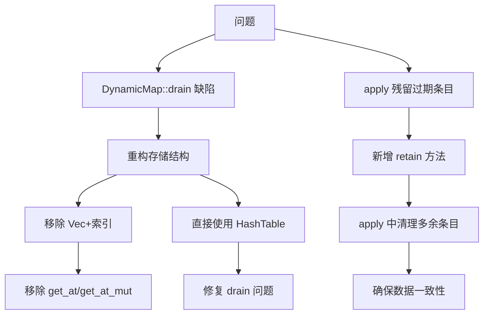

+++
title = "#19802 Fix `PartialReflect::apply` for maps, remove `get_at/_mut` from `Map` trait"
date = "2025-06-25T00:00:00"
draft = false
template = "pull_request_page.html"
in_search_index = false

[extra]
current_language = "zh-cn"
available_languages = {"en" = { name = "English", url = "/pull_request/bevy/2025-06/pr-19802-en-20250625" }, "zh-cn" = { name = "中文", url = "/pull_request/bevy/2025-06/pr-19802-zh-cn-20250625" }}
+++

## 技术分析报告：PR #19802

### 基本资料
- **标题**: Fix `PartialReflect::apply` for maps, remove `get_at/_mut` from `Map` trait
- **PR链接**: https://github.com/bevyengine/bevy/pull/19802
- **作者**: Azorlogh
- **状态**: 已合并
- **标签**: C-Bug, S-Ready-For-Final-Review, A-Reflection, M-Needs-Migration-Guide
- **创建时间**: 2025-06-24T14:41:18Z
- **合并时间**: 2025-06-25T16:03:19Z
- **合并人**: alice-i-cecile

### 问题描述翻译
# 目标
- 修复 https://github.com/bevyengine/bevy/issues/14328
- `DynamicMap::drain` 存在缺陷（索引未清除，导致后续读取时 panic）
- `PartialReflect::apply` 在映射(map)和集合(set)上存在缺陷，因为它们不会从 `self` 映射中移除应用映射中不存在的条目
    - 在实现包含 `HashMap<Entity, _>` 的组件的 MapEntities 时发现此缺陷。由于 `apply` 用于重新应用更改到反射映射，映射最终会残留大量过期条目

# 解决方案
- 移除 `DynamicMap` 中单独的 `Vec`，改为直接使用 `HashTable`（类似 `DynamicSet` 的实现）
- 将 `MapIter` 替换为 `Box<dyn Iterator>`（类似 `DynamicSet`），并移除现在无用的 `Map::get_at` 和 `Map::get_at_mut`
- 现在假设 `DynamicMap` 类型是无序的，并相应调整文档
- 修正 `DynamicSet` 的文档（有序 -> 无序）
- 添加 `Map::retain` 和 `Set::retain` 方法，并在 `PartialReflect::apply` 实现中使用它们移除多余条目

# 测试
- 添加 `map::tests::apply` 和 `set::tests::apply` 验证 `<DynamicMap as PartialReflect>::apply` 和 `<DynamicSet as PartialReflect>::apply`

### 技术实现分析

#### 问题背景
1. **`DynamicMap::drain` 的缺陷**：
   - 原始实现中，`drain` 操作后索引未清除，导致后续操作 panic
   - 根本原因：`DynamicMap` 使用分离的 `Vec` 存储值和 `HashTable` 存储索引，但清除时未同步状态

2. **`PartialReflect::apply` 的行为缺陷**：
   - 当应用于映射时，不会移除 `self` 中存在但应用数据中不存在的条目
   - 导致映射中积累过期数据，特别是在实现 `MapEntities` 等需要精确同步的场景

3. **设计不一致性**：
   - `DynamicMap` 尝试维护顺序（通过 `Vec`），但哈希容器本质无序
   - `get_at`/`get_at_mut` 方法暴露基于索引的访问，与哈希容器的特性冲突

#### 解决方案设计
核心策略是统一容器实现并修正 `apply` 语义：
1. **移除顺序保证**：
   - 承认 `DynamicMap` 的无序特性，移除 `Vec` 存储层
   - 直接使用 `HashTable` 存储键值对，与 `DynamicSet` 实现对齐

2. **API 简化**：
   - 删除与索引访问相关的 `get_at`/`get_at_mut` 方法
   - 将 `iter()` 返回类型统一为 `Box<dyn Iterator>`

3. **新增保留逻辑**：
   - 引入 `Map::retain` 和 `Set::retain` 方法
   - 在 `apply` 操作中调用 `retain` 移除多余条目

#### 关键实现细节
1. **`DynamicMap` 重构**：
```rust
// 重构前
pub struct DynamicMap {
    represented_type: Option<&'static TypeInfo>,
    values: Vec<(Box<dyn PartialReflect>, Box<dyn PartialReflect>)>,
    indices: HashTable<usize>,
}

// 重构后
pub struct DynamicMap {
    represented_type: Option<&'static TypeInfo>,
    hash_table: HashTable<(Box<dyn PartialReflect>, Box<dyn PartialReflect>)>,
}
```
- 移除 `values` 和 `indices`，直接使用 `hash_table` 存储条目
- 解决 `drain` 后索引残留问题（现在由 `HashTable` 统一管理）

2. **`apply` 逻辑修正**：
```rust
// map_try_apply 新增 retain 调用
pub fn map_try_apply<M: Map>(a: &mut M, b: &dyn PartialReflect) -> Result<(), ApplyError> {
    let map_value = b.as_reflect_map().ok_or(ApplyError::MismatchedKinds)?;
    for (key, b_value) in map_value.iter() {
        // ... 更新或插入值 ...
    }
    // 关键新增：移除多余条目
    a.retain(&mut |key, _| map_value.get(key).is_some());
    Ok(())
}
```
- 通过 `retain` 确保 `self` 只保留应用数据中存在的键

3. **`retain` 方法实现**：
```rust
// DynamicMap 的 retain 实现
fn retain(&mut self, f: &mut dyn FnMut(&dyn PartialReflect, &mut dyn PartialReflect) -> bool) {
    self.hash_table.retain(move |(key, value)| f(&**key, &mut **value));
}
```
- 代理到 `HashTable::retain` 实现过滤逻辑

4. **测试覆盖增强**：
```rust
#[test]
fn apply() {
    let mut map_a = DynamicMap::default();
    map_a.insert(0, 0);
    map_a.insert(1, 1);
    
    let mut map_b = DynamicMap::default();
    map_b.insert(10, 10);
    map_b.insert(1, 5);
    
    map_a.apply(&map_b);
    
    assert!(map_a.get(&0).is_none());  // 验证多余条目被移除
    assert_eq!(map_a.get(&1).unwrap().try_downcast_ref(), Some(&5));
    assert_eq!(map_a.get(&10).unwrap().try_downcast_ref(), Some(&10));
}
```
- 明确验证 `apply` 后多余条目移除和值更新

#### 架构影响
1. **行为变更**：
   - `DynamicMap` 正式变为无序容器
   - `apply` 操作现在会移除目标容器中的多余条目

2. **API 破坏性变更**：
   - 移除 `Map::get_at` 和 `Map::get_at_mut`
   - 所有映射实现（`HashMap`, `BTreeMap` 等）需同步修改

3. **迁移要求**：
   - 依赖索引访问的代码需重构为基于键的访问
   - 依赖 `DynamicMap` 顺序的代码需自行维护顺序信息

### 关键文件变更

1. **`crates/bevy_reflect/src/map.rs`**  
   - 重构 `DynamicMap` 内部结构（+75/-219）
   - 移除 `MapIter` 和索引访问方法
   - 实现 `retain` 方法并修正 `apply` 逻辑
   
   重构核心：
```rust
// 存储结构变更
- values: Vec<(Box<dyn PartialReflect>, Box<dyn PartialReflect>)>,
- indices: HashTable<usize>,
+ hash_table: HashTable<(Box<dyn PartialReflect>, Box<dyn PartialReflect>)>,

// 方法实现简化
fn get(&self, key: &dyn PartialReflect) -> Option<&dyn PartialReflect> {
-   let hash = Self::internal_hash(key);
-   let eq = Self::internal_eq(key, &self.values);
-   self.indices.find(hash, eq).map(|&index| &*self.values[index].1)
+   self.hash_table.find(Self::internal_hash(key), Self::internal_eq(key))
+       .map(|(_, value)| &**value)
}
```

2. **`crates/bevy_reflect/src/set.rs`**  
   - 为 `DynamicSet` 添加 `retain` 方法（+35/-10）
   - 同步修正 `apply` 逻辑
```rust
// 新增 retain 方法
fn retain(&mut self, f: &mut dyn FnMut(&dyn PartialReflect) -> bool) {
    self.hash_table.retain(move |value| f(&**value));
}

// apply 逻辑增强
a.retain(&mut |value| set_value.get(value).is_some());  // 移除多余元素
```

3. **`crates/bevy_reflect/src/impls/alloc/collections/btree/map.rs`**  
   - 移除 `get_at`/`get_at_mut`（+10/-18）
   - 实现新的 `iter` 和 `retain`
```rust
// 接口统一
fn iter(&self) -> Box<dyn Iterator<Item = (&dyn PartialReflect, &dyn PartialReflect)> + '_> {
    Box::new(self.iter().map(|(k, v)| (k as &dyn PartialReflect, v as &dyn PartialReflect)))
}
```

4. **`release-content/migration-guides/map_set_apply.md`**  
   - 新增迁移指南（+11/-0）
```markdown
---
title: `DynamicMap` 现在是无序的，`Map::get_at` 和 `Map::get_at_mut` 已被移除
---

`DynamicMap` 现在是无序的，`Map` trait 不再假设实现是有序的...
```

### 技术图示


### 延伸阅读
1. 哈希表原理:  
   https://en.wikipedia.org/wiki/Hash_table
2. Rust 所有权与借用:  
   https://doc.rust-lang.org/book/ch04-00-understanding-ownership.html
3. Bevy 反射系统设计:  
   https://bevyengine.org/learn/book/reflection/