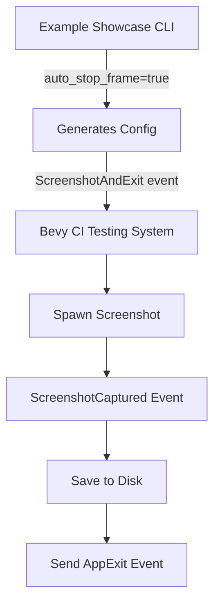

+++
title = "#19806 CI tests can exit directly after taking a screenshot"
date = "2025-06-24T00:00:00"
draft = false
template = "pull_request_page.html"
in_search_index = true

[taxonomies]
list_display = ["show"]

[extra]
current_language = "en"
available_languages = {"en" = { name = "English", url = "/pull_request/bevy/2025-06/pr-19806-en-20250624" }, "zh-cn" = { name = "中文", url = "/pull_request/bevy/2025-06/pr-19806-zh-cn-20250624" }}
labels = ["A-Rendering", "A-Build-System", "C-Testing"]
+++

# CI tests can exit directly after taking a screenshot

## Basic Information
- **Title**: CI tests can exit directly after taking a screenshot
- **PR Link**: https://github.com/bevyengine/bevy/pull/19806
- **Author**: mockersf
- **Status**: MERGED
- **Labels**: A-Rendering, A-Build-System, S-Ready-For-Final-Review, C-Testing
- **Created**: 2025-06-24T22:22:16Z
- **Merged**: 2025-06-24T23:05:59Z
- **Merged By**: alice-i-cecile

## Description Translation
# Objective

- Currently, CI tests take a screenshot at frame X and exits at frame Y with X < Y, and both number fixed
- This means tests can take longer than they actually need when taking the screenshot is fast, and can fail to take the screenshot when it's taking too long

## Solution

- Add a new event `ScreenshotAndExit` that exit directly after the screenshot is saved

## The Story of This Pull Request

### The Problem and Context
The Bevy engine's CI testing workflow for examples had an efficiency issue. Tests were configured to take a screenshot at a specific frame (X) and then continue running until a later frame (Y) before exiting. This design caused two problems:

1. **Unnecessary execution time**: When screenshot capture was fast, tests wasted resources running additional frames after the screenshot was already taken
2. **Potential test failures**: When screenshot processing took longer than expected, the test could exit at frame Y before completing the screenshot operation, resulting in failed tests

These issues were particularly problematic for CI environments where resource efficiency and test reliability are critical. The existing `Screenshot` event didn't provide a way to exit immediately after screenshot completion, forcing tests to run longer than necessary.

### The Solution Approach
The solution introduces a new event type `ScreenshotAndExit` that combines screenshot capture with immediate application exit. Key design decisions:

1. **New event type**: Created instead of modifying existing `Screenshot` event to maintain backward compatibility
2. **Immediate exit**: Application terminates right after screenshot is saved to disk
3. **Observer pattern**: Uses Bevy's observer system to wait for screenshot completion before triggering exit
4. **CLI integration**: Added a new `auto_stop_frame` flag to control this behavior

The implementation avoids complex threading or async operations by leveraging Bevy's existing event systems and observer patterns.

### The Implementation
The solution required changes in three main areas:

1. **Event definition**: Added `ScreenshotAndExit` to the CI testing event enum
2. **Event handling**: Implemented systems to process the new event
3. **CLI configuration**: Updated the example runner to support the new option

In `config.rs`, the new event variant was added to the `CiTestingEvent` enum:
```rust
// crates/bevy_dev_tools/src/ci_testing/config.rs
pub enum CiTestingEvent {
    // ...
    ScreenshotAndExit,
}
```

In `systems.rs`, the handler for `ScreenshotAndExit` was implemented. This system:
1. Captures a screenshot of the primary window
2. Observes the `ScreenshotCaptured` event
3. Saves the image to disk
4. Sends `AppExit::Success` immediately after saving:
```rust
// crates/bevy_dev_tools/src/ci_testing/systems.rs
CiTestingEvent::ScreenshotAndExit => {
    let this_frame = *current_frame;
    world.spawn(Screenshot::primary_window()).observe(
        move |captured: On<bevy_render::view::screenshot::ScreenshotCaptured>,
              mut exit_event: EventWriter<AppExit>| {
            let path = format!("./screenshot-{}.png", this_frame);
            save_to_disk(path)(captured);
            info!("Exiting. Test successful!");
            exit_event.write(AppExit::Success);
        },
    );
    info!("Took a screenshot at frame {}.", *current_frame);
}
```

The CLI interface in `main.rs` was extended with a new `auto_stop_frame` flag and updated configuration logic:
```rust
// tools/example-showcase/src/main.rs
#[arg(long, default_value = "false")]
/// Automatically ends after taking a screenshot
///
/// Only works if `screenshot-frame` is set to non-0, and overrides `stop-frame`.
auto_stop_frame: bool,
```

The configuration logic was expanded to handle combinations of `stop_frame`, `screenshot_frame`, and the new `auto_stop_frame` flag. When `auto_stop_frame` is enabled, it generates configuration using the new `ScreenshotAndExit` event:
```rust
// tools/example-showcase/src/main.rs
(0, _, true) => {
    let mut file = File::create("example_showcase_config.ron").unwrap();
    file.write_all(
        format!("(setup: (fixed_frame_time: Some({fixed_frame_time})), events: [({screenshot_frame}, ScreenshotAndExit)])").as_bytes(),
    )
    .unwrap();
    extra_parameters.push("--features");
    extra_parameters.push("bevy_ci_testing");
}
```

### Technical Insights
Key technical aspects of this implementation:

1. **Observer pattern**: The solution uses Bevy's observer system (`observe()`) to wait for the `ScreenshotCaptured` event before exiting. This ensures the exit happens only after the screenshot is fully processed.

2. **Frame capture**: The current frame number is captured in a closure (`let this_frame = *current_frame`) to ensure the correct frame number is used in the filename when the screenshot completes asynchronously.

3. **Resource cleanup**: By exiting immediately after screenshot capture, the solution minimizes resource usage (GPU, CPU, memory) in CI environments.

4. **Backward compatibility**: The new event doesn't affect existing tests using `Screenshot` or `AppExit` events.

### The Impact
These changes provide concrete benefits:

1. **Faster CI runs**: Tests exit immediately after screenshot completion, reducing average test duration
2. **Increased reliability**: Eliminates race conditions where tests could exit before screenshot processing completed
3. **Resource efficiency**: Reduces CPU/GPU usage in CI environments
4. **Simplified configuration**: New `auto_stop_frame` flag provides straightforward control over this behavior

The solution maintains all existing functionality while adding a more efficient operation mode for screenshot-based tests.

## Visual Representation



## Key Files Changed

### 1. `crates/bevy_dev_tools/src/ci_testing/config.rs` (+3/-0)
Added new event variant to support immediate exit after screenshot capture.

```rust
pub enum CiTestingEvent {
    // ...
    /// Takes a screenshot of the entire screen, saves the results to
    /// `screenshot-{current_frame}.png`, and exits once the screenshot is taken.
    ScreenshotAndExit,
}
```

### 2. `crates/bevy_dev_tools/src/ci_testing/systems.rs` (+13/-0)
Implemented event handler for the new `ScreenshotAndExit` event.

```rust
CiTestingEvent::ScreenshotAndExit => {
    let this_frame = *current_frame;
    world.spawn(Screenshot::primary_window()).observe(
        move |captured: On<bevy_render::view::screenshot::ScreenshotCaptured>,
              mut exit_event: EventWriter<AppExit>| {
            let path = format!("./screenshot-{}.png", this_frame);
            save_to_disk(path)(captured);
            info!("Exiting. Test successful!");
            exit_event.write(AppExit::Success);
        },
    );
    info!("Took a screenshot at frame {}.", *current_frame);
}
```

### 3. `tools/example-showcase/src/main.rs` (+32/-5)
Extended CLI interface and updated configuration logic to support the new behavior.

```rust
// Added new flag
#[arg(long, default_value = "false")]
auto_stop_frame: bool,

// Updated configuration logic
match (stop_frame, screenshot_frame, auto_stop_frame) {
    // ... other cases
    (0, _, true) => {
        let mut file = File::create("example_showcase_config.ron").unwrap();
        file.write_all(
            format!("(setup: (fixed_frame_time: Some({fixed_frame_time})), events: [({screenshot_frame}, ScreenshotAndExit)])").as_bytes(),
        )
        .unwrap();
        extra_parameters.push("--features");
        extra_parameters.push("bevy_ci_testing");
    }
    // ... other cases
}
```

## Further Reading
1. [Bevy Events Documentation](https://docs.rs/bevy/latest/bevy/ecs/event/index.html)
2. [Bevy Observer Pattern](https://bevy-cheatbook.github.io/programming/observer.html)
3. [CI Testing Best Practices](https://docs.github.com/en/actions/automating-builds-and-tests/about-continuous-integration)