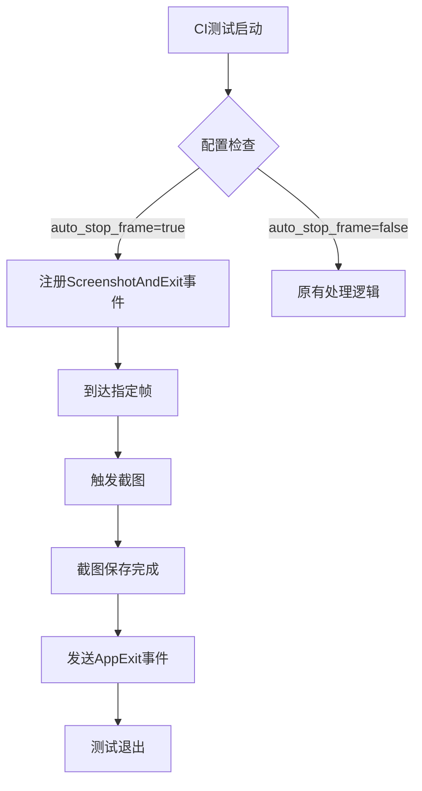

+++
title = "#19806 CI tests can exit directly after taking a screenshot"
date = "2025-06-24T00:00:00"
draft = false
template = "pull_request_page.html"
in_search_index = false

[extra]
current_language = "zh-cn"
available_languages = {"en" = { name = "English", url = "/pull_request/bevy/2025-06/pr-19806-en-20250624" }, "zh-cn" = { name = "中文", url = "/pull_request/bevy/2025-06/pr-19806-zh-cn-20250624" }}
+++

## CI tests can exit directly after taking a screenshot

### 基本信息
- **标题**: CI tests can exit directly after taking a screenshot
- **PR链接**: https://github.com/bevyengine/bevy/pull/19806
- **作者**: mockersf
- **状态**: 已合并
- **标签**: A-Rendering, A-Build-System, S-Ready-For-Final-Review, C-Testing
- **创建时间**: 2025-06-24T22:22:16Z
- **合并时间**: 2025-06-24T23:05:59Z
- **合并者**: alice-i-cecile

### 问题描述
当前 CI 测试框架存在两个关键问题：
1. 测试在固定帧 X 截图后继续运行到固定帧 Y (X < Y)，导致测试时间过长
2. 当截图操作耗时较长时，可能在截图完成前测试就已退出，导致截图失败

这种设计在持续集成环境中效率低下，尤其当截图操作快速完成时，测试仍会运行到预设的结束帧，浪费计算资源。反之当截图操作较慢时，测试可能提前退出导致截图失败。

### 解决方案
引入新的 `ScreenshotAndExit` 事件类型，该事件在截图保存后立即退出测试。核心修改包括：
1. 新增事件枚举变体
2. 实现事件处理系统
3. 更新测试配置逻辑

### 实现细节

#### 1. 新增事件类型 (`crates/bevy_dev_tools/src/ci_testing/config.rs`)
```rust
pub enum CiTestingEvent {
    // ... 现有事件
    Screenshot,
    /// 新增事件类型
    ScreenshotAndExit,
    NamedScreenshot(String),
}
```

#### 2. 事件处理系统 (`crates/bevy_dev_tools/src/ci_testing/systems.rs`)
```rust
CiTestingEvent::ScreenshotAndExit => {
    let this_frame = *current_frame;
    world.spawn(Screenshot::primary_window()).observe(
        move |captured: On<bevy_render::view::screenshot::ScreenshotCaptured>,
              mut exit_event: EventWriter<AppExit>| {
            let path = format!("./screenshot-{}.png", this_frame);
            save_to_disk(path)(captured);
            info!("Exiting. Test successful!");
            exit_event.write(AppExit::Success);
        },
    );
    info!("Took a screenshot at frame {}.", *current_frame);
}
```
关键点：
- 使用闭包捕获当前帧号
- 截图保存后立即发送 `AppExit::Success` 事件
- 确保退出前完成截图写入

#### 3. 配置逻辑更新 (`tools/example-showcase/src/main.rs`)
```rust
match (stop_frame, screenshot_frame, auto_stop_frame) {
    // 自动停止且截图
    (_, _, true) => {
        file.write_all(
            format!("(setup: (fixed_frame_time: Some({fixed_frame_time})), events: [({screenshot_frame}, ScreenshotAndExit)])").as_bytes(),
        ).unwrap();
        extra_parameters.push("--features");
        extra_parameters.push("bevy_ci_testing");
    }
    // 其他情况处理...
}
```
配置逻辑变化：
- 新增 `auto_stop_frame` 参数控制行为
- 当启用 `auto_stop_frame` 时优先使用 `ScreenshotAndExit`
- 保持向后兼容原有配置模式

### 技术要点
1. **事件驱动设计**：
   - 利用 Bevy 的 ECS 事件系统实现精确控制
   - 通过 `observe` 方法确保退出前完成异步截图操作

2. **资源管理**：
   - 闭包捕获当前帧号，避免全局状态依赖
   - 显式处理退出逻辑，确保资源正确释放

3. **配置兼容性**：
   - 新增 `auto_stop_frame` 参数不影响现有接口
   - 通过三值匹配逻辑覆盖所有使用场景

### 影响评估
1. **性能提升**：测试时间从固定 Y 帧减少到截图完成即退出
2. **可靠性增强**：消除截图未完成即退出的竞态条件
3. **资源节约**：减少 CI 运行时间和计算资源消耗
4. **兼容性**：完全向后兼容现有测试配置

### 关键文件变更
1. `crates/bevy_dev_tools/src/ci_testing/config.rs` (+3/-0)
   - 新增 `ScreenshotAndExit` 事件枚举值

2. `crates/bevy_dev_tools/src/ci_testing/systems.rs` (+13/-0)
   - 实现事件处理逻辑
   ```rust
   CiTestingEvent::ScreenshotAndExit => {
       // 截图后立即退出的实现
   }
   ```

3. `tools/example-showcase/src/main.rs` (+32/-5)
   - 更新配置处理逻辑
   ```rust
   match (stop_frame, screenshot_frame, auto_stop_frame) {
       // 处理自动停止的新分支
       (0, _, true) => { /* 配置 ScreenshotAndExit */ },
       (_, _, true) => { /* 配置 ScreenshotAndExit */ },
   }
   ```

### 事件流程


### 延伸阅读
1. [Bevy事件系统文档](https://bevyengine.org/learn/book/getting-started/events/)
2. [ECS观察者模式示例](https://github.com/bevyengine/bevy/blob/main/examples/ecs/event.rs)
3. [CI测试框架设计讨论](https://github.com/bevyengine/bevy/discussions/18945)

此修改通过精确控制测试退出时机，显著优化CI效率，同时保持API向后兼容，是事件驱动架构在测试自动化中的典型应用。