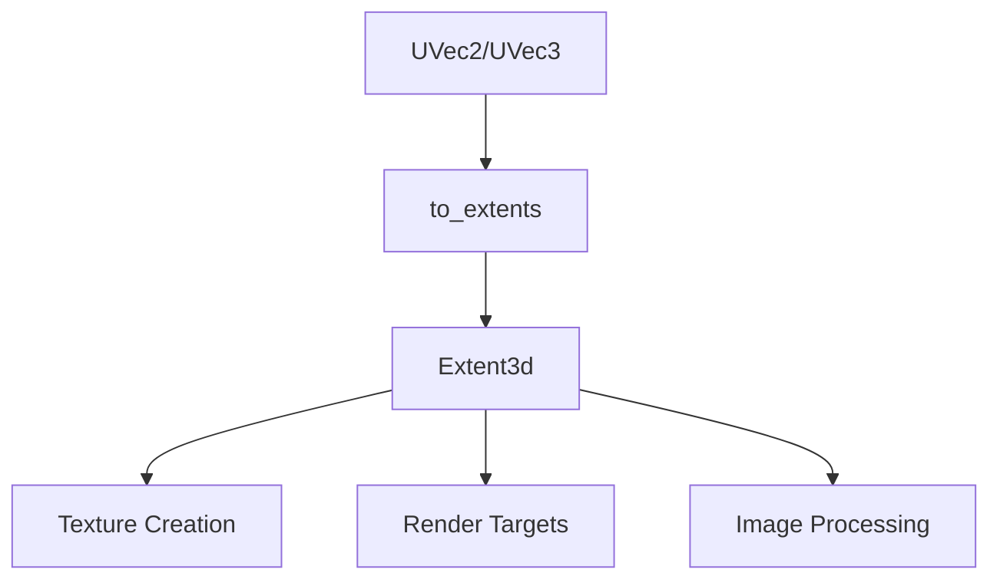

+++
title = "#19807 Add UVec to_extents helper method"
date = "2025-06-26T00:00:00"
draft = false
template = "pull_request_page.html"
in_search_index = true

[taxonomies]
list_display = ["show"]

[extra]
current_language = "en"
available_languages = {"en" = { name = "English", url = "/pull_request/bevy/2025-06/pr-19807-en-20250626" }, "zh-cn" = { name = "中文", url = "/pull_request/bevy/2025-06/pr-19807-zh-cn-20250626" }}
labels = ["A-Rendering", "C-Usability"]
+++

# Technical Analysis: PR #19807 - Add UVec to_extents helper method

## Basic Information
- **Title**: Add UVec to_extents helper method
- **PR Link**: https://github.com/bevyengine/bevy/pull/19807
- **Author**: atlv24
- **Status**: MERGED
- **Labels**: A-Rendering, C-Usability, S-Ready-For-Final-Review
- **Created**: 2025-06-25T02:07:38Z
- **Merged**: 2025-06-26T21:14:31Z
- **Merged By**: alice-i-cecile

## Description Translation
# Objective

- Simplify common usecase

## Solution

- Helper trait


## The Story of This Pull Request

### The Problem and Context
The Bevy codebase contained repeated patterns for converting `UVec2` and `UVec3` values into `Extent3d` structs. This conversion was manually implemented across multiple systems, including rendering pipelines, texture preparation, and image processing. The manual approach led to verbose code and potential inconsistencies, especially since `Extent3d` requires explicit handling of the `depth_or_array_layers` field which was typically set to 1 for 2D cases.

The issue was particularly noticeable in texture creation workflows where developers frequently needed to convert viewport sizes (stored as `UVec2`) into texture extents. The repetitive nature of this pattern increased code maintenance overhead and created opportunities for errors.

### The Solution Approach
The solution introduces a `ToExtents` trait with implementations for `UVec2` and `UVec3` that provide a consistent conversion method. This approach:

1. Centralizes the conversion logic in a single location
2. Reduces boilerplate code throughout the codebase
3. Improves readability by making the intent clearer
4. Maintains type safety through trait implementation

The implementation was straightforward since it didn't require new data structures or complex algorithms. The primary design decision was whether to implement this as a method on the vector types or as a standalone utility. The trait approach was chosen for better code organization and discoverability.

### The Implementation
The core implementation adds the `ToExtents` trait to `bevy_image/src/image.rs`:

```rust
pub trait ToExtents {
    fn to_extents(self) -> Extent3d;
}

impl ToExtents for UVec2 {
    fn to_extents(self) -> Extent3d {
        Extent3d {
            width: self.x,
            height: self.y,
            depth_or_array_layers: 1,
        }
    }
}

impl ToExtents for UVec3 {
    fn to_extents(self) -> Extent3d {
        Extent3d {
            width: self.x,
            height: self.y,
            depth_or_array_layers: self.z,
        }
    }
}
```

This trait was then integrated across the codebase, replacing manual `Extent3d` constructions. For example, in the bloom pipeline:

```rust
// Before:
let texture_descriptor = TextureDescriptor {
    size: Extent3d {
        width: ((width as f32 * mip_height_ratio).round() as u32).max(1),
        height: ((height as f32 * mip_height_ratio).round() as u32).max(1),
        depth_or_array_layers: 1,
    },
    // ...
};

// After:
let texture_descriptor = TextureDescriptor {
    size: (viewport.as_vec2() * mip_height_ratio)
        .round()
        .as_uvec2()
        .max(UVec2::ONE)
        .to_extents(),
    // ...
};
```

The changes also included replacing default 1x1 extents with `Extent3d::default()` where applicable, further reducing boilerplate.

### Technical Insights
The implementation demonstrates several good practices:
1. **DRY Principle**: Eliminates repetitive code patterns
2. **Type-driven Design**: Uses Rust's trait system for type-safe conversions
3. **API Ergonomics**: Improves call-site readability with fluent method chaining
4. **Backward Compatibility**: Maintains existing functionality with no behavioral changes

Performance impact is negligible since the conversion is a simple struct transformation that compiles to the same machine code as manual initialization. The changes are purely syntactic improvements.

### The Impact
The PR affects 20 files across the codebase, primarily in rendering-related modules. Key improvements include:
1. Reduced code duplication in texture creation workflows
2. Improved readability in rendering pipeline setup
3. Consistent handling of depth/array layer defaults
4. ~200 lines of code removed (net negative diff)

The changes are particularly valuable in complex rendering pipelines like SMAA anti-aliasing and bloom effects, where texture setup code becomes more maintainable.

## Visual Representation



## Key Files Changed

1. `crates/bevy_image/src/image.rs` (Added trait implementation)
```rust
// Added trait
pub trait ToExtents {
    fn to_extents(self) -> Extent3d;
}

// UVec2 implementation
impl ToExtents for UVec2 {
    fn to_extents(self) -> Extent3d {
        Extent3d {
            width: self.x,
            height: self.y,
            depth_or_array_layers: 1,
        }
    }
}

// UVec3 implementation
impl ToExtents for UVec3 {
    fn to_extents(self) -> Extent3d {
        Extent3d {
            width: self.x,
            height: self.y,
            depth_or_array_layers: self.z,
        }
    }
}
```

2. `crates/bevy_core_pipeline/src/core_3d/mod.rs` (Updated texture preparation)
```rust
// Before:
let size = Extent3d {
    depth_or_array_layers: 1,
    width: physical_target_size.x,
    height: physical_target_size.y,
};

// After:
let size = physical_target_size.to_extents();
```

3. `crates/bevy_anti_aliasing/src/smaa/mod.rs` (Simplified texture creation)
```rust
// Before:
let edge_detection_color_texture = texture_cache.get(
    &render_device,
    TextureDescriptor {
        size: Extent3d {
            width: texture_size.x,
            height: texture_size.y,
            depth_or_array_layers: 1,
        },
        // ...
    },
);

// After:
let edge_detection_color_texture = texture_cache.get(
    &render_device,
    TextureDescriptor {
        size: texture_size.to_extents(),
        // ...
    },
);
```

4. `crates/bevy_pbr/src/atmosphere/resources.rs` (Reduced LUT setup boilerplate)
```rust
// Before:
TextureDescriptor {
    size: Extent3d {
        width: lut_settings.transmittance_lut_size.x,
        height: lut_settings.transmittance_lut_size.y,
        depth_or_array_layers: 1,
    },
    // ...
}

// After:
TextureDescriptor {
    size: lut_settings.transmittance_lut_size.to_extents(),
    // ...
}
```

5. `crates/bevy_core_pipeline/src/bloom/mod.rs` (Improved bloom texture calculation)
```rust
// Before:
let texture_descriptor = TextureDescriptor {
    size: Extent3d {
        width: ((width as f32 * mip_height_ratio).round() as u32).max(1),
        height: ((height as f32 * mip_height_ratio).round() as u32).max(1),
        depth_or_array_layers: 1,
    },
    // ...
};

// After:
let texture_descriptor = TextureDescriptor {
    size: (viewport.as_vec2() * mip_height_ratio)
        .round()
        .as_uvec2()
        .max(UVec2::ONE)
        .to_extents(),
    // ...
};
```

## Further Reading
- [Rust Traits Documentation](https://doc.rust-lang.org/book/ch10-02-traits.html)
- [Bevy Render Architecture](https://bevyengine.org/learn/book/getting-started/rendering/)
- [Extent3d in wgpu](https://docs.rs/wgpu/latest/wgpu/struct.Extent3d.html)