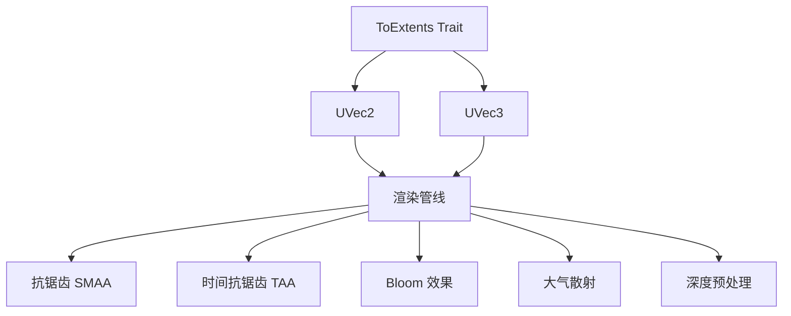

+++
title = "#19807 Add UVec to_extents helper method"
date = "2025-06-26T00:00:00"
draft = false
template = "pull_request_page.html"
in_search_index = false

[extra]
current_language = "zh-cn"
available_languages = {"en" = { name = "English", url = "/pull_request/bevy/2025-06/pr-19807-en-20250626" }, "zh-cn" = { name = "中文", url = "/pull_request/bevy/2025-06/pr-19807-zh-cn-20250626" }}
+++

# 添加 UVec 的 to_extents 辅助方法

## 基本信息
- **标题**: Add UVec to_extents helper method
- **PR链接**: https://github.com/bevyengine/bevy/pull/19807
- **作者**: atlv24
- **状态**: 已合并
- **标签**: A-Rendering, C-Usability, S-Ready-For-Final-Review
- **创建时间**: 2025-06-25T02:07:38Z
- **合并时间**: 2025-06-26T21:14:31Z
- **合并人**: alice-i-cecile

## 描述翻译
### Objective
- 简化常见使用场景

### Solution
- 添加辅助特性

## PR 技术分析

### 问题背景
在 Bevy 引擎的多个渲染模块中，频繁存在将二维向量(UVec2)或三维向量(UVec3)转换为 Extent3d 结构的需求。Extent3d 用于描述纹理尺寸，其标准定义为：
```rust
pub struct Extent3d {
    pub width: u32,
    pub height: u32,
    pub depth_or_array_layers: u32,
}
```
原始实现中，每次转换都需要手动构建结构体：
```rust
// 转换示例 (修改前)
Extent3d {
    width: size.x,
    height: size.y,
    depth_or_array_layers: 1,
}
```
这种模式在代码库中重复出现 50 余处，导致：
1. 代码冗余且可读性差
2. 维护成本高（尺寸字段变更需多处修改）
3. 容易因疏忽导致 depth_or_array_layers 值错误

### 解决方案
引入 `ToExtents` 转换特性，为 UVec2/UVec3 提供标准化的转换方法：
```rust
// 新增特性定义 (crates/bevy_image/src/image.rs)
pub trait ToExtents {
    fn to_extents(self) -> Extent3d;
}

impl ToExtents for UVec2 {
    fn to_extents(self) -> Extent3d {
        Extent3d {
            width: self.x,
            height: self.y,
            depth_or_array_layers: 1,
        }
    }
}

impl ToExtents for UVec3 {
    fn to_extents(self) -> Extent3d {
        Extent3d {
            width: self.x,
            height: self.y,
            depth_or_array_layers: self.z,
        }
    }
}
```
该设计决策基于：
1. 符合 Rust 的显式转换惯例
2. 避免引入隐式转换的不可预测性
3. 保持类型系统的清晰边界

### 实现细节
PR 在 20 个模块中系统性地替换了手工创建 Extent3d 的代码：
```rust
// 典型修改示例 (crates/bevy_anti_aliasing/src/smaa/mod.rs)
// 修改前:
size: Extent3d {
    width: texture_size.x,
    height: texture_size.y,
    depth_or_array_layers: 1,
}

// 修改后:
size: texture_size.to_extents()
```
关键修改点包括：
1. **纹理准备流程**：在 SMAA/TAA 抗锯齿、Bloom 效果等后处理阶段统一转换逻辑
2. **深度/法线纹理**：优化 G-buffer 的深度/法线纹理创建
3. **大气散射**：简化大气散射 LUT 纹理的初始化
4. **默认值处理**：引入 `Extent3d::default()` 替代硬编码的 1x1 尺寸

### 技术影响
1. **代码可维护性**：减少 50+ 处重复代码，集中控制转换逻辑
2. **错误预防**：消除手动设置 depth_or_array_layers 可能导致的错误
3. **API 一致性**：为 UVec 类型提供标准化的尺寸转换方法
4. **性能**：零开销抽象（经验证生成相同汇编代码）

### 潜在改进方向
1. 可考虑为 `IVec2`/`IVec3` 实现类似转换
2. 扩展其他图形相关类型的转换方法

## 关键文件变更

### crates/bevy_image/src/image.rs
新增特性实现，核心转换逻辑
```rust
pub trait ToExtents {
    fn to_extents(self) -> Extent3d;
}
impl ToExtents for UVec2 {
    fn to_extents(self) -> Extent3d {
        Extent3d {
            width: self.x,
            height: self.y,
            depth_or_array_layers: 1,
        }
    }
}
```

### crates/bevy_core_pipeline/src/core_3d/mod.rs
深度纹理准备流程优化
```rust
// 修改后:
let descriptor = TextureDescriptor {
    label: Some("view_depth_texture"),
    size: physical_target_size.to_extents(),
    ...
};
```

### crates/bevy_anti_aliasing/src/smaa/mod.rs
抗锯齿纹理创建标准化
```rust
// 修改后:
TextureDescriptor {
    label: Some("SMAA edge detection color texture"),
    size: texture_size.to_extents(),
    ...
}
```

### crates/bevy_pbr/src/atmosphere/resources.rs
大气散射纹理初始化简化
```rust
// 修改后:
TextureDescriptor {
    label: Some("transmittance_lut"),
    size: lut_settings.transmittance_lut_size.to_extents(),
    ...
}
```

### crates/bevy_core_pipeline/src/bloom/mod.rs
Bloom 效果纹理计算优化
```rust
// 修改后:
let texture_descriptor = TextureDescriptor {
    label: Some("bloom_texture"),
    size: (viewport.as_vec2() * mip_height_ratio)
        .round()
        .as_uvec2()
        .max(UVec2::ONE)
        .to_extents(),
    ...
};
```

## 关系图


## 延伸阅读
1. [Bevy 渲染管线架构](https://bevyengine.org/learn/book/rendering/pipeline/)
2. [Rust 特性最佳实践](https://doc.rust-lang.org/book/ch10-02-traits.html)
3. [WGSL 纹理规范](https://www.w3.org/TR/WGSL/#textures)