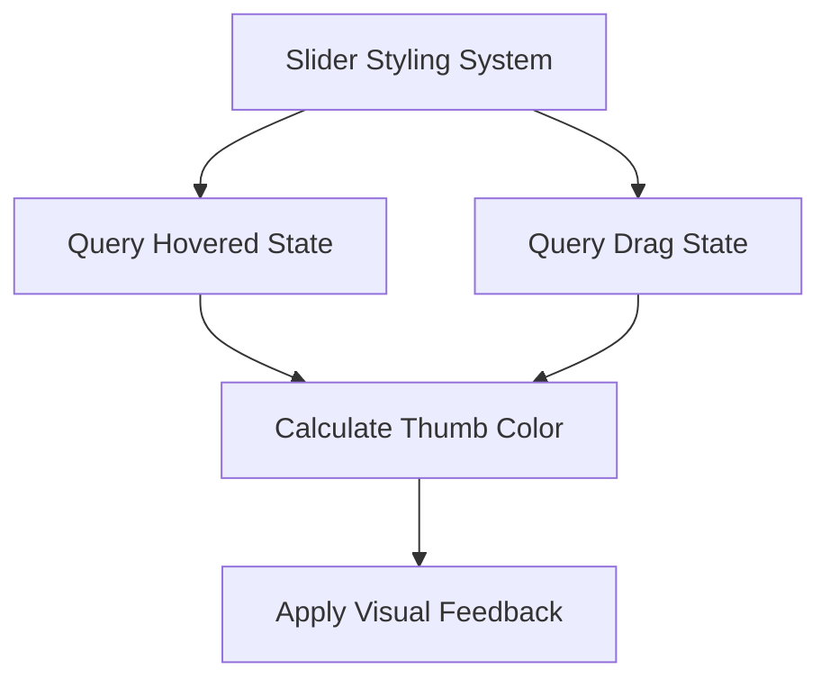

+++
title = "#19810 `core_widgets` example slider fix"
date = "2025-06-29T00:00:00"
draft = false
template = "pull_request_page.html"
in_search_index = true

[taxonomies]
list_display = ["show"]

[extra]
current_language = "en"
available_languages = {"en" = { name = "English", url = "/pull_request/bevy/2025-06/pr-19810-en-20250629" }, "zh-cn" = { name = "中文", url = "/pull_request/bevy/2025-06/pr-19810-zh-cn-20250629" }}
labels = ["C-Examples", "A-UI", "D-Straightforward"]
+++

## `core_widgets` example slider fix

### Basic Information
- **Title**: `core_widgets` example slider fix
- **PR Link**: https://github.com/bevyengine/bevy/pull/19810
- **Author**: ickshonpe
- **Status**: MERGED
- **Labels**: C-Examples, A-UI, S-Ready-For-Final-Review, D-Straightforward
- **Created**: 2025-06-25T09:31:26Z
- **Merged**: 2025-06-29T18:01:04Z
- **Merged By**: alice-i-cecile

### Description Translation
**Objective**  
When dragging the slider thumb, the thumb is only highlighted while the pointer is hovering the widget. If the pointer moves off the widget during a drag, the thumb reverts to its normal unhovered colour.  

**Solution**  
Query for `CoreSliderDragState` in the slider update systems and set the lighter color if the thumb is dragged or hovered.

---

### The Story of This Pull Request

#### The Problem
In Bevy's UI system, the `core_widgets` example had a visual inconsistency with slider widgets. During drag operations, the slider thumb would only maintain its "highlighted" state when the cursor was directly over the widget. If users moved their pointer outside the widget boundaries while dragging (a common interaction pattern), the thumb would revert to its default appearance. This behavior contradicted standard UI conventions where draggable elements maintain visual feedback throughout the entire drag operation.

The root cause was the styling logic's sole reliance on the `Hovered` component. The hover state naturally becomes false when the cursor leaves the widget area, causing the thumb to lose its active visual state prematurely.

#### The Solution Approach
The fix required incorporating drag state into the styling logic. Rather than:
1. Adding new systems
2. Creating new components
3. Modifying core widget behavior

The solution leveraged existing state tracking via the `CoreSliderDragState` component. This component already contained a `dragging` field indicating active drag operations. By incorporating this state into the color calculation, we could maintain visual consistency throughout drag interactions.

#### Implementation Details
Two systems managed slider thumb styling: `update_slider_style` and `update_slider_style2`. Both were modified to:

1. Include `CoreSliderDragState` in their queries
2. Combine hover and drag states for color determination
3. React to drag state changes

The key modification was replacing the hover-only check with a combined state check:
```rust
thumb_bg.0 = thumb_color(disabled, hovered.0 | drag_state.dragging);
```
The logical OR (`|`) ensures the thumb appears highlighted if either:
- The cursor is hovering the widget (`hovered.0 == true`)
- An active drag is in progress (`drag_state.dragging == true`)

The systems now also trigger updates when drag state changes:
```rust
Changed<CoreSliderDragState>
```

#### Technical Considerations
This approach maintains:
- **Data locality**: Uses existing drag state without new components
- **Performance**: Minimal additional query complexity
- **Consistency**: Preserves existing color calculation logic (`thumb_color`) while enhancing its input conditions

No architectural changes were needed since the drag state was already tracked for operational purposes - we simply exposed this state to the styling system.

### Visual Representation



### Key Files Changed

#### `examples/ui/core_widgets.rs`
**Changes**:  
Modified slider styling systems to include drag state in thumb color calculation.

**Key Modifications**:  
1. Added `CoreSliderDragState` to system queries
2. Combined hover and drag states for color determination
3. Added reactivity to drag state changes

**Code Snippets**:  
```rust
// Before: Only used Hovered state
fn update_slider_style(
    sliders: Query<
        (Entity, &SliderValue, &SliderRange, &Hovered, Has<InteractionDisabled>),
        ...
    >,
    ...
) {
    ...
    thumb_bg.0 = thumb_color(disabled, hovered.0);
    ...
}

// After: Added drag state
fn update_slider_style(
    sliders: Query<
        (
            Entity,
            &SliderValue,
            &SliderRange,
            &Hovered,
            &CoreSliderDragState,  // Added
            Has<InteractionDisabled>,
        ),
        ...
    >,
    ...
) {
    ...
    // Combined hover and drag states
    thumb_bg.0 = thumb_color(disabled, hovered.0 | drag_state.dragging);
    ...
}
```

```rust
// Before: Only tracked hover state
fn update_slider_style2(
    sliders: Query<(Entity, &Hovered, Has<InteractionDisabled>), With<DemoSlider>>,
    ...
) {
    ...
    thumb_bg.0 = thumb_color(disabled, hovered.0);
    ...
}

// After: Added drag state tracking
fn update_slider_style2(
    sliders: Query<
        (
            Entity,
            &Hovered,
            &CoreSliderDragState,  // Added
            Has<InteractionDisabled>,
        ),
        With<DemoSlider>,
    >,
    ...
) {
    ...
    thumb_bg.0 = thumb_color(disabled, hovered.0 | drag_state.dragging);
    ...
}
```

### Further Reading
1. [Bevy UI System Documentation](https://docs.rs/bevy_ui/latest/bevy_ui/)
2. [Bevy Input Handling Guide](https://bevy-cheatbook.github.io/input.html)
3. [UI Interaction Patterns (Material Design)](https://m3.material.io/foundations/interaction)