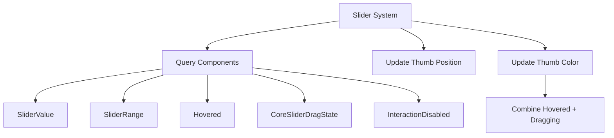

+++
title = "#19810 core_widgets` example slider fix"
date = "2025-06-29T00:00:00"
draft = false
template = "pull_request_page.html"
in_search_index = false

[extra]
current_language = "zh-cn"
available_languages = {"en" = { name = "English", url = "/pull_request/bevy/2025-06/pr-19810-en-20250629" }, "zh-cn" = { name = "中文", url = "/pull_request/bevy/2025-06/pr-19810-zh-cn-20250629" }}
+++

# core_widgets example slider fix

## 基本信息
- **标题**: `core_widgets` example slider fix
- **PR链接**: https://github.com/bevyengine/bevy/pull/19810
- **作者**: ickshonpe
- **状态**: 已合并
- **标签**: C-Examples, A-UI, S-Ready-For-Final-Review, D-Straightforward
- **创建时间**: 2025-06-25T09:31:26Z
- **合并时间**: 2025-06-29T18:01:04Z
- **合并者**: alice-i-cecile

## 描述翻译
### 目标

当拖动滑块拇指时，只有当指针悬停在控件上时拇指才会高亮显示。如果在拖动过程中指针移出控件，拇指会恢复为正常的未悬停颜色。

### 解决方案

在滑块更新系统中查询 `CoreSliderDragState`，当拇指被拖动或悬停时设置较亮的颜色。

## 本次PR的故事

### 问题背景
在Bevy引擎的`core_widgets`示例中，滑块控件存在视觉反馈不一致的问题。当用户拖动滑块时，视觉指示器（滑块拇指）应该保持高亮状态，表明当前正在进行拖动操作。然而，在原始实现中，当指针在拖动过程中移出控件边界时，滑块拇指会错误地恢复到未悬停状态的颜色，即使拖动操作仍在进行中。这导致用户体验不连贯，用户无法通过视觉反馈确认当前是否仍在拖动操作中。

### 解决方案分析
问题的核心在于颜色更新逻辑仅依赖悬停状态(`Hovered`)，而没有考虑拖动状态(`CoreSliderDragState`)。修复方案需要同时检查两个状态：
1. 当指针悬停在控件上时（`Hovered`为true）
2. 当拖动操作正在进行时（`CoreSliderDragState.dragging`为true）

解决方案采用逻辑或(|)操作组合这两个状态条件，确保只要任一条件为真，滑块拇指就会保持高亮状态。这种方法避免了添加新状态变量或重构现有逻辑，保持了代码简洁性。

### 具体实现
修复涉及两个系统函数`update_slider_style`和`update_slider_style2`的修改：

1. **状态查询扩展**：
   - 在查询中添加了`CoreSliderDragState`组件
   - 添加了该组件的变更检测(Changed<CoreSliderDragState>)

```rust
// Before:
sliders: Query<(
    Entity,
    &SliderValue,
    &SliderRange,
    &Hovered,
    Has<InteractionDisabled>
)>

// After:
sliders: Query<(
    Entity,
    &SliderValue,
    &SliderRange,
    &Hovered,
    &CoreSliderDragState,  // 新增组件
    Has<InteractionDisabled>
)>
```

2. **颜色计算逻辑更新**：
   - 将拖动状态(drag_state.dragging)与悬停状态(hovered.0)组合
   - 使用逻辑或(|)确保任一激活状态都触发高亮

```rust
// Before:
thumb_bg.0 = thumb_color(disabled, hovered.0);

// After:
thumb_bg.0 = thumb_color(disabled, hovered.0 | drag_state.dragging);
```

3. **移除禁用状态处理**：
   - 同样在`update_slider_style2`中添加拖动状态处理
   - 确保移除禁用状态时也考虑拖动状态

```rust
// Before:
thumb_bg.0 = thumb_color(disabled, hovered.0);

// After:
thumb_bg.0 = thumb_color(disabled, hovered.0 | drag_state.dragging);
```

### 技术考量
实现采用最小侵入式修改：
- 保持现有thumb_color函数不变
- 复用原有状态检测机制
- 添加必要组件查询但避免额外系统开销
- 修改点集中在视觉反馈逻辑，不影响核心拖动功能

### 修复效果
修复后，滑块行为符合用户预期：
1. 开始拖动时，滑块拇指立即高亮
2. 拖动过程中移出控件区域，保持高亮状态
3. 释放鼠标后，恢复正常状态
4. 常规悬停行为保持不变

## 视觉关系图



## 关键文件变更

### examples/ui/core_widgets.rs
**修改说明**：修复滑块示例中的视觉反馈问题，确保拖动过程中滑块拇指保持高亮状态。

**核心变更**：
```rust
@@ -3,8 +3,8 @@
 use bevy::{
     color::palettes::basic::*,
     core_widgets::{
-        CoreButton, CoreCheckbox, CoreRadio, CoreRadioGroup, CoreSlider, CoreSliderThumb,
-        CoreWidgetsPlugin, SliderRange, SliderValue, TrackClick,
+        CoreButton, CoreCheckbox, CoreRadio, CoreRadioGroup, CoreSlider, CoreSliderDragState,
+        CoreSliderThumb, CoreWidgetsPlugin, SliderRange, SliderValue, TrackClick,
     },
     ecs::system::SystemId,
     input_focus::{
@@ -398,6 +398,7 @@ fn update_slider_style(
             &SliderValue,
             &SliderRange,
             &Hovered,
+            &CoreSliderDragState,  // 添加拖动状态查询
             Has<InteractionDisabled>,
         ),
         (
@@ -405,6 +406,7 @@ fn update_slider_style(
                 Changed<SliderValue>,
                 Changed<SliderRange>,
                 Changed<Hovered>,
+                Changed<CoreSliderDragState>,  // 添加状态变更检测
                 Added<InteractionDisabled>,
             )>,
             With<DemoSlider>,
@@ -413,12 +415,12 @@ fn update_slider_style(
     children: Query<&Children>,
     mut thumbs: Query<(&mut Node, &mut BackgroundColor, Has<DemoSliderThumb>), Without<DemoSlider>>,
 ) {
-    for (slider_ent, value, range, hovered, disabled) in sliders.iter() {
+    for (slider_ent, value, range, hovered, drag_state, disabled) in sliders.iter() {
         for child in children.iter_descendants(slider_ent) {
             if let Ok((mut thumb_node, mut thumb_bg, is_thumb)) = thumbs.get_mut(child) {
                 if is_thumb {
                     thumb_node.left = Val::Percent(range.thumb_position(value.0) * 100.0);
-                    thumb_bg.0 = thumb_color(disabled, hovered.0);
+                    thumb_bg.0 = thumb_color(disabled, hovered.0 | drag_state.dragging); // 组合悬停和拖动状态
                 }
             }
         }
@@ -426,17 +428,25 @@ fn update_slider_style(
 }
 
 fn update_slider_style2(
-    sliders: Query<(Entity, &Hovered, Has<InteractionDisabled>), With<DemoSlider>>,
+    sliders: Query<
+        (
+            Entity,
+            &Hovered,
+            &CoreSliderDragState,  // 添加拖动状态查询
+            Has<InteractionDisabled>,
+        ),
+        With<DemoSlider>,
+    >,
     children: Query<&Children>,
     mut thumbs: Query<(&mut BackgroundColor, Has<DemoSliderThumb>), Without<DemoSlider>>,
     mut removed_disabled: RemovedComponents<InteractionDisabled>,
 ) {
     removed_disabled.read().for_each(|entity| {
-        if let Ok((slider_ent, hovered, disabled)) = sliders.get(entity) {
+        if let Ok((slider_ent, hovered, drag_state, disabled)) = sliders.get(entity) {
             for child in children.iter_descendants(slider_ent) {
                 if let Ok((mut thumb_bg, is_thumb)) = thumbs.get_mut(child) {
                     if is_thumb {
-                        thumb_bg.0 = thumb_color(disabled, hovered.0);
+                        thumb_bg.0 = thumb_color(disabled, hovered.0 | drag_state.dragging); // 组合悬停和拖动状态
                     }
                 }
             }
```

## 扩展阅读
1. [Bevy UI 系统架构](https://bevyengine.org/learn/book/features/ui/)
2. [ECS 交互状态管理](https://bevy-cheatbook.github.io/programming/states.html)
3. [UI 组件系统设计模式](https://github.com/bevyengine/bevy/blob/main/examples/ui/README.md)