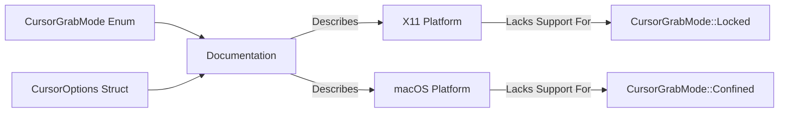

+++
title = "#19811 Doc for X11 CursorGrabMode support"
date = "2025-06-28T00:00:00"
draft = false
template = "pull_request_page.html"
in_search_index = true

[taxonomies]
list_display = ["show"]

[extra]
current_language = "en"
available_languages = {"en" = { name = "English", url = "/pull_request/bevy/2025-06/pr-19811-en-20250628" }, "zh-cn" = { name = "中文", url = "/pull_request/bevy/2025-06/pr-19811-zh-cn-20250628" }}
labels = ["D-Trivial", "A-Input", "O-Linux"]
+++

# Doc for X11 CursorGrabMode support

## Basic Information
- **Title**: Doc for X11 CursorGrabMode support
- **PR Link**: https://github.com/bevyengine/bevy/pull/19811
- **Author**: jf908
- **Status**: MERGED
- **Labels**: D-Trivial, A-Input, O-Linux, S-Ready-For-Final-Review
- **Created**: 2025-06-25T14:38:22Z
- **Merged**: 2025-06-28T19:13:54Z
- **Merged By**: alice-i-cecile

## Description Translation
# Objective

- Clarify that `CursorGrabMode::Locked` isn't supported on X11

Source: https://docs.rs/winit/latest/winit/window/enum.CursorGrabMode.html#variant.Locked

## Solution

- Add it to the platform-specific docs

## The Story of This Pull Request

The PR addresses a documentation gap in Bevy's windowing system related to cursor grab mode support on X11. The `CursorGrabMode::Locked` variant, which locks the cursor position to the window center while still allowing relative mouse movement, wasn't properly documented as unsupported on X11 platforms.

This documentation update was necessary because developers targeting Linux/X11 environments might otherwise expect `CursorGrabMode::Locked` to function correctly, leading to confusion when it didn't work as expected. The PR author referenced winit's documentation which clearly states this limitation.

The solution involved updating two documentation blocks in the Bevy window module:
1. The documentation for the `grab_mode` field in the `CursorOptions` struct
2. The documentation for the `CursorGrabMode` enum itself

Both documentation blocks previously only mentioned macOS limitations (`CursorGrabMode::Confined` unsupported) and mobile platform constraints (no cursors). The PR adds explicit mention that X11 doesn't support `CursorGrabMode::Locked`, providing accurate platform-specific behavior information.

Additionally, the explanatory note about fallback behavior was updated from focusing solely on macOS to include X11 as well. This note explains that when the requested grab mode isn't fully supported, Bevy will first attempt to use it anyway before falling back to an alternate mode. This fallback mechanism ensures applications remain functional even when platform limitations exist.

The changes are purely documentation updates with no code logic modifications. They improve the developer experience by accurately reflecting platform constraints, helping developers make informed decisions about cursor handling in cross-platform applications.

## Visual Representation



## Key Files Changed

### `crates/bevy_window/src/window.rs`
**Change Summary**: Added X11 platform limitation to documentation for cursor grab modes.

**Context**: This file contains core windowing functionality including cursor management. The documentation updates clarify platform-specific limitations of cursor grab modes.

**Code Changes**:
```rust
// Before:
/// ## Platform-specific
///
/// - **`macOS`** doesn't support [`CursorGrabMode::Confined`]
/// - **`iOS/Android`** don't have cursors.
///
/// Since `macOS` doesn't have full [`CursorGrabMode`] support, we first try to set the grab mode that was asked for. If it doesn't work then use the alternate grab mode.

// After:
/// ## Platform-specific
///
/// - **`macOS`** doesn't support [`CursorGrabMode::Confined`]
/// - **`X11`** doesn't support [`CursorGrabMode::Locked`]
/// - **`iOS/Android`** don't have cursors.
///
/// Since `macOS` and `X11` don't have full [`CursorGrabMode`] support, we first try to set the grab mode that was asked for. If it doesn't work then use the alternate grab mode.
```

```rust
// Before:
/// ## Platform-specific
///
/// - **`macOS`** doesn't support [`CursorGrabMode::Confined`]
/// - **`iOS/Android`** don't have cursors.
///
/// Since `macOS` doesn't have full [`CursorGrabMode`] support, we first try to set the grab mode that was asked for. If it doesn't work then use the alternate grab mode.

// After:
/// ## Platform-specific
///
/// - **`macOS`** doesn't support [`CursorGrabMode::Confined`]
/// - **`X11`** doesn't support [`CursorGrabMode::Locked`]
/// - **`iOS/Android`** don't have cursors.
///
/// Since `macOS` and `X11` don't have full [`CursorGrabMode`] support, we first try to set the grab mode that was asked for. If it doesn't work then use the alternate grab mode.
```

## Further Reading
1. [winit CursorGrabMode Documentation](https://docs.rs/winit/latest/winit/window/enum.CursorGrabMode.html) - Source documentation for platform-specific cursor grab behavior
2. [Bevy Input Handling Documentation](https://bevyengine.org/learn/book/getting-started/input/) - General input handling concepts in Bevy
3. [XInput Extension Documentation](https://www.x.org/releases/current/doc/inputproto/inputproto.html) - Technical details of X11 input handling

## Full Code Diff
```diff
diff --git a/crates/bevy_window/src/window.rs b/crates/bevy_window/src/window.rs
index 77728543e72f2..94d0e112b3858 100644
--- a/crates/bevy_window/src/window.rs
+++ b/crates/bevy_window/src/window.rs
@@ -752,9 +752,10 @@ pub struct CursorOptions {
     /// ## Platform-specific
     ///
     /// - **`macOS`** doesn't support [`CursorGrabMode::Confined`]
+    /// - **`X11`** doesn't support [`CursorGrabMode::Locked`]
     /// - **`iOS/Android`** don't have cursors.
     ///
-    /// Since `macOS` doesn't have full [`CursorGrabMode`] support, we first try to set the grab mode that was asked for. If it doesn't work then use the alternate grab mode.
+    /// Since `macOS` and `X11` don't have full [`CursorGrabMode`] support, we first try to set the grab mode that was asked for. If it doesn't work then use the alternate grab mode.
     pub grab_mode: CursorGrabMode,
 
     /// Set whether or not mouse events within *this* window are captured or fall through to the Window below.
@@ -1064,9 +1065,10 @@ impl From<DVec2> for WindowResolution {
 /// ## Platform-specific
 ///
 /// - **`macOS`** doesn't support [`CursorGrabMode::Confined`]
+/// - **`X11`** doesn't support [`CursorGrabMode::Locked`]
 /// - **`iOS/Android`** don't have cursors.
 ///
-/// Since `macOS` doesn't have full [`CursorGrabMode`] support, we first try to set the grab mode that was asked for. If it doesn't work then use the alternate grab mode.
+/// Since `macOS` and `X11` don't have full [`CursorGrabMode`] support, we first try to set the grab mode that was asked for. If it doesn't work then use the alternate grab mode.
 #[derive(Default, Debug, Clone, Copy, PartialEq, Eq)]
 #[cfg_attr(
     feature = "bevy_reflect",
```