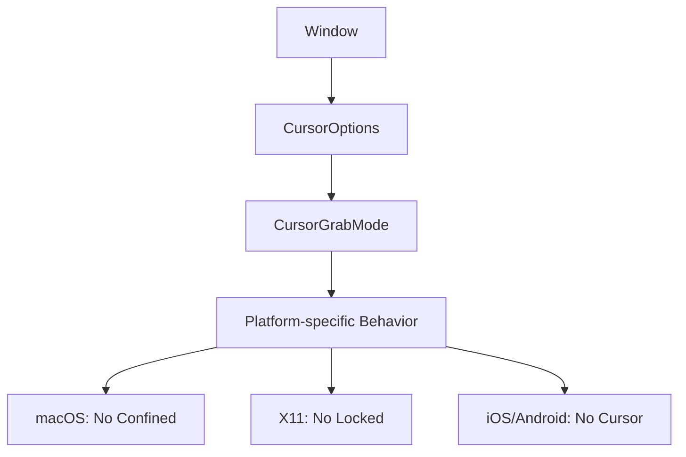

+++
title = "#19811 Doc for X11 CursorGrabMode support"
date = "2025-06-28T00:00:00"
draft = false
template = "pull_request_page.html"
in_search_index = false

[extra]
current_language = "zh-cn"
available_languages = {"en" = { name = "English", url = "/pull_request/bevy/2025-06/pr-19811-en-20250628" }, "zh-cn" = { name = "中文", url = "/pull_request/bevy/2025-06/pr-19811-zh-cn-20250628" }}
+++

# PR 分析报告: Doc for X11 CursorGrabMode support

## 基本信息
- **标题**: Doc for X11 CursorGrabMode support
- **PR链接**: https://github.com/bevyengine/bevy/pull/19811
- **作者**: jf908
- **状态**: 已合并
- **标签**: D-Trivial, A-Input, O-Linux, S-Ready-For-Final-Review
- **创建时间**: 2025-06-25T14:38:22Z
- **合并时间**: 2025-06-28T19:13:54Z
- **合并者**: alice-i-cecile

## 描述翻译
### 目标
- 澄清 `CursorGrabMode::Locked` 在 X11 上不受支持

来源: https://docs.rs/winit/latest/winit/window/enum.CursorGrabMode.html#variant.Locked

### 解决方案
- 将其添加到平台特定文档中

## PR 技术分析

### 问题背景
在 Bevy 引擎的输入处理系统中，`CursorGrabMode` 控制鼠标光标的捕获行为。该枚举有三个变体：
- `None`: 不捕获光标
- `Confined`: 将光标限制在窗口边界内
- `Locked`: 锁定光标位置并隐藏（常用于第一人称游戏）

问题在于底层窗口库 winit 在 X11 平台上不支持 `Locked` 模式。但 Bevy 的文档只提到了 macOS 不支持 `Confined` 模式，遗漏了 X11 不支持 `Locked` 模式的情况。这会导致开发者在 X11 上尝试使用 `Locked` 模式时遇到意外行为，且无法从文档中找到解释。

### 解决方案
作者 jf908 通过以下步骤解决问题：
1. 确认了 winit 官方文档明确说明 X11 不支持 `Locked` 模式
2. 在 Bevy 的相关文档中添加了平台特定说明
3. 更新了备用策略的描述，使其同时涵盖 macOS 和 X11 的情况

### 实现细节
PR 的核心是两处文档更新：

1. 在 `CursorOptions` 结构的 `grab_mode` 字段文档中：
```diff
 /// ## Platform-specific
 ///
 /// - **`macOS`** doesn't support [`CursorGrabMode::Confined`]
+/// - **`X11`** doesn't support [`CursorGrabMode::Locked`]
 /// - **`iOS/Android`** don't have cursors.
 ///
-/// Since `macOS` doesn't have full [`CursorGrabMode`] support, we first try to set the grab mode that was asked for. If it doesn't work then use the alternate grab mode.
+/// Since `macOS` and `X11` don't have full [`CursorGrabMode`] support, we first try to set the grab mode that was asked for. If it doesn't work then use the alternate grab mode.
 pub grab_mode: CursorGrabMode,
```

2. 在 `CursorGrabMode` 枚举的文档中：
```diff
 /// ## Platform-specific
 ///
 /// - **`macOS`** doesn't support [`CursorGrabMode::Confined`]
+/// - **`X11`** doesn't support [`CursorGrabMode::Locked`]
 /// - **`iOS/Android`** don't have cursors.
 ///
-/// Since `macOS` doesn't have full [`CursorGrabMode`] support, we first try to set the grab mode that was asked for. If it doesn't work then use the alternate grab mode.
+/// Since `macOS` and `X11` don't have full [`CursorGrabMode`] support, we first try to set the grab mode that was asked for. If it doesn't work then use the alternate grab mode.
```

这些修改明确告知开发者：
1. X11 不支持 `Locked` 模式
2. Bevy 在 macOS 和 X11 上会先尝试请求的模式，失败后回退到备用模式
3. iOS/Android 没有光标支持

### 技术考量
1. **平台兼容性**：跨平台引擎必须清晰记录各平台的行为差异
2. **回退机制**：文档明确说明了当首选模式不可用时，引擎会自动尝试备用方案
3. **文档一致性**：相同说明同时出现在结构体和枚举的文档中，确保开发者无论从哪里查阅都能看到

### 影响分析
1. **开发者体验**：Linux/X11 开发者现在能明确了解平台限制
2. **错误预防**：减少开发者花费时间调试平台特定问题
3. **代码维护**：保持文档与实际行为一致，减少未来混淆

## 组件关系图



## 关键文件变更

### `crates/bevy_window/src/window.rs`
**变更说明**：更新了 `CursorOptions` 和 `CursorGrabMode` 的文档，添加 X11 平台对 `Locked` 模式不支持的说明。

**变更前**：
```rust
/// ## Platform-specific
///
/// - **`macOS`** doesn't support [`CursorGrabMode::Confined`]
/// - **`iOS/Android`** don't have cursors.
///
/// Since `macOS` doesn't have full [`CursorGrabMode`] support, we first try to set the grab mode that was asked for. If it doesn't work then use the alternate grab mode.
```

**变更后**：
```rust
/// ## Platform-specific
///
/// - **`macOS`** doesn't support [`CursorGrabMode::Confined`]
/// - **`X11`** doesn't support [`CursorGrabMode::Locked`]
/// - **`iOS/Android`** don't have cursors.
///
/// Since `macOS` and `X11` don't have full [`CursorGrabMode`] support, we first try to set the grab mode that was asked for. If it doesn't work then use the alternate grab mode.
```

## 延伸阅读
1. [winit CursorGrabMode 文档](https://docs.rs/winit/latest/winit/window/enum.CursorGrabMode.html) - 底层窗口库的原始文档
2. [Bevy 输入系统指南](https://bevyengine.org/learn/book/getting-started/input/) - Bevy 官方输入处理文档
3. [XInput 扩展文档](https://www.x.org/releases/X11R7.7/doc/input/XInput2/xinput2.html) - X11 输入处理底层机制