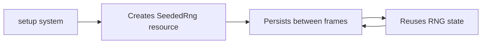

+++
title = "#19812 Reuse seeded rng in tilemap_chunk for more determinism"
date = "2025-06-25T00:00:00"
draft = false
template = "pull_request_page.html"
in_search_index = true

[taxonomies]
list_display = ["show"]

[extra]
current_language = "en"
available_languages = {"en" = { name = "English", url = "/pull_request/bevy/2025-06/pr-19812-en-20250625" }, "zh-cn" = { name = "中文", url = "/pull_request/bevy/2025-06/pr-19812-zh-cn-20250625" }}
labels = ["A-Rendering", "C-Examples", "C-Testing"]
+++

## Reuse seeded rng in tilemap_chunk for more determinism

### Basic Information
- **Title**: Reuse seeded rng in tilemap_chunk for more determinism
- **PR Link**: https://github.com/bevyengine/bevy/pull/19812
- **Author**: rparrett
- **Status**: MERGED
- **Labels**: A-Rendering, C-Examples, S-Ready-For-Final-Review, C-Testing
- **Created**: 2025-06-25T15:53:00Z
- **Merged**: 2025-06-25T16:30:59Z
- **Merged By**: alice-i-cecile

### Description Translation
# Objective

This example uses a seeded RNG for the initial setup, but new unseeded RNGs during each timed update.

This is causing the example to produce different output each time in the [example report](https://bevyengine.github.io/bevy-example-runner/).


## Solution

Store and reuse the RNG, following the pattern used in other examples.

## Testing

`cargo run --example tilemap_chunk`

### The Story of This Pull Request

#### The Problem and Context
The `tilemap_chunk` example was exhibiting non-deterministic behavior during automated testing. While the initial setup used a seeded RNG (ChaCha8Rng seeded with 42) to generate tilemap chunks, each timed update created a new RNG instance using `ChaCha8Rng::from_entropy()`. This entropy-based initialization produced different random sequences each run, causing inconsistent output in the Bevy example runner reports. The inconsistency is visible in the attached screenshot showing varying frame times across runs. For testing and deterministic behavior, consistent output across runs is essential.

#### The Solution Approach
The fix follows established patterns in Bevy examples where RNG state needs to persist across frames. Instead of creating a new RNG on each update, we store the initial seeded RNG as a resource and reuse it throughout the application's lifecycle. This approach maintains the example's deterministic behavior while preserving its functionality. The solution required:
1. Defining a new resource wrapper for the RNG
2. Initializing this resource during startup
3. Accessing the shared RNG in the update system

#### The Implementation
The changes are minimal but effective. First, we define a new resource type to hold our seeded RNG:

```rust
#[derive(Resource, Deref, DerefMut)]
struct SeededRng(ChaCha8Rng);
```

During the setup phase, we insert this resource into the ECS after initializing the RNG:

```rust
commands.insert_resource(SeededRng(rng));
```

The key modification comes in the `update_tilemap` system, where we replace the locally-scoped RNG with the persistent resource:

```rust
fn update_tilemap(
    time: Res<Time>,
    mut query: Query<(&mut TilemapChunkIndices, &mut UpdateTimer)>,
    mut rng: ResMut<SeededRng>,  // Access the seeded RNG resource
) {
    for (mut indices, mut timer) in query.iter_mut() {
        timer.tick(time.delta());
        
        if timer.just_finished() {
            // Reuse the same seeded RNG instead of creating new instances
            for _ in 0..50 {
                let index = rng.gen_range(0..indices.len());
                indices[index] = Some(rng.gen_range(0..5));
            }
        }
    }
}
```

A minor cleanup was also made to the plugin initialization, removing unnecessary parentheses:
```rust
// Before
.add_plugins((DefaultPlugins.set(ImagePlugin::default_nearest()),))

// After
.add_plugins(DefaultPlugins.set(ImagePlugin::default_nearest()))
```

#### Technical Insights
This fix demonstrates proper resource management in ECS architectures. The solution leverages Bevy's resource system to maintain state across systems and frames. By using `ResMut<SeededRng>`, we ensure:
1. The RNG state persists between updates
2. The RNG is safely accessible in systems that need it
3. The initial seed configuration remains consistent

The `Deref` and `DerefMut` derivations on `SeededRng` provide ergonomic access to the underlying RNG methods through deref coercion, avoiding boilerplate code.

#### The Impact
These changes ensure the `tilemap_chunk` example now produces consistent output across runs, making it reliable for automated testing and documentation. The solution:
1. Eliminates non-determinism from entropy-based RNG initialization
2. Maintains the example's visual behavior
3. Aligns with established Bevy patterns for RNG handling
4. Adds minimal overhead (single resource allocation)

### Visual Representation



### Key Files Changed

**File**: `examples/2d/tilemap_chunk.rs`  
**Changes**: +14 lines, -3 lines

1. **Added RNG resource and initialization**  
```rust
#[derive(Resource, Deref, DerefMut)]
struct SeededRng(ChaCha8Rng);

// In setup()
commands.insert_resource(SeededRng(rng));
```

2. **Modified update system to use resource**  
```rust
fn update_tilemap(
    // ...
    mut rng: ResMut<SeededRng>,  // Added resource access
) {
    // ...
    // Removed: let mut rng = ChaCha8Rng::from_entropy();
}
```

3. **Minor syntax cleanup**  
```rust
// Before
.add_plugins((DefaultPlugins.set(ImagePlugin::default_nearest()),))

// After
.add_plugins(DefaultPlugins.set(ImagePlugin::default_nearest()))
```

### Further Reading
1. [Bevy Resources Documentation](https://docs.rs/bevy/latest/bevy/ecs/system/trait.Resource.html)  
2. [rand_chacha crate documentation](https://docs.rs/rand_chacha/latest/rand_chacha/)  
3. [Deterministic Simulation Patterns](https://bevy-cheatbook.github.io/programming/determinism.html)  
4. [ECS Resource Management](https://bevy-cheatbook.github.io/programming/resources.html)